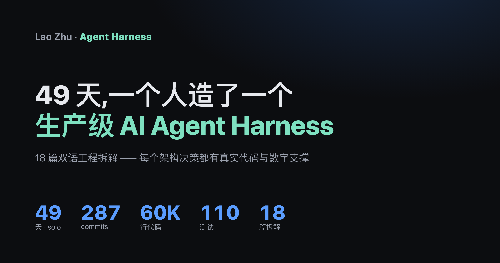

  

  <a href="https://sky54laozhu.github.io/building-an-agent-harness/"><b>🔗 在线主页 / Live site</b></a>
  &nbsp;·&nbsp;
  <a href="./docs/blog/reading-map.md"><b>📖 阅读地图 / Reading map</b></a>
  &nbsp;·&nbsp;
  <a href="http://47.107.103.144/"><b>⚙️ HarWork demo</b></a>

# Building an Agent Harness

> An 18-article bilingual deep dive on the engineering behind a production-grade AI Agent Harness, drawn from HarWork — a solo-built platform shipped in 49 days.
>
> 18 篇双语工程拆解 · 从 HarWork（一人 49 天打造的企业级 Agent Harness）的真实实现讲起。

## Status

✅ **Complete** · 18/18 articles published (ZH + EN), 54 original SVG diagrams.

📖 **Start here**: [docs/blog/reading-map.md](./docs/blog/reading-map.md) — full bilingual reading map with topical reverse-index.

## At a glance

- **287 commits / 49 days / 60,444 LOC / 110 tests** — the real HarWork numbers behind the series
- **18 parts** organized into 7 themes (Thesis → Core Loop → Tools → Sandbox → Storage → Streaming → Design → DevOps → Retro)
- **54 SVG diagrams**, all with `<title>` / `<desc>` for accessibility
- **~180K Chinese characters** + **~40K English words**

## Repo layout

| Path | Purpose |
|------|---------|
| [`docs/blog/reading-map.md`](./docs/blog/reading-map.md) | **Entry point** — bilingual reading map + reverse index |
| [`docs/blog/zh/`](./docs/blog/zh/) | 中文版 18 篇 |
| [`docs/blog/en/`](./docs/blog/en/) | English version, 18 articles |
| [`docs/blog/assets/img/`](./docs/blog/assets/img/) | 54 original SVG diagrams |
| [`docs/blog/seo-matrix.md`](./docs/blog/seo-matrix.md) | Keyword × article map |
| [`docs/blog/publishing-checklist.md`](./docs/blog/publishing-checklist.md) | Per-article release checklist |
| [`docs/blog/DECISIONS.md`](./docs/blog/DECISIONS.md) | Hosting / structure ADRs |
| [`scripts/blog/`](./scripts/blog/) | Content production tooling |

## Reading paths

- **From scratch (18 articles)**: 01 → 02 → ... → 18
- **Skim path (8 articles)**: 01 → 03 → 04 → 07 → 08 → 10 → 13 → 18
- **Hacker News path (4 articles)**: 01 → 11 → 17 → 18
- **"I want to learn X" reverse index**: see [reading-map.md](./docs/blog/reading-map.md#按我想了解-x反查)

## Series themes

1. **Thesis (01-02)** — what an Agent Harness *is*, full architecture map
2. **Core loop (03-06)** — async generators, context compression, tool orchestration, long-term memory
3. **Tools & sandbox (07-09)** — protocol, permissions, hooks
4. **Session storage (10-11)** — 30-table schema, persistent per-user Docker
5. **Streaming (12-13)** — WebSocket 30s grace, multi-model routing
6. **Design collaboration (14-16)** — AI artifacts, variants, optimistic-lock collab
7. **DevOps & retro (17-18)** — canary CI/CD, 49-day solo retrospective

## License

Dual-licensed — see [LICENSE](./LICENSE) for the full text.

- **Content** (`docs/`, README): [CC BY-SA 4.0](https://creativecommons.org/licenses/by-sa/4.0/) — free to share & adapt with attribution; derivatives must use the same license.
- **Tooling** (`scripts/`, `.github/`): [MIT](https://opensource.org/licenses/MIT) — use freely with attribution.

---

🔗 中文读者：[阅读地图](./docs/blog/reading-map.md) · [seo-matrix.md](./docs/blog/seo-matrix.md) 含全部中英关键词映射。
