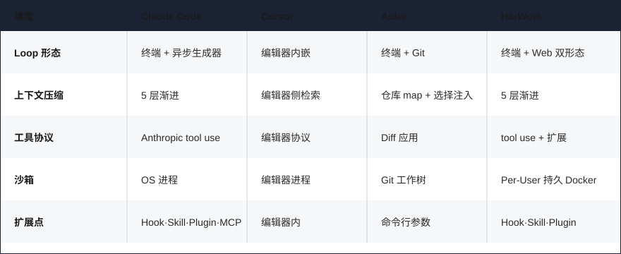
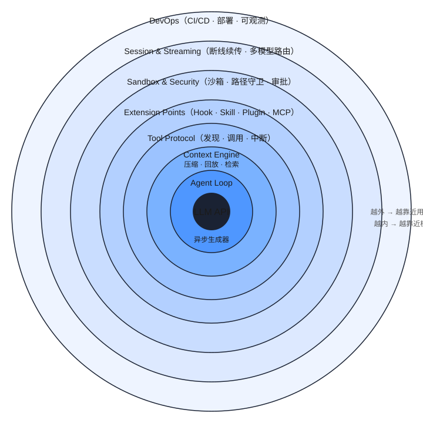
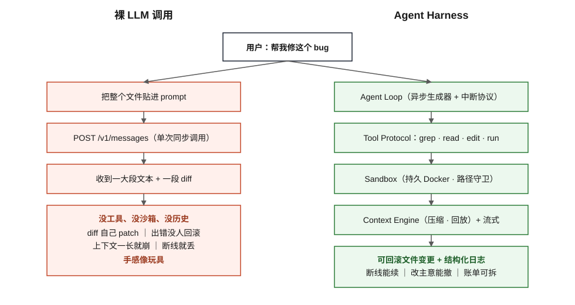

# Part 01: What Is an Agent Harness — How AI Coding Tools Like Claude Code Are Actually Built

> Claude Code, Cursor, and Aider all call the same Claude API. So why do they feel so different? The answer lives in the engineering shell wrapped around the LLM.

## Problem Statement

If you open the source code or public material for Claude Code, Cursor, Aider, and Continue, you notice something striking: **they're all riding the same underlying LLMs** — mostly Claude Sonnet/Opus, GPT-4 variants, Gemini, plus some in-house fine-tuned smaller models. Yet their product feel, extensibility, security boundaries, and reconnect behavior diverge wildly.

The difference is not the model. The difference is **the shell wrapped around the model**: how you turn a stateless `POST /v1/messages` call into an engineering tool that can "read code, edit files, run commands, remember context across sessions, and recover from network drops."

That shell, in the English engineering community, is increasingly called an **Agent Harness**. It's not an LLM, and it's not a class in some Agent framework. It's a **runtime** that treats the LLM like a CPU, tools like peripherals, and the conversation like session state.

This series takes the harness apart. Today's article nails down what an Agent Harness actually is.

## Why Naive Approaches Fail

There are three intuitive ways to build an AI coding assistant. None of them go the distance.

**Approach 1: Just `curl` the LLM API.** You paste the entire codebase into the prompt and ask the model to return a diff you patch yourself. Demo works in ten minutes. But any non-trivial project breaks it: the context window can't hold the code, the model can't see runtime output, and there's no way for it to "grep first, then decide what to change." This path effectively blindfolds the LLM.

**Approach 2: Bolt on a LangChain Agent or ReAct template.** This was the 2023 default. The problem is shallow abstraction — it solves "let the LLM call tools in a loop" but not "how do tool results feed back to the next turn," not "how do we compress a 50-turn conversation," not "who blocks `rm -rf /`," not "how does streaming resume after a disconnect," not "how do we cleanly cancel mid-execution." Run it in production for a week and a dozen edge cases bite.

**Approach 3: Hand-roll your own ReAct loop.** Looks flexible. Then you discover: every new tool needs prompt surgery, every new model needs custom tool-call parsing (Anthropic's tool use and OpenAI's function calling have incompatible schemas), every new safety rule means a full regression. Three months later you've shipped **a stunted version** of a harness — and nobody can maintain it.

The shared bug across all three is treating "calling the LLM" as the central problem. In real engineering, **calling the LLM is maybe 20% of the work**. The other 80% — the part that actually determines product feel and stability — lives in everything around the call: deciding which tools are available, which paths are off-limits, turning token streams into events, splitting tool calls into cancellable sub-tasks, replaying results back to the LLM, compressing context, structuring logs. The harness is the container for that 80%.

## Core Definition

Here's a precise definition:

> **Agent Harness: the runtime layer that wraps a stateless LLM API into a "stateful, controllable, observable, and extensible" engineering Agent.**

All four adjectives matter. Drop one and users leave:

- **Stateful**: sessions survive disconnects and container restarts; context can be compressed, replayed, retrieved; a 30-turn conversation doesn't evaporate on browser refresh.
- **Controllable**: users can interrupt, undo, change their mind at any moment; dangerous operations (deleting files, outbound network calls, writes to sensitive paths) go through approval; token budgets and concurrency limits are enforced, so a single bad prompt can't take down the service.
- **Observable**: every LLM call, tool invocation, context compaction, and hook fire emits a structured log; production errors trace back to the exact prompt and tool response that caused them; bills can be sliced by user, model, and tool.
- **Extensible**: third parties extend without forking — hooks and skills add new tools, triggers, and models; community extensions install like browser plugins; the same harness can drive a general coding agent or a domain-specific one (medical, legal, ops).

Meeting all four requires at minimum 7 components, which map directly to the seven volumes of this series:

| Component | Problem It Solves | Volume |
|-----------|-------------------|--------|
| Agent Loop | how multi-turn tool calls terminate safely | II |
| Context Engine | how a long conversation avoids blowing the window | II |
| Tool Protocol | how tools are discovered, invoked, interrupted | III |
| Extension Points | how users extend without forking | III |
| Sandbox & Security | how dangerous commands, path traversal, secrets are contained | IV |
| Session & Streaming | how disconnects, concurrency, and multi-model are absorbed | V |
| DevOps | how a solo dev or small team runs this in production | VII |

Each component is straightforward on its own. The hard part is **making the seams between them not leak** — exactly what the remaining 18 articles will dissect.

## Key Implementation Details

The trade-offs between different harnesses are visible at a glance. The table below is distilled from reading [Anthropic's official guide on building effective agents](https://www.anthropic.com/research/building-effective-agents), the [two-hour Cursor team interview on Lex Fridman #447](https://lexfridman.com/cursor-team-transcript/), [Aider author Paul Gauthier's benchmark showing LLMs are worse at returning code wrapped in JSON](https://aider.chat/2024/08/14/code-in-json.html), and our own scars from building the HarWork harness:

| Dimension | Claude Code | Cursor | Aider | HarWork |
|-----------|-------------|--------|-------|---------|
| Loop shape | terminal + async generator | editor-embedded | terminal + Git | terminal + Web (dual) |
| Context compaction | 5-stage progressive | editor-side retrieval | repo map + selective injection | 5-stage progressive |
| Tool protocol | Anthropic tool use | editor protocol | diff application | tool use + custom extensions |
| Sandbox | OS process | editor process | Git worktree | per-user persistent Docker |
| Extension points | Hook + Skill + Plugin + MCP | in-editor | CLI flags | Hook + Skill + Plugin |

The surface differences look large, but **underneath everyone is solving the same seven-component problem** — they just prioritize differently. Cursor pushes editor UX to its limit; Aider pushes Git integration; Claude Code pushes extensibility; HarWork pushes "one person can still run enterprise-grade DevOps."

If you want to read source to verify the framing, the HarWork project keeps 16 internal reverse-engineering notes on Claude Code under `docs/claude-code-analysis/`, covering Agent Loop, context compaction, the permission system, the hook system, and Skill/Plugin internals — this series unpacks each of them.

## Counterintuitive Conclusion

> **The hardest part of a harness is not when the LLM is calling — it's when the LLM isn't. How tool results flow back, when compaction fires, how disconnects resume, how the user's mind-change rolls cleanly back. Harness ≈ 80% engineering problems + 20% LLM problems.**

What this means: **building a working AI coding tool is mostly classic distributed systems, OS, and database engineering — not prompt engineering.**

A concrete example. Claude Code handles user Ctrl-C interrupts via a three-layer dance: AbortController + async generator protocol + tool cleanup hooks. The signal propagates to the Loop; the Loop marks the running tool as cancelled; the tool itself is responsible for cleaning up half-written files, closing spawned subprocesses, committing rollback-safe transactions. Any layer that drops the ball leaves dirty state. Cursor's team in the Lex Fridman interview spent considerable time on Merkle trees for repo semantic indexing and KV cache sharing for transformer attention — all to resolve the engineering tension "context big enough, latency low enough." **Every one of these is an engineering problem, not an LLM problem.**

Now a counter-example. Aider author Paul Gauthier ran a benchmark: asking LLMs to return code wrapped in JSON dropped success rates **across the board**, with Sonnet and DeepSeek Coder hit hardest — because JSON string escaping pollutes the model's attention while generating code. You cannot fix this by "upgrading the model"; you can only route around it by picking the right protocol. Which is why Aider chose plain text + diff blocks over function calls. The harness's value is right here: it accumulates "which protocol works best with which model" so you don't pay the cost again on the next swap.

In the other direction: swap a more powerful LLM into the harness and you'll typically fix 5% of bugs; convert your tool protocol from sync to async streaming and you'll fix 30% in one shot. This is why Cursor, Aider, and Claude Code can all share the same Claude models and still feel completely different products — the shell sets the ceiling.

That's why across the 19 articles in this series, only 1-2 are about "how to call the LLM." The other 17 are about loops, context, tools, sandboxes, streaming, sessions, observability, and DevOps — **which is the actual body of the harness**.

## Figures

1. 
2. 
3. 

## Next Article

→ [Part 02: HarWork Harness — the 16-layer stack in one picture](./02-harwork-stack-overview.md)

Next time we use real HarWork code as the sample, lay the full 16-layer stack from LLM API down to CI/CD on one page, and report the cloc-measured ratio of business code vs supporting infrastructure — you'll see a counterintuitive number.

---

📌 Series reading map: [reading-map.md](../reading-map.md)
🔗 中文版: [zh/01-what-is-agent-harness.md](../zh/01-what-is-agent-harness.md)
