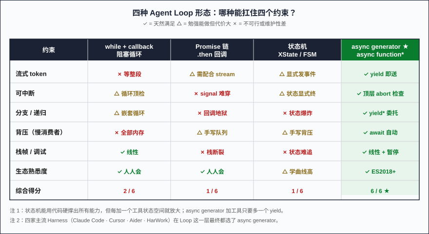
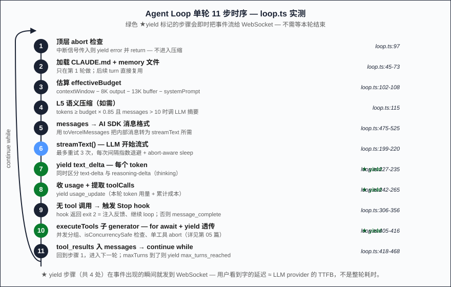
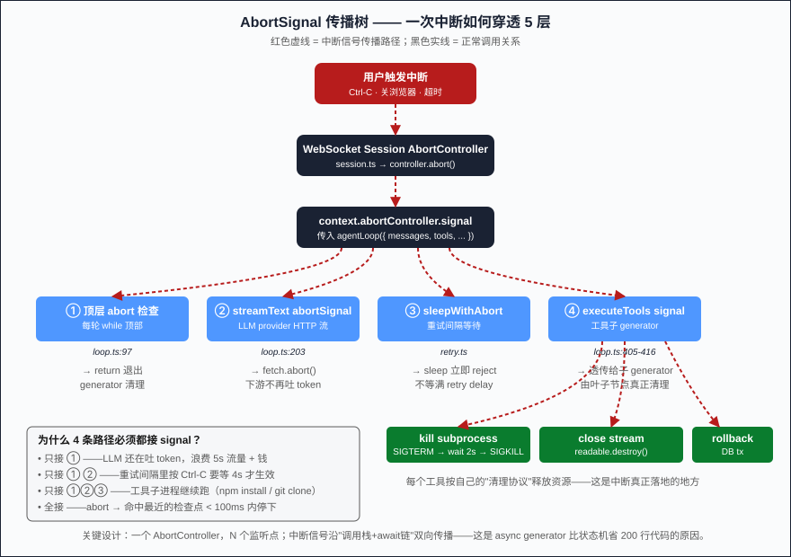

# Part 03: Agent Loop — Why It Has to Be an Async Generator, Not a Plain Async Function

> Part 01 gave you a 20-line Loop skeleton. HarWork's real `agent/loop.ts` is 640 lines. The extra 620 lines aren't "logic" — they're what keeps the original 20 lines from crashing under disconnects, window overflows, concurrent tools, and user interrupts. This article answers: why is the Loop an `async function*`, and where exactly does a plain `async function` die?

**Jump to:** [Problem](#problem-statement) · [Why naive fails](#why-naive-approaches-fail) · [Solution](#core-solution-async-generator) · [Implementation](#key-implementation-details) · [Counterintuitive](#counterintuitive-conclusion) · [Pitfalls](#three-production-pitfalls)

## Problem Statement

Writing an Agent Loop sounds trivial — "call the LLM, check for tool_use, run tools or stop." That's how I sketched it in Part 01.

In reality, the Loop fights **four constraints that conflict with each other**:

1. **Streaming**: LLMs emit tokens one by one. You have to **send them as they arrive** — wait for the whole completion and the user stares at a blank screen for 10 seconds. UX dies.
2. **Async**: Every tool call is async. Some take 50ms (memory lookup), some take 5 minutes (`pnpm install`). The Loop can't block — upper layers (WebSocket, UI) need to keep working while a tool runs.
3. **Interruptible**: Ctrl-C, browser close, timeout — any moment the user can demand "stop now." Stop has to leave no half-spawned subprocesses, half-written files, half-committed transactions.
4. **Branchable**: After tool results feed back, the LLM may call more tools (multi-tool turn), or call a sub-agent (Agent tool spawning a nested Loop). Depth is unbounded.

Any two of these stacked together, and a plain `async function` starts breaking.

## Why Naive Approaches Fail

I've tried every common Loop shape. Each fails differently.

**Approach 1: `while (true) { msgs.push(await callLLM(...)); ... }`** — blocking sync-style loop. `await callLLM()` has to wait for the *entire* completion before returning. The model emits 1000 tokens, you wait the full duration, and the user only sees "a complete paragraph appears at once." Streaming dead on arrival.

**Approach 2: Promise chain + `.then` callbacks**. Code becomes spaghetti fast: error handlers spread across seven `.catch`es, `abortSignal` can't pierce inner call stacks (you'd thread it through every `.then`), retry logic means copying the whole chain. Add a second tool and it's already unmaintainable.

**Approach 3: State machine (XState, hand-rolled FSM)**. Sounds elegant. Reality: "waiting on LLM stream," "waiting on tool result," and "waiting on abort signal" are three *concurrent* waits, not sequential states. One state ends up awaiting `Promise.race` on three things, and the FSM definition is bigger than the business logic. One more tool → state explosion.

**Approach 4: RxJS / Observables**. Streams, concurrency, backpressure — all available. But the community familiarity is too low. New hires spend two weeks learning obscure operators. Claude Code, Cursor, and Aider all skipped this route for the same reason: **painful debugging, unreadable stack traces, ecosystem fragmentation**.

The shared bug across all four: they couple "control flow of the loop" with "data flow of outputs." `while + return` outputs once. `.then` forwards once. In a state machine, output is a side effect. But the Agent Loop is fundamentally **a process that emits data while still running**. JavaScript happens to have a dedicated language primitive for exactly that: `async function*`.

## Core Solution: async generator

A 30-second crash course on `async function*` (async generator). The only difference from a regular `async function`:

- A regular `async function` returns a Promise once via `return`.
- An `async function*` yields multiple values via `yield`, returning an **async iterator** (AsyncIterator).

Consumers iterate with `for await ... of`:

```typescript
async function* counter() {
  for (let i = 0; i < 3; i++) {
    await new Promise(r => setTimeout(r, 1000))
    yield i  // emit one number per second
  }
}

for await (const n of counter()) {
  console.log(n)  // prints 0, 1, 2 at 1s/2s/3s
}
```

Key insight: **`yield` isn't "return," it's "pause."** The generator preserves local variables, loop position, and await state, then resumes when `.next()` is called again. Translation: the Loop can be written as linear code, but every step's output streams immediately to consumers.

Rewriting the Agent Loop as an async generator:

```typescript
async function* agentLoop({ messages, tools, abortSignal }) {
  while (true) {
    if (abortSignal.aborted) return                    // ① top-level abort check
    await compress(messages)                           // ② context compaction

    for await (const chunk of llmStream(messages)) {   // ③ streaming LLM
      yield { type: 'text_delta', text: chunk }        //    emit each token immediately
    }

    const toolCalls = extractToolCalls(messages)
    if (!toolCalls.length) {                           // ④ no tools → done
      yield { type: 'message_complete' }
      return
    }

    yield* executeTools(toolCalls, abortSignal)        // ⑤ delegate to sub-generator
    // yield* forwards the sub-generator's events upstream
  }
}
```

Why does this shape land exactly on all four constraints?

- **Streaming for free**: `yield` sends each token straight to the consumer (WebSocket), zero buffer. The frontend sees characters the instant they leave the LLM provider.
- **Interrupt for free**: One `abortSignal` check at the top of each turn — no need to thread signal through every await. On abort, `return` unwinds the generator cleanly.
- **Backpressure for free**: If the WebSocket writes slowly (bad network), the consumer's `for await` blocks, and the producer's next `yield` waits — LLM tokens don't pile up in memory.
- **Testable for free**: `await Array.fromAsync(loop())` collects all events into an array, then assert on order and content. HarWork's `loop.test.ts` is literally written that way.

The killer feature: **sub-generators compose via `yield*`**. When the agent calls the Agent tool (spawning a nested sub-agent), the sub-agent is itself an async generator. The outer Loop runs `yield* runSubAgent(...)` and the child's event stream merges into the parent's — one line, recursion depth unbounded, stack never blows.

## Key Implementation Details

HarWork's `packages/engine/src/agent/loop.ts` is 640 lines. Comparing the 20-line skeleton against the real thing, the extra 620 lines do five things:

**1. Multi-layer retry with backoff (lines 32-33, 211-220)**

```typescript
const MAX_RETRIES = 3
const RETRY_BASE_DELAY_MS = 1000

// On error, yield a retry event — frontend shows "retry 2/3 in 2s..."
yield { type: 'retry', attempt, maxAttempts: MAX_RETRIES, retryInMs: delay, error: err.message }
await sleepWithAbort(delay, context.abortController.signal)
```

Notice `sleepWithAbort` — even *waiting for the next retry* is interruptible. If the user hits Ctrl-C during the retry interval, sleep returns immediately, and the Loop detects abort at the top of the next iteration and exits.

**2. Context budget and compaction trigger (lines 102-128)**

```typescript
const MAX_OUTPUT_RESERVE = 8_000
const AUTOCOMPACT_BUFFER = 13_000
const effectiveBudget = contextWindow
  ? contextWindow - MAX_OUTPUT_RESERVE - systemPromptTokenEstimate - AUTOCOMPACT_BUFFER
  : undefined

if (currentTokens >= budget * 0.85 && messages.length > 10) {
  // trigger L5 semantic compaction (calls the LLM to summarize old messages)
}
```

Part 04 unpacks all 5 tiers. For now, one fact: **the compaction check runs before the LLM call** — to avoid the paradox of "compacting itself blows the window."

**3. Hook lifecycle integration (lines 116-120, 325-354)**

```typescript
// Before compaction, fire the PreCompact hook — third parties can veto
const hookGen = context.executeHooks('PreCompact', compactInput)
let hookResult = await hookGen.next()
while (!hookResult.done) {
  yield hookResult.value   // hook's own output streams upstream
  hookResult = await hookGen.next()
}
```

Hooks are themselves generators — their events splice seamlessly into the main Loop's event stream. The "approve before tool call" pause the user sees in the UI is just a hook generator yielding a "waiting" event.

**4. Sub-generator for tool execution (lines 405-416)**

```typescript
for await (const event of executeTools(internalToolCalls, tools, context, ...)) {
  yield event                          // forward to consumer
  if (event.type === 'tool_call_result') {
    toolResults.push({...})            // also collect into messages
  }
}
```

`executeTools` is another async generator. It handles tool concurrency, `isConcurrencySafe` grouping, per-tool cancellation (Part 05). The main Loop uses `for await` to *simultaneously* forward events and collect results — only async generators can express "streaming output + result aggregation" cleanly.

**5. Nine-plus event types, all via `yield`**

HarWork's Loop yields these event types (from the `StreamEvent` union): `text_delta` · `thinking_delta` · `tool_call_start` · `tool_call_result` · `usage_update` · `message_complete` · `retry` · `error` · `hook_event`. The WebSocket layer doesn't need to know any internal Loop state — it just forwards the generator's output verbatim: `for await (const e of loop()) { ws.send(JSON.stringify(e)) }`. **Part 13 unpacks the full mapping from this event stream to wire frames.**

## Counterintuitive Conclusion

> [!IMPORTANT]
> **`yield` isn't "output," it's "pause."**
>
> The hard part of the Agent Loop isn't "the loop itself" — it's making everything that happens *between* loop iterations (streaming tokens, tool results, compaction, abort, retry, hooks) **pausable and observable**. The async generator is the cheapest implementation in JavaScript: one language keyword, zero external dependencies.

Put differently: **the Agent Loop is not an "algorithm" — it's an "event stream shape."** You can implement the same behavior with state machines, Observables, or callback pyramids, but the code balloons 3–5×, readability drops to 30%, and debugging a null-pointer takes six breakpoints. Switch to async generators and the entire Loop reads top-to-bottom as linear code, every `yield` is an observation point, every `await` is an interruption point. That's why Claude Code, Cursor, and HarWork independently landed on async generators — **not because it's the most powerful, but because it's the one you'll regret least**.

Going further: **async generators unify "control flow" and "data flow" in a single primitive**. `for await` lets you execute sequentially *and* lets data emerge in order. A plain async function only gives you sequential execution; Observables only give you data flow with implicit control flow. Combining both behind one keyword means stack traces, breakpoints, and error frames all line up — the most important engineering payoff.

## Three Production Pitfalls

Theory aside — three real traps HarWork has paid for, that you'll hit too:

> [!WARNING]
> **Pitfall 1 — Early `for await` break may not clean up the generator.**
>
> If the consumer exits the loop while the generator is mid-await, the generator hangs on that await forever, never freeing resources. **HarWork's fix**: every blocking await accepts `abortSignal`. On `return()`, the signal fires, the inner await throws `AbortError`, and the generator unwinds.

> [!WARNING]
> **Pitfall 2 — After `yield`, the suspended generator holds onto every local variable.**
>
> If you held a 50 MB grep result buffer right before yielding, that memory doesn't free during the pause. **HarWork's fix**: large tool outputs go to disk attachments first; `messages` only stores "first 500 chars + attachment_id" so long yields don't pin memory (Part 04 L2 compaction tier).

> [!WARNING]
> **Pitfall 3 — Errors thrown from a generator surface in unintuitive places.**
>
> A `throw` after `yield` shows up in the consumer's `for await`, not the generator's actual offending line. **HarWork's fix**: at every potentially-throwing site, `yield { type: 'error', code, message }` first, then `return`. Errors become data, not control flow.

The three pitfalls together say: **async generators aren't free**. They express "control flow + data flow" in the most compact syntax, but you have to understand pause semantics, lifecycle, and error propagation. Hand a generator to someone who only knows plain `async function`, and within six months they'll have six "mysterious hangs" in production.

## Figures

1. 
2. 
3. 

## Next Article

→ [Part 04: Context Engine — when each of the 5 compaction tiers actually fires](./04-context-compaction-5-tiers.md)

Next time we drill into layer 4 of the 16-layer stack. Part 01 promised "5-tier progressive compaction"; Part 04 uses real HarWork code (`compression.ts` + `llm-compact.ts` + `memory.ts`) to lay out each tier's trigger threshold, compression strength, and measured compression ratio — you'll see why "compaction itself must not consume budget" is the soul of the system.

---

📌 Series reading map: [reading-map.md](../reading-map.md)
🔗 中文版: [zh/03-agent-loop-async-generator.md](../zh/03-agent-loop-async-generator.md)
