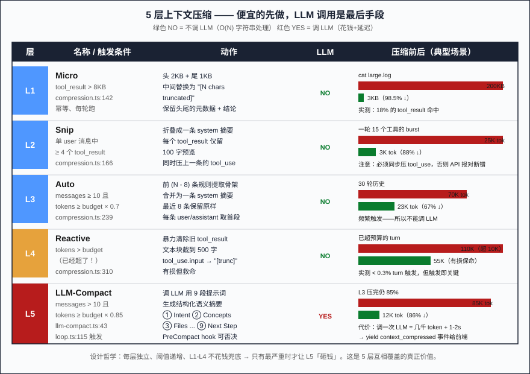
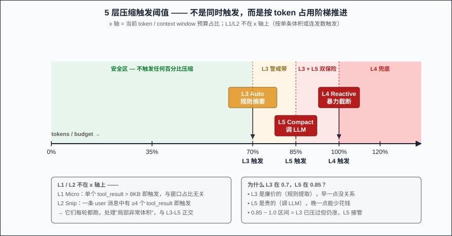
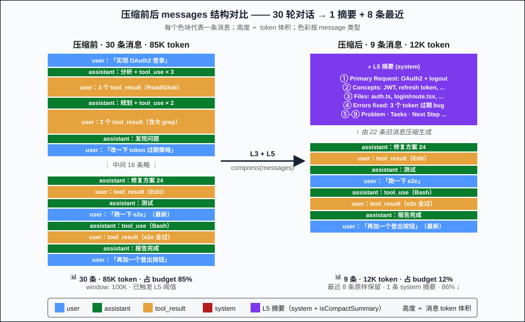

# Part 04: Context Engineering — When Each of the 5 Compaction Tiers Actually Fires

> Part 03 said every loop iteration starts with `await compress(messages)`. This article answers: **what does `compress` actually do**? Why don't Claude Code, Cursor, and HarWork blow the context window after hundreds of turns? Not "one clever summarization algorithm" — but **5 tiers firing at different moments, at different costs, with different intensities**. This piece opens up HarWork's `compression.ts` (378 lines) + `llm-compact.ts` (133 lines) and lays bare every threshold and compression ratio.

## Problem Statement

Long agent conversations have two hard pain points:

1. **Tool results are huge.** A single `grep -r` can dump 80,000 lines. A single `cat large.log` is 200KB. Two or three of those raw in `messages` and the window is gone.
2. **History grows.** 50-turn conversations are tens of thousands of tokens by themselves. Even if every tool result is small, the cumulative weight crosses the line.

The naive strategy — **"drop old messages when you overflow"** — gives the agent instant amnesia: the dropped message may have been the user's original requirement statement five turns back. Claude Code's "conversation never overflows" illusion isn't luck. It's 5 tiers of progressive compaction. **The first 4 tiers don't call the LLM** (no money, no latency); only the most severe case fires L5 (LLM-driven semantic summary).

## Why Naive Approaches Fail

I've tried every one-shot compaction strategy. Each fails in a specific scenario.

**Naive 1: FIFO drop**. "Overflow → discard oldest." But the oldest messages often contain the user's initial requirement ("we're building OAuth2 login"). Drop them and at turn 30 the LLM suddenly asks "what are we building?" Continuity dies.

**Naive 2: Global summary**. Every N turns, call the LLM to summarize all history into 200 words. But the LLM call itself burns tokens and seconds, and the timing is impossible to pick: too early → lose detail; too late → already overflowing, get `prompt_too_long`.

**Naive 3: Plain sliding window**. Keep only the most recent 10 messages. Same problem as FIFO, and a sliding window drops **whole conversations**, not "redundant information" — still loses the core requirement.

**Naive 4: Compress tool results only**. Truncate huge `tool_result` blocks, leave history alone. But when the conversation itself (user descriptions + assistant reasoning) eats 80% of the window, truncating tool results can't save you.

Common failure: **all four try one strategy for every scenario**. But "compaction" faces four different bloat shapes — oversized single message, tool-result bursts, cumulative history, sudden overrun — each shape demands a different treatment.

## Core Solution: 5 Tiers Stacked

HarWork's compaction chain is ordered **"cheap first, expensive last"**:

| Tier | Trigger | Intensity | Calls LLM? | Code |
|------|---------|-----------|------------|------|
| **L1 Micro** | Single `tool_result` > 8KB | Truncate to head 2KB + tail 1KB | No | `compression.ts:142` |
| **L2 Snip** | ≥ 4 consecutive `tool_result` in one message | Fold into a system summary (100-char preview each) | No | `compression.ts:166` |
| **L3 Auto** | `messages ≥ 10` AND `tokens ≥ budget × 0.7` | Rule-based summary of old messages, keep last 8 verbatim | No (rule) | `compression.ts:239` |
| **L4 Reactive** | `tokens > budget` (already over!) | Brute-force strip old tool_results, truncate text to 500 chars | No | `compression.ts:310` |
| **L5 LLM-Compact** | `tokens ≥ budget × 0.85` AND `messages > 10` | LLM call with 9-section semantic prompt | **Yes** | `llm-compact.ts:43`, `loop.ts:115` |

**Key insights:**

- **L1-L4 are O(N) string operations, zero LLM calls** — meaning the per-turn `compress` is effectively free in time and money
- L5's threshold (0.85) is **higher** than L3's (0.7) — L3 rule-compresses first; only if that's not enough does L5 spend money
- L4 is the safety net for "L1-L3 ran but still over" — brute-force, lossy, but saves the request from failing

Let's walk each tier.

### L1 Micro — 8KB Truncation

```typescript
const MICRO_MAX_CHARS = 8192    // 8KB
const MICRO_HEAD_CHARS = 2048   // head 2KB
const MICRO_TAIL_CHARS = 1024   // tail 1KB

if (block.type === 'tool_result' && block.content.length > MICRO_MAX_CHARS) {
  const head = block.content.slice(0, MICRO_HEAD_CHARS)
  const tail = block.content.slice(-MICRO_TAIL_CHARS)
  return { ...block, content: `${head}\n\n... [${truncated} characters truncated] ...\n\n${tail}` }
}
```

Scenario: a single tool call returned a huge dump (`cat` on a log, `grep` on a big repo). **Keeping both ends is the trick** — the head usually has metadata/errors, the tail usually has conclusions/latest entries, the middle is repetitive. Slice the middle 5KB and the LLM still understands what the tool did.

Hit pattern: this tier triggers frequently in code-task conversations — Bash long outputs and large Read calls are the main sources.

### L2 Snip — Burst Folding

```typescript
const SNIP_MIN_TOOL_RESULTS = 4

// When one user message has ≥ 4 tool_result blocks (LLM called ≥ 4 tools in a turn)
// Fold it into a single system summary with 100-char previews
return {
  type: 'system',
  content: `[Compressed ${msg.content.length} tool results]\n${summaries.join('\n')}`,
  isCompactSummary: true,
}
```

Scenario: the LLM made one turn with 4 Reads, 5 Globs, 6 Greps — fed back, the next user message has 15 `tool_result` blocks. This burst pattern is wasteful because the LLM has already decided based on these results — old results are just "evidence."

L2 collapses the whole message into one summary line; combined with L1 (if a single block still > 8KB), it pushes "scanning-type turns" from ~25K tokens down to ~3K.

### L3 Auto — Rule-Based Old-History Summary

```typescript
const AUTO_MIN_MESSAGES = 10
const AUTO_TOKEN_RATIO = 0.7
const AUTO_KEEP_RECENT = 8

if (opts.enableAuto && result.length >= AUTO_MIN_MESSAGES) {
  if (currentEstimate >= opts.maxTokenBudget * AUTO_TOKEN_RATIO) {
    // Summarize first (N - 8) messages into one system message, keep last 8 verbatim
  }
}
```

Scenario: conversation past 10 turns, token usage breaks 70% — the early signal "time to start compressing history." L3 uses **pure rules** to extract the gist of each old message (user → first 200 chars of text + tool_result count; assistant → first 300 chars of text + tool_call count) and concatenates into a single system summary message.

Why not LLM-call? Because L3 fires **frequently** — once over 70%, every subsequent turn will trigger again (unless the user opens a new topic and usage drops). Calling the LLM each turn would burn thousands of tokens per call and seconds of latency. Rule-based summary loses semantic nuance but **keeps the conversation skeleton** — enough for the LLM to maintain continuity. If details matter later, the user can reference the original message and the model recovers context.

### L4 Reactive — Already-Over-Budget Safety Net

```typescript
if (estimateTokens(result) > opts.maxTokenBudget) {
  // Brute mode: replace all old tool_result.content with "[result truncated: N chars]"
  // Truncate any text block > 500 chars to 500 chars
  // Replace tool_use.input with "[truncated]"
}
```

Scenario: L1-L3 all ran but the estimate still exceeds budget — typical cause is the system prompt is huge (CLAUDE.md + memory together = several thousand chars) and history fills the rest. L4 is **lossy but life-saving** — it nukes `tool_result` content, truncates long text. The LLM sees "these tools were called, but only metadata remains." This tier rarely fires, but when it does it's critical — without L4 the API returns `prompt_too_long`.

### L5 LLM-Compact — Semantic Summary

```typescript
// Triggered at loop.ts:115
if (currentTokens >= budget * 0.85 && messages.length > 10) {
  // PreCompact hook can veto
  // Call LLM with a 9-section structured prompt to produce <analysis>...</analysis><summary>...</summary>
  const { text } = await generateText({
    model,
    system: 'You are a conversation summarizer...',
    prompt: `Here is the conversation to summarize:\n\n${transcript}\n\n---\n\n${getCompactPrompt()}`,
  })
}
```

Scenario: the conversation has already been compressed once by L3, but the user keeps asking, new tool results pile up, and usage spikes back to 85%. L3 is now useless (old messages are already compressed) — you need **semantic-level reorganization**. L5 uses an **80-line carefully designed prompt** (`compact-prompt.ts`) to force the LLM to compress the entire history into 9 structured sections: ① Primary Request and Intent ② Key Technical Concepts ③ Files and Code Sections ④ Errors and fixes ⑤ Problem Solving ⑥ All user messages ⑦ Pending Tasks ⑧ Current Work ⑨ Optional Next Step.

Why these 9? **Because it's Claude Code's open-source prototype** (HarWork ports it). This structure was battle-tested across tens of thousands of conversations inside Anthropic's product — it preserves semantics for "continuing a coding task" better than any homebrew alternative.

L5's cost: one LLM call ≈ several thousand input tokens + 1-2 seconds. So **only as last resort** (85% threshold AND the previous 4 tiers weren't enough).

## Key Implementation Details

Theory aside, 5 details in real HarWork code make or break this:

**1. Compaction check before the LLM call**

`loop.ts:113-115` order: estimate tokens → decide to compress → THEN call LLM. Reverse it (call LLM, get `prompt_too_long`, then compress and retry) and the user has already paid for one failed prompt + delay, and the retry logic gets messy.

**2. L1-L4 must be idempotent**

`compression.ts:11` comment is explicit: "Each layer is idempotent and can run independently." Run L1 twice → same result. Run L1 then L2 → same as L2 then L1. This guarantees per-turn `compress` can run blindly without compounding into emptiness.

**3. AUTO_KEEP_RECENT = 8 is not arbitrary**

Why 8? A typical turn = user → assistant → tool_results → assistant, ~4 messages. 8 = last 2 turns = what the user is currently doing + the previous step's feedback. This number is ported from Claude Code's default — adjust it, but going below 4 loses the previous turn's feedback, going above 16 makes the old-history summary pointless.

**4. PreCompact hook can veto L5**

Before L5 fires, a `PreCompact` hook runs (see Part 03 hook lifecycle); third-party plugins can `exit 2` to abort. Typical use: compliance mode "preserve full conversation," forbid lossy LLM summary.

**5. `context_compressed` event yields to the frontend**

After L5 finishes, the Loop yields `{ type: 'context_compressed', from, to }` (token counts). The frontend renders "context compressed 12K → 3K, please continue." This is the only moment users perceive compaction.

## Counterintuitive Conclusion

> **Context compaction is not "one clever algorithm" — it's "a set of strategies firing at different moments, at different costs, with different intensities."** Any proposal that talks only about "the summarization algorithm" misses the point: what matters is **when** to compress, **how aggressively**, and **whether to spend on an LLM call**.

Put differently: **compaction is fundamentally a budget-management problem, not an information-theory problem.** Each tier answers a concrete budget question:
- L1: "Is this single tool result worth 8KB?" (no → cut middle)
- L2: "Are 15 tool_results in one turn all worth keeping?" (no → fold to summary)
- L3: "History at 70%, are 90% of old messages worth keeping verbatim?" (no → rule-extract skeleton)
- L4: "Already over — burn part of history to survive?" (yes)
- L5: "Rule compaction wasn't enough — worth 2s + thousands of tokens for LLM to reorganize?" (only at 85%)

Each tier is an independent decision, with its own threshold and its own kill switch — HarWork's `CompressionOptions` exposes `enableMicro / enableSnip / enableAuto / enableReactive` as 4 flags. This is the real reason the system survives hundreds of turns: **not one tier being clever, but 5 tiers covering for each other, failing independently, never chain-crashing**.

## Three Production Pitfalls

**Pitfall 1: token estimation by "chars / 4" underestimates 30%**. HarWork's `estimateTokens` (`compression.ts:108`) uses `CHARS_PER_TOKEN = 4`. Chinese text underestimates badly (Chinese tokenizes at ~1.5 chars/token). Fix: keep `AUTOCOMPACT_BUFFER = 13K` (Part 03's effectiveBudget formula) as safety pad. Better early than late.

**Pitfall 2: L2 Snip breaks tool_use/tool_result pairing**. `compression.ts:197-216` has special code that **also compresses the preceding assistant's tool_use blocks** — because Anthropic's API requires every `tool_use` to have a matching `tool_result`. Strip the result without touching the call and you get `tool_use_id mismatch`. HarWork's early version paid for this lesson.

**Pitfall 3: L5 LLM call mid-abort leaves state stuck**. L5's `generateText` accepts an `abortSignal` — but if the user hits Ctrl-C mid-call, the prompt has already been sent and billed. HarWork's handling: L5 does NOT retry (different from the main LLM call's 3-retry policy); on failure it falls back to "skip this turn's compaction, let L4 catch it next turn before yielding `error`."

Common takeaway: **all the magic numbers (8KB / 0.7 / 0.85 / 8 messages) are NOT universal optima** — they're HarWork's "good-enough trade-offs" calibrated on real production data. Switch LLMs, switch use case (short Q&A vs code generation), and these numbers need recalibration.

## Figures

1. 
2. 
3. 

## Next Article

→ [Part 05: Tool Orchestration — Parallel / Serial / Interruptible](./05-tool-orchestration.md)

Next we move from "how context doesn't overflow" to "how tools don't fight each other." The LLM may emit 8 tool calls per turn — the orchestrator decides which can run in parallel (Read × 3), which must serialize (Edit blocks), and what happens when one fails mid-flight. Part 05 walks HarWork's real `tool-executor.ts` for the two-step "`isConcurrencySafe` self-declaration + orchestrator backstop" scheduling.

---

📌 Series reading map: [reading-map.md](../reading-map.md)
🔗 中文版: [zh/04-context-compaction-5-tiers.md](../zh/04-context-compaction-5-tiers.md)
