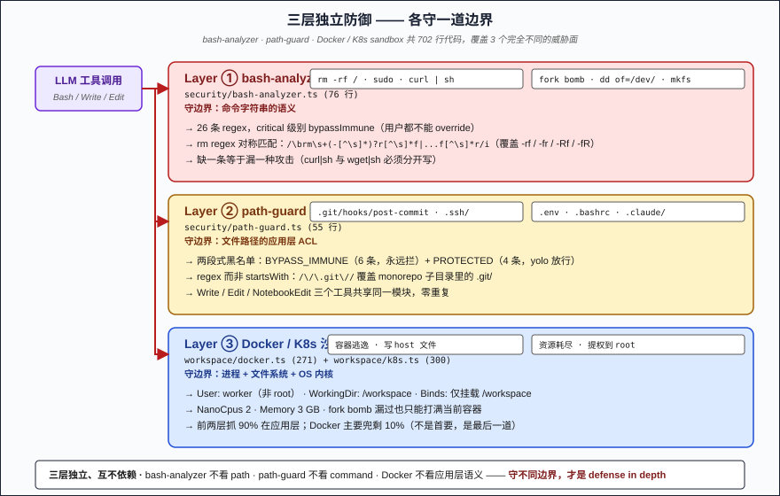
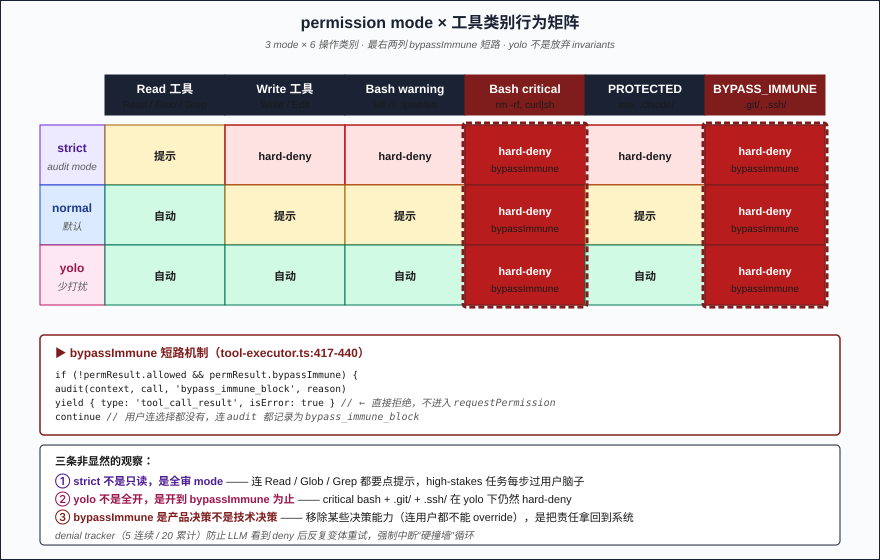
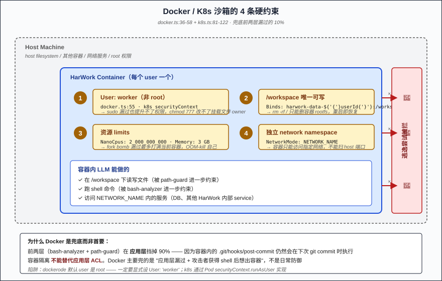

# Part 08: Permissions & Sandbox — bash-analyzer / path-guard / Docker triple defense

> Part 07 said `checkPermissions` is the first gate at the tool layer. But the LLM will find ways around any single gate — concatenating `rm -rf` after `;`, base64-encoding then piping to shell, command substitution with `$()`, or writing to `.git/hooks/post-commit`. This part unpacks how HarWork stops all of those with **three layers of defense**: bash-analyzer for command content, path-guard for file paths, and the Docker sandbox to catch physical side effects. The three layers aren't redundant — they're **complementary**, each catching a different threat model. Bypassing one doesn't compromise the others.

## Problem Statement

The LLM isn't malicious, but its training corpus is full of `curl xxx | bash` oneliners — it'll write them naturally while helping you install something. You need to solve:

1. **How do you intercept dangerous commands?** — The Bash tool can't depend on a human reviewer; it has to auto-detect `rm -rf` / `curl | sh` / fork bombs.
2. **How do you intercept dangerous file operations?** — The LLM might write `.env`, change `.bashrc`, even modify `.git/hooks/post-commit` (so the next commit runs arbitrary code).
3. **How do you backstop side effects outside the container?** — Even if the first two layers pass, Bash commands have to be confined to the container — they can't touch the host.
4. **How do you give the user an opening?** — In yolo mode the LLM has to be able to write files and run commands; if all three layers slam shut, nothing works.

All four are real production problems, but HarWork splits them into **three independent layers + a bypassImmune flag** — layering precisely because each cares about a different **threat surface**.

## Why Naive Approaches Fail

**Naive 1: only block `rm -rf` inside the Bash tool.** The LLM uses `rm$IFS-rf`, base64-encodes the command, or writes to `.bashrc` so your next shell auto-runs it. **Can't be stopped at the regex layer alone** — the attack surface is much larger than one pattern.

**Naive 2: Docker is the only line — it can't escape the container anyway.** The problem: a `.git/hooks/post-commit` inside the container still runs at your next `git commit`; `.ssh/authorized_keys` written there can still be read by SSH; tokens in `.env` still leak to malicious services. **Container isolation doesn't substitute for application-layer ACL.**

**Naive 3: every tool writes its own permission logic.** `write.ts`, `edit.ts`, `bash.ts`, `notebook-edit.ts` each do their own path-guard — 4 regex copies to maintain, drift is inevitable. **Logic diverges.**

**Naive 4: make every deny "user can override."** The LLM sees a deny and thinks "I have a better idea" — comes back with a variant. **Making the user the gatekeeper hands responsibility to the worst-positioned actor.**

HarWork's answer: **layering + bypassImmune.** Each layer is independent and non-interdependent; critical level (`rm -rf` / `.git/`) takes the bypassImmune path — not even the user can override.

## Core Solution: Roles of the Three Layers

| Layer | File | Concerns | LOC | Example block |
|---|---|---|---|---|
| ① **bash-analyzer** | `security/bash-analyzer.ts` | command string content | 76 | `rm -rf /`, `curl \| sh`, fork bomb |
| ② **path-guard** | `security/path-guard.ts` | file paths | 55 | write `.git/`, `.env`, `.ssh/` |
| ③ **Docker / K8s sandbox** | `web/lib/workspace/docker.ts` (271) + `engine/workspace/k8s.ts` (300) | process boundary + filesystem mounts | 571 | escape container, modify host |

**The three layers are independent:** bash-analyzer doesn't look at paths, path-guard doesn't look at commands, Docker doesn't look at app-layer semantics. **Complementary:** commands bash-analyzer missed still can't escape Docker; files path-guard missed still only live in a mounted volume; whatever Docker missed (theoretically nothing) is caught by the first two layers at app level.

### Layer 1: bash-analyzer — 26 regexes as semantic guard

`bash-analyzer.ts:15-49` defines 26 patterns:

```typescript
const PATTERNS: Pattern[] = [
  // critical (always blocked, bypassImmune)
  { regex: /\brm\s+(-[^\s]*)?r[^\s]*f|rm\s+(-[^\s]*)?f[^\s]*r/i, ... risk: 'critical' },
  { regex: /\bsudo\b/, ... risk: 'critical' },
  { regex: /\bcurl\b.*\|\s*(ba)?sh/, ... risk: 'critical' },
  { regex: /:\(\)\s*\{\s*:\|:\s*&\s*\}\s*;/, ... description: 'fork bomb', risk: 'critical' },
  { regex: /\bdd\b.*\bof=\/dev\//, ... risk: 'critical' },
  { regex: /\bmkfs\b/, ... risk: 'critical' },
  // warning (user-overridable)
  { regex: /\bkill\s+-9\b/, ... risk: 'warning' },
  { regex: /\biptables\b/, ... risk: 'warning' },
  // ...
]
```

`bash.ts:317-325` invokes it:

```typescript
const analysis = analyzeBashCommand(input.command)
if (analysis.risk === 'critical') {
  return {
    allowed: false,
    bypassImmune: true,  // ← never allowed
    reason: `Dangerous command blocked: ${analysis.matchedPatterns.join(', ')}`,
  }
}
```

Three design choices to notice:

1. **The `rm -rf` regex is symmetric** — `/\brm\s+(-[^\s]*)?r[^\s]*f|rm\s+(-[^\s]*)?f[^\s]*r/i` — matches both `-rf` and `-fr`, and `-Rf` `-fR` too.
2. **Fork bomb has its own pattern** `/:\(\)\s*\{\s*:\|:\s*&\s*\}\s*;/` — it wouldn't be caught by the `rm` regex but would OOM the container.
3. **`curl | sh` and `wget | sh` are separate patterns** — the LLM might use either; missing one means missing an attack.

### Layer 2: path-guard — two-tier blocklist

`path-guard.ts:10-30` defines two lists:

```typescript
const BYPASS_IMMUNE_PATTERNS = [
  { pattern: /\/\.git\//, reason: 'Writing to .git/ internals is never allowed' },
  { pattern: /\/\.ssh\//, reason: 'Writing to .ssh/ is never allowed' },
  { pattern: /\/\.gnupg\//, reason: 'Writing to .gnupg/ is never allowed' },
  // ...
]
const PROTECTED_PATTERNS = [
  { pattern: /\/\.env($|\.)/, reason: 'Writing to .env files requires confirmation' },
  { pattern: /\/\.claude\//, reason: 'Writing to .claude/ config requires confirmation' },
  { pattern: /\/(\.bashrc|\.zshrc|\.bash_profile|\.zprofile|\.profile)$/, ... },
]
```

Called in `write.ts:42-48`:

```typescript
const immune = isBypassImmuneProtected(input.file_path)
if (immune.blocked) return { allowed: false, bypassImmune: true, reason: immune.reason }
if (context.permissionMode === 'yolo') return { allowed: true }
const guard = isProtectedPath(input.file_path)
if (guard.blocked) return { allowed: false, reason: guard.reason }
return { allowed: true }
```

**Note where the yolo check lives** — between bypassImmune and PROTECTED. `.git/` is blocked even in yolo; `.env` is allowed in yolo. That asymmetric design encodes a semantic: **"yolo means trust the user, not disable security"** — core security invariants never relax.

`edit.ts:56-63` and `notebook-edit.ts:122-130` have the exact same structure — three tools share one `path-guard` module, **never duplicate**.

### Layer 3: Docker / K8s sandbox — kernel-level isolation

Two implementations:
- `web/lib/workspace/docker.ts:36-58` uses `dockerode`:
  ```typescript
  HostConfig: {
    NanoCpus: 2_000_000_000,             // 2 CPU
    Memory: 3 * 1024 * 1024 * 1024,      // 3 GB
    Binds: [`harwork-data-${userId}:/workspace`],  // only mount /workspace
    NetworkMode: NETWORK_NAME,
  },
  User: 'worker',                         // non-root
  WorkingDir: '/workspace',
  ```
- `engine/workspace/k8s.ts:81-122` creates Pod + PVC: CPU/memory limits, `workingDir: '/workspace'`, `volumeMounts: [{ name: 'workspace-data', mountPath: '/workspace' }]`.

**Three things:**
1. **`/workspace` is the only writable mount** — every LLM op is confined to the mounted volume. A Bash `rm -rf /` even if it slipped past bash-analyzer can only nuke the container rootfs (restart restores), can't touch host.
2. **Resource limits** — Docker hardcodes 2 CPU / 3 GB (`docker.ts:47-48`); K8s reads `config.cpuLimit/memoryLimit` (configurable at deploy time). A fork bomb that slipped past bash-analyzer can at worst saturate the current container and OOM-kill itself.
3. **User: worker (non-root)** — `sudo` even if it slipped past can't elevate.

Docker is the backstop, not the primary — the first two layers catch 90% at app layer; Docker mostly catches the remaining 10%.

## Key Implementation Details

Five non-obvious details:

**1. bypassImmune is a boolean flag, but procedurally it's a short-circuit switch**

`tool-executor.ts:417-440`:

```typescript
const permResult = tool.checkPermissions(call.args, context)
if (!permResult.allowed && permResult.bypassImmune) {
  audit(context, call, 'bypass_immune_block', permResult.reason)
  // → straight to deny, skip requestPermission flow
  yield { type: 'tool_call_result', ..., isError: true }
  continue
}
if (!permResult.allowed) {
  // normal deny → route through requestPermission for user choice
  if (context.requestPermission) {
    const action = await context.requestPermission(...)
    // user can override
  }
}
```

**bypassImmune = true skips the `requestPermission` call** — that's the only difference from a normal deny. But the effect is qualitative: **the user doesn't even get the choice.**

**2. Behavior matrix across three permission modes**

| Mode | Read tools | Write tools | bash-analyzer warning | bash-analyzer critical | path-guard PROTECTED | path-guard BYPASS_IMMUNE |
|---|---|---|---|---|---|---|
| strict | prompt | hard-deny | hard-deny | hard-deny | hard-deny | hard-deny |
| normal | auto | prompt | prompt | hard-deny | prompt | hard-deny |
| yolo | auto | auto | auto | hard-deny | auto | hard-deny |

The rightmost two columns are bypassImmune — **hard-deny across all three modes**. The leftmost column even in strict mode prompts for read tools — that's so strict actually functions as an audit mode. yolo isn't "open everything" — it's "open up to bypassImmune."

**3. Denial tracker: 5 consecutive or 20 total denials aborts**

`tool-executor.ts:193-211` + L408, L434:

```typescript
const denials = createDenialTracker(5, 20)
// on each deny:
const abortMsg = denials.record()
if (abortMsg) {
  yield { type: 'error', code: 'too_many_denials', message: abortMsg }
  return
}
```

**Why the tracker:** The LLM doesn't stop on a deny — it tries variants. The tracker forcibly interrupts the "ram into the wall" loop — prevents token waste + saves the user from 50 deny dialogs.

**4. Strict mode prompts even for "read"**

`tool-executor.ts:124`:

```typescript
if (context.permissionMode === 'strict') return true  // needsPermission = true
```

Most agent systems implement strict as "read-only mode"; HarWork instead makes it "audit-everything mode" — even reads need confirmation. That way strict actually becomes the high-stakes audit mode for sensitive tasks (every step goes through the user's brain).

**5. Parallel scheduling collapses to serial**

`tool-executor.ts:51-52`:

```typescript
const canParallel =
  permissionMode !== 'strict' &&  // ← strict disables parallel
  tool != null &&
  tool.isReadOnly(call.args) &&
  tool.isConcurrencySafe(call.args)
```

In strict mode partitionToolCalls stops merging parallel batches — each call needs a user confirmation, so parallel is pointless. **permissionMode simultaneously changes scheduling behavior** — that's what lets it compress into a single enum value.

## Counterintuitive Conclusion

> **Triple defense isn't "duplicate protection" — it's "guarding different boundaries."** bash-analyzer guards command semantic boundaries, path-guard guards application-layer ACL boundaries, Docker guards OS kernel boundaries. Three layers guarding the same thing is redundancy; three layers guarding different boundaries is defense in depth. **When adding a new security check, decide which boundary it guards first, then decide which layer it belongs to.**

Put differently: **bypassImmune is a product decision, not a technical one.** Technically you could route `.git/` through requestPermission (user-overridable), but the product doesn't allow it — because "user gets social-engineered into clicking allow" is a real threat. **Removing the ability to make certain decisions wrong, even for the user, is taking responsibility back to the system layer.**

Most counterintuitive: **yolo mode is more conservative than it sounds.** Functionally yolo "allows everything" — but critical bash + bypassImmune paths are still hard-deny under yolo. **yolo means "stop interrupting the user," not "abandon invariants."** That's product-design discipline: convenience can flex, core safety can't.

## Three Production Pitfalls

**Pitfall 1: making bash-analyzer an LLM-callable tool.** Some try "let the LLM use the analyzer tool to vet commands" — the LLM will route around it (skip analyzer, call Bash directly). **Security checks must live on the tool executor's mandatory path**, not be left to LLM self-discipline.

**Pitfall 2: path-guard with startsWith instead of regex.** `startsWith('/workspace/.git/')` misses `/workspace/sub/.git/` (the user's monorepo). **path-guard must use regex matching `\/\.git\//`** — "contains," not "prefix."

**Pitfall 3: forgetting to set Docker's user to worker.** dockerode's default user is root — and once root inside the container, `chown` / `chmod 777` can change the owner of any mounted file. HarWork `docker.ts:55` sets `User: 'worker'`; k8s does it through Pod securityContext. **Non-root inside containers is baseline, not optional.**

## Figures

1. 
2. 
3. 

## Next Article

→ Part 09: Hook Lifecycle — 8 events that let you safely run code inside the loop

Permissions and sandbox guard *what the LLM can't do*; the next part flips to the other side: how the **user injects their own code** while the LLM is doing things. The hook system exposes 8 events (PreToolUse / PostToolUse / UserPromptSubmit / Stop / SessionStart / SessionEnd / PreCompact / PostToolUseFailure), each can attach shell commands or HTTP webhooks. Hooks run **inside the user's container in parallel**, and their JSON output can rewrite the LLM's input, append context, or even deny the call. Part 09 unpacks the hook executor's wrappedCommand injection, exit code semantics (0/2/other), and "most-restrictive wins" parallel aggregation.

---

📌 Series reading map: [reading-map.md](../reading-map.md)
🔗 中文版: [zh/08-permissions-sandbox.md](../zh/08-permissions-sandbox.md)
