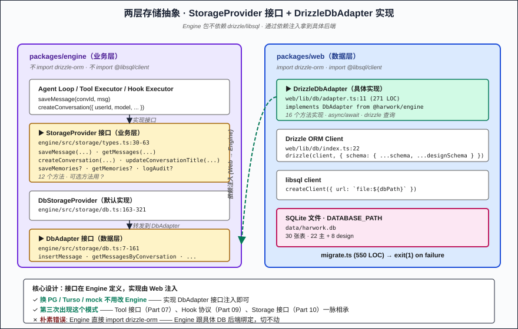
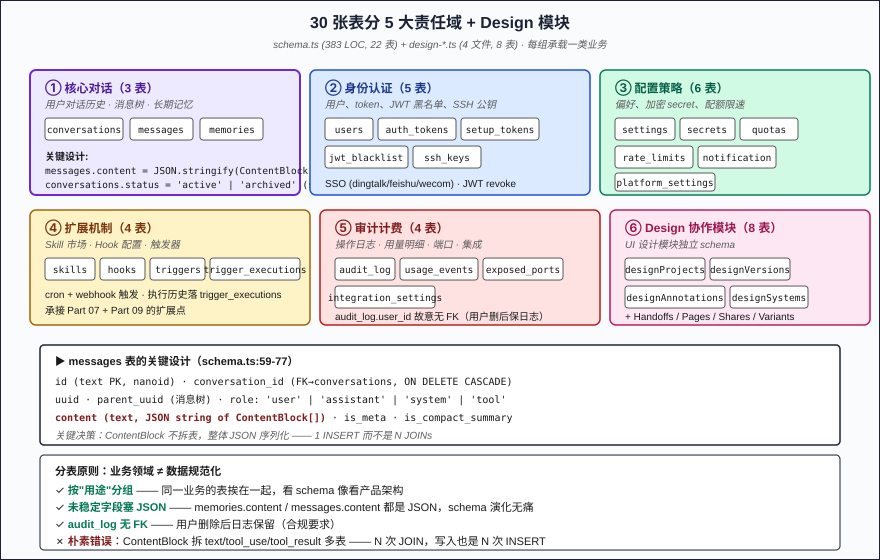
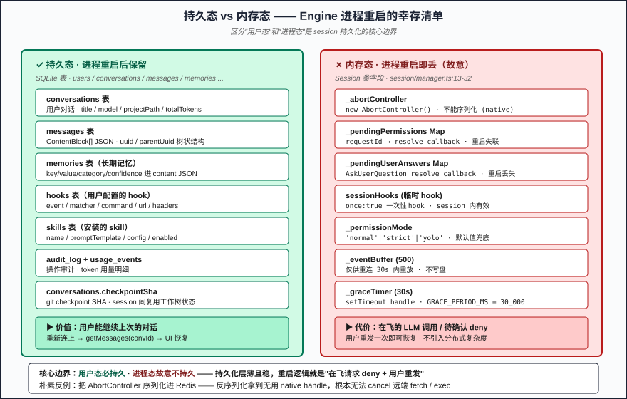

# Part 10: Session Persistence — where Conversation / Message / Memory actually live

> Part 09 covered how hooks inject user code. The next question is obvious: user closes the tab, container pauses, Engine restarts — **can the next session continue the conversation?** This part unpacks HarWork's 30-table SQLite + Drizzle ORM persistence layer (**`schema.ts` 383 LOC + `adapter.ts` 271 LOC + `migrate.ts` 550 LOC**). The more valuable finding than "use SQLite for chats" is: **session runtime state — AbortController / pending permission resolvers / event buffer / permissionMode — HarWork deliberately does NOT persist**. Engine process restart = all in-flight requests deny, but conversation history is intact. That's an intentional line between "process lifecycle" and "user-visible state."

## Problem Statement

Making an agent "remember" the prior conversation sounds direct but actually solves five problems:

1. **What to store?** — ContentBlock[] is nested (text / tool_use / tool_result / thinking); messages are tree-shaped (parentUuid points to parent). How does that fit a relational database?
2. **Which database?** — Self-hosted Postgres is heavy (ops cost); Redis isn't durable (power outage = data loss); SQLite single-node is fine but can it scale horizontally?
3. **How does schema evolve?** — Add a column after launch — how do old rows migrate? Down migration? Recovery from a crash mid-migration?
4. **Persist session runtime state?** — AbortController, pending Promise resolvers, in-memory Maps — none of these serialize across processes. Hard-persisting them only stores corpses.
5. **How does Engine stay decoupled from the DB?** — Engine runs in a container; backend could be SQLite / libsql / Turso / Postgres. How does Engine avoid binding to a specific one?

All five matter. HarWork's answers live in **`packages/web/lib/db/` (1401 LOC TypeScript / 8 files, 30 tables)** + **`packages/engine/src/storage/` (384 LOC / 2 files, storage abstraction layer)**, with the core being: **Drizzle ORM + libsql + SQLite backend + Engine StorageProvider interface abstraction + content stored as a JSON string + 30s grace period + AbortController/pending NOT persisted at all**.

## Why Naive Approaches Fail

**Naive 1: split ContentBlock into multiple tables.** Table for text, table for tool_use, table for tool_response — an LLM message with N blocks means N INSERTs and N JOINs to read it back. **Relational normalization over nested structures explodes complexity.**

**Naive 2: use better-sqlite3's sync API.** Single-process sync I/O is fast in microbenchmarks, but Engine runs the agent loop as an async generator ([Part 03](03-agent-loop-async-generator.md)) — sync-blocking I/O stalls the entire yield chain. **Sync I/O in Node async ecosystem is an anti-pattern.**

**Naive 3: run `drizzle-kit migrate` on every startup.** drizzle-kit is a CLI tool, not a production runtime. Running `npx drizzle-kit migrate` at boot adds a container step, adds a CI step, has no rollback story. **Migration should be part of the code, not part of deployment.**

**Naive 4: serialize AbortController into Redis.** AbortController is a native object, can't `JSON.stringify`. Fall back to a `sessionId → cancellation_requested` boolean — but how do you cancel an in-flight fetch / exec? **Cross-process cancellation = redesign the protocol.**

**Naive 5: Engine imports Drizzle directly.** Engine becomes bound to SQLite/libsql; switching to Postgres means rewriting Engine. **Leaked abstraction = backend coupling = can't swap.**

HarWork's answer: **StorageProvider interface (Engine side) + DrizzleDbAdapter implementation (Web side) + ContentBlock JSON.stringify into messages.content + libsql async client + versioned idempotent migration + session runtime state entirely in-memory + 30s grace period for reconnect**.

## Core Solution: Two-Layer Storage Abstraction + 30 Tables + In-Memory Sessions

### Responsibility split across 30 SQLite tables (`schema.ts`)

Main schema 22 tables + design module 8 tables = 30 total, grouped by purpose:

| Group | Tables | Purpose |
|---|---|---|
| **Core conversation** | conversations, messages, memories | User chat history, message tree, long-term memory |
| **Identity & auth** | users, auth_tokens, setup_tokens, jwt_blacklist, ssh_keys | Users, tokens, JWT blacklist, SSH public keys |
| **Config & policy** | settings, secrets, notification_config, quotas, rate_limits, platform_settings | Preferences, encrypted secrets, quotas + rate limits |
| **Extension** | skills, hooks, triggers, trigger_executions | Skill market, hook config, triggers |
| **Audit & billing** | audit_log, usage_events, exposed_ports, integration_settings | Operation audit, usage events, ports, integrations |
| **Design module** | designProjects, designVersions, designAnnotations, designSystems, designHandoffs, designPages, designShares, designVariants | UI collaboration module — 8 dedicated tables |

The `conversations` table is the core (`schema.ts:21-42`), columns include `id` (nanoid) / `userId` (FK→users) / `model` / `projectPath` / `source` ('cli'|'web'|'trigger') / `status` ('active'|'archived' — **soft delete**) / `totalTokens` / `totalCostUsd` / `checkpointSha`. The `messages` table (`schema.ts:59-77`) — the key is **content stored as a JSON string**:

```typescript
content: text('content').notNull(), // JSON string: ContentBlock[]
isMeta: integer('is_meta', { mode: 'boolean' }).notNull().default(false),
isCompactSummary: integer('is_compact_summary', { mode: 'boolean' })
  .notNull()
  .default(false),
```

`parentUuid` column models the message tree (reply chain); `isCompactSummary` marks compact products (the output of [Part 04](04-context-compaction-5-tiers.md) lands here); `isMeta` marks system-injected messages (not fed to LLM but shown to the user).

### Two-layer storage abstraction (`engine/src/storage/types.ts` + `web/lib/db/adapter.ts`)

Engine doesn't know about SQLite, doesn't know about Drizzle, doesn't know about libsql. Engine only defines two interfaces:

```typescript
// engine/src/storage/types.ts:30-63
export interface StorageProvider {
  saveMessage(conversationId: string, msg: Message): Promise<void>
  getMessages(conversationId: string): Promise<Message[]>
  createConversation(params: CreateConversationParams): Promise<string>
  updateConversationTitle(conversationId: string, title: string): Promise<void>
  updateConversationUsage(conversationId: string, tokens: number, costUsd: number): Promise<void>
  saveMemories?(userId: string, conversationId: string, entries: MemoryEntry[]): Promise<void>
  getMemories?(userId: string): Promise<MemoryEntry[]>
  // ... 12 methods total
}
```

```typescript
// engine/src/storage/db.ts:7-161
export interface DbAdapter {
  insertMessage(row: { ... }): void | Promise<void>
  getMessagesByConversation(conversationId: string): Array<{ ... }> | Promise<...>
  // ... 16 low-level SQL operations
}
```

**StorageProvider is the business-layer interface** ("save a message"); **DbAdapter is the data-layer interface** ("INSERT INTO messages..."). Engine ships `DbStorageProvider` class implementing StorageProvider, forwarding to DbAdapter (`db.ts:163-321`). The Web side implements DbAdapter:

```typescript
// web/lib/db/adapter.ts:11
export class DrizzleDbAdapter implements DbAdapter {
  constructor(private db: DB) {}

  async insertMessage(row: { ... }): Promise<void> {
    await this.db.insert(messages).values({
      id: row.id, conversationId: row.conversationId, ...
    })
  }
  // ... 16 methods implemented
}
```

**Engine package depends on neither drizzle-orm nor @libsql/client**. Swap to Postgres? Turso? In-memory mock? Implement DbAdapter and inject. This is the third time this series shows the "interface in core + implementation in sub-package" pattern ([Part 07 Tool interface](07-tool-system.md), [Part 09 Hook protocol](09-hooks-lifecycle.md), now Storage).

### The critical step: JSON.stringify content into messages (`db.ts:166-191`)

```typescript
async saveMessage(conversationId: string, msg: Message): Promise<void> {
  await this.adapter.insertMessage({
    id: nanoid(),
    conversationId,
    uuid: msg.uuid,
    parentUuid: msg.parentUuid || null,
    role: msg.type,
    content: JSON.stringify(msg.content),  // ← ContentBlock[] serialized as one string
    isMeta: msg.isMeta || false,
    isCompactSummary: msg.isCompactSummary || false,
  })
}

async getMessages(conversationId: string): Promise<Message[]> {
  const rows = await this.adapter.getMessagesByConversation(conversationId)
  return rows.map((row) => ({
    type: row.role as Message['type'],
    uuid: row.uuid,
    parentUuid: row.parentUuid ?? undefined,
    timestamp: row.createdAt?.getTime() || Date.now(),
    content: JSON.parse(row.content),  // ← parsed back on read
    isMeta: row.isMeta,
    isCompactSummary: row.isCompactSummary,
  })) as Message[]
}
```

**ContentBlock[] stored as a JSON string** — not split into text / tool_use / tool_result tables, no joins. The cost: can't SQL-query inside a block ("find all messages that called Edit" needs `LIKE '%tool_use%Edit%'`). The wins:

- 1 INSERT per write instead of N (one LLM response may have 5-10 blocks)
- 1 SELECT per read instead of one with joins
- Adding a new ContentBlock type doesn't require schema changes
- 1:1 with the LLM SDK message structure — no information loss across serialization

**This is the reverse of ORM normalization: when something can be a document, don't split it into tables**. Outside of OLTP-friendly reasons, the split has no benefit.

### Session runtime state: **deliberately NOT persisted** (`session/manager.ts:13-32`)

```typescript
export class Session {
  readonly userId: string
  private connections = new Set<WebSocketLike>()
  private _abortController = new AbortController()        // ← can't serialize
  private _isAgentRunning = false                          // ← process state
  private _lastActivityAt = Date.now()                     // ← in-memory timer
  private _containerId: string | null = null
  readonly sessionAllowedTools: SessionAllowEntry[] = []   // ← in-memory list
  sessionHooks: HooksConfig = {}                           // ← in-memory hooks config
  private _pendingPermissions = new Map<...>()             // ← resolve callbacks
  private _pendingUserAnswers = new Map<...>()             // ← resolve callbacks
  private _permissionMode: PermissionMode = 'normal'       // ← in-memory
  private _graceTimer: ReturnType<typeof setTimeout> | null = null
  private _eventBuffer = new EventBuffer(500)              // ← reconnect replay only
  private static GRACE_PERIOD_MS = 30_000                  // ← 30 s grace
}
```

**Not a single one of these fields hits the DB**. What happens on Engine process restart?

- ✗ In-flight LLM request (abortController.signal is a native object) → **lost**
- ✗ Pending permission (yes/no waiting on user click) → **abort() triggers 'deny', current call rejected**
- ✗ Pending user answer (AskUserQuestion modal) → **abort() triggers rejected**
- ✗ sessionHooks (user-added temporary hooks) → **lost**
- ✗ permissionMode (current session's mode override) → **resets to default 'normal'**
- ✗ Event buffer (queued events) → **lost, but conversation messages are already in DB**
- ✓ conversations table → **kept**
- ✓ messages table → **kept**

The cost of process restart is "in-flight requests lost, history intact." **User reconnects WebSocket, resends the last message, continues the chat**. This is the same boundary the series has held since [Part 03 Agent Loop](03-agent-loop-async-generator.md) through [Part 09 Hooks](09-hooks-lifecycle.md): **LLM calls are transactional and not persisted; user text history is persisted**.

## Key Implementation Details

Five non-obvious details:

**1. Migration runs synchronously before drizzle client is created (`web/lib/db/index.ts:12-26`)**

```typescript
import { migrateDatabase } from './migrate'

const dbPath = process.env.DATABASE_PATH || join(process.cwd(), 'data', 'harwork.db')
mkdirSync(join(dbPath, '..'), { recursive: true })

const _migrated = migrateDatabase().catch((err) => {
  console.error('DATABASE MIGRATION FAILED:', err)
  process.exit(1)  // ← migration failure → exit the process
})

const client = createClient({ url: `file:${dbPath}` })
export const db = drizzle(client, { schema: { ...schema, ...designSchema } })
export const migrationReady = _migrated
```

**Key design: migration failure → `process.exit(1)`**. No partial migrations tolerated, no app runs against an inconsistent schema. `migrationReady` is a Promise; critical DB access can await it for guaranteed schema readiness. **Migration is part of the code, not part of the deployment.**

**2. addColumnsIfMissing's tolerant semantics (`migrate.ts:24-35`)**

```typescript
async function addColumnsIfMissing(
  client: Client,
  columns: Array<{ table: string; column: string; type: string }>,
): Promise<void> {
  for (const { table, column, type } of columns) {
    try {
      await client.execute(`ALTER TABLE "${table}" ADD COLUMN "${column}" ${type}`)
    } catch (e: any) {
      if (!e.message?.includes('duplicate column')) throw e  // ← duplicate column ≠ error
    }
  }
}
```

This is the heart of idempotent migration — **only the "column already exists" specific error is swallowed**. Any other SQL error (typo, FK conflict) re-throws normally. This "narrow exemption" pattern is far safer than `try { ... } catch { /* ignore */ }`.

**3. Dual-write + tolerant fallback on usage_events (`adapter.ts:107-132`)**

```typescript
async insertUsageEventByConversation(conversationId, tokens, costUsd) {
  const row = await this.db.select({ userId, source }).from(conversations)
    .where(eq(conversations.id, conversationId)).get()
  if (!row?.userId) return

  try {
    await this.db.insert(usageEvents).values({ ... })
  } catch {
    // Backward-compatible: usage_events may not exist before migration.
  }
}
```

Every conversation usage update **dual-writes to the usage_events detail table** ("summary + ledger" pattern). The ledger table was added later — old DBs may not have it — so the catch swallows the error, **letting new functionality not block old users**. First explicit graceful-degradation pattern in the series.

**4. Long-term memory stored as JSON (`adapter.ts:154-170`)**

```typescript
async insertMemory(row: { ... category: string; confidence: number }) {
  await this.db.insert(memories).values({
    id: row.id,
    userId: row.userId,
    conversationId: row.conversationId,
    content: JSON.stringify({       // ← again: business fields in JSON
      key: row.key,
      value: row.value,
      category: row.category,
      confidence: row.confidence,
    }),
    source: 'auto',
  })
}
```

The memories table (`schema.ts:196-209`) has only `content` / `source` / `userId` / `conversationId` as business columns. `key` / `value` / `category` / `confidence` all live in JSON inside content. **Why not split into 4 columns?** Because long-term memory's format is still evolving ([Part 06](06-long-term-memory.md) showed fact/preference/context/correction classifications were still being tuned), so JSON keeps flexibility. **Use JSON for unstable domains; split into columns once they stabilize** — a common schema-evolution technique.

**5. 30-second grace period — disconnect ≠ abort (`session/manager.ts:82-93`)**

```typescript
removeConnection(ws: WebSocketLike): void {
  this.connections.delete(ws)
  if (this.connections.size === 0 && this._isAgentRunning) {
    this._graceTimer = setTimeout(() => {
      this._graceTimer = null
      if (this.connections.size === 0 && this._isAgentRunning) {
        this.abort()  // ← only abort if still nobody back after 30s
      }
    }, Session.GRACE_PERIOD_MS)  // 30_000
  }
}
```

WebSocket disconnect **does not** immediately cancel the agent loop. Reconnect within 30s → `addConnection()` clears the timer → agent keeps running. **User switches Wi-Fi, closes laptop briefly, hits Cmd-R — none of those interrupt the loop**. Combined with EventBuffer(500) buffering events, the reconnected client can replay the last 500 events to reconcile UI state. Foreshadowing for [Part 12](12-websocket-30s-grace), but the grace-period implementation lives right here in session/manager.ts.

## Counterintuitive Conclusion

> **The correct boundary for session persistence isn't "store everything" — it's "separate process state from user state."** AbortController / pending Promise resolvers / event buffer / permissionMode are **process state, deliberately not persisted** — lost on process restart. conversation / message / memory / hook config are **user state, must be persisted**. Once these two boundaries are drawn, the entire persistence layer's complexity collapses: process restart logic becomes "in-flight requests drop, user resends," and there's no need for Redis, distributed state, saga / outbox / event sourcing.

Put differently: **forcing process state to persist = disaster**. Serialize AbortController and on the next boot you deserialize an unusable native handle; persist a pending Promise and where does the resolver live after a process swap; cache EventBuffer to disk and do you really replay it on restart? **Every piece of runtime state that "feels like it should be persisted" is a state contamination source on closer inspection**. HarWork goes the other way — **what shouldn't persist, just don't persist** — and the storage layer becomes shockingly thin yet shockingly stable in production.

The most counterintuitive part: **ContentBlock[] stored as a JSON string**. Textbook ORM normalization wants you to split into N tables; HarWork inverts it — **if it can be JSON, make it JSON**. The cost is no SQL queries inside blocks, but **the agent system doesn't need to query block internals** (message lookup by conversation/user suffices). **Align the ORM to the LLM protocol structure; don't force the LLM protocol to adapt to ORM normalization.**

## Three Production Pitfalls

**Pitfall 1: using better-sqlite3's sync API for Engine.** Sync API is fast in unit tests and benchmarks, but Engine streams events via async generator ([Part 03](03-agent-loop-async-generator.md)). Sync I/O blocks the event loop → streamed events queue up → UI freezes for the user. HarWork picks `@libsql/client` async driver (`web/lib/db/index.ts:22`) + drizzle-orm async APIs, **every DB op is awaited**.

**Pitfall 2: awaiting every audit / usage / message DB write synchronously.** A single agent run yields tens of events; awaiting every INSERT visibly delays the LLM stream. HarWork streams messages (saveMessage as each arrives) but audit_log goes through a batched async channel. The more aggressive move: push audit_log via `setImmediate` to the next tick, off the main path.

**Pitfall 3: `drizzle-kit migrate` in the deploy stage.** "Run migration at deploy time" is the 12-factor textbook play, but in containerized scenarios **runtime migration is what makes the image launchable anywhere**. HarWork picks runtime migration (`web/lib/db/index.ts:17` awaits before db client creation) + versioned tracker table (MIGRATIONS array in migrate.ts:38), with exit(1) on failure. **Give the image + DB path → launch and go, no extra steps.**

## Figures

1. 
2. 
3. 

## Next Article

→ Part 11: Per-User Persistent Docker — pause/unpause saves 13s cold-start

Session data is sorted; next we cover the container side: each user is bound to a long-lived Docker container (not a new container per request); idle containers `docker pause` to freeze CPU while keeping memory mapping; 30 minutes idle triggers auto-pause; user returns and `docker unpause` instantly wakes — **cold start 13.7s → warm wake 0.2s**. Covers the container lifecycle, SessionManager's idle sweep scheduler, and why pause beats stop.

---

📌 Series reading map: [reading-map.md](../reading-map.md)
🔗 中文版: [zh/10-session-storage.md](../zh/10-session-storage.md)
