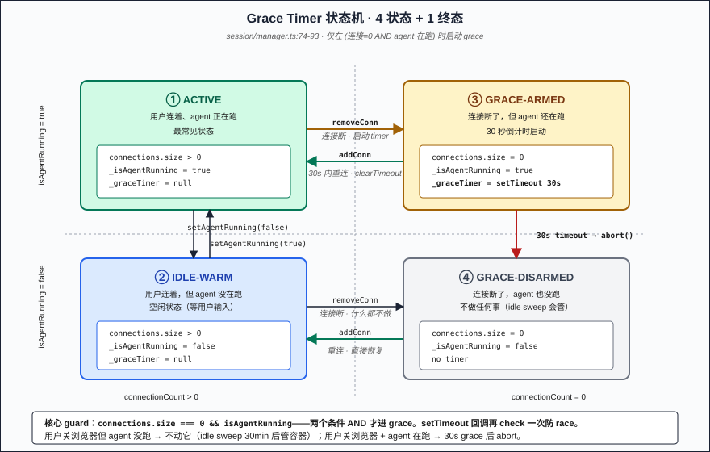
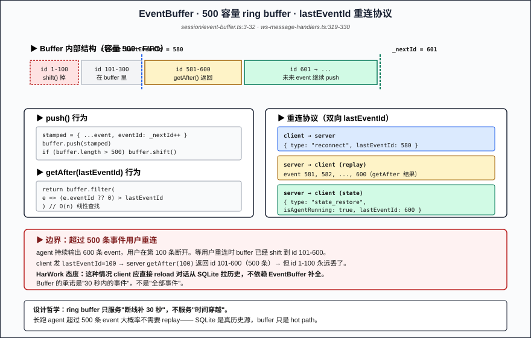
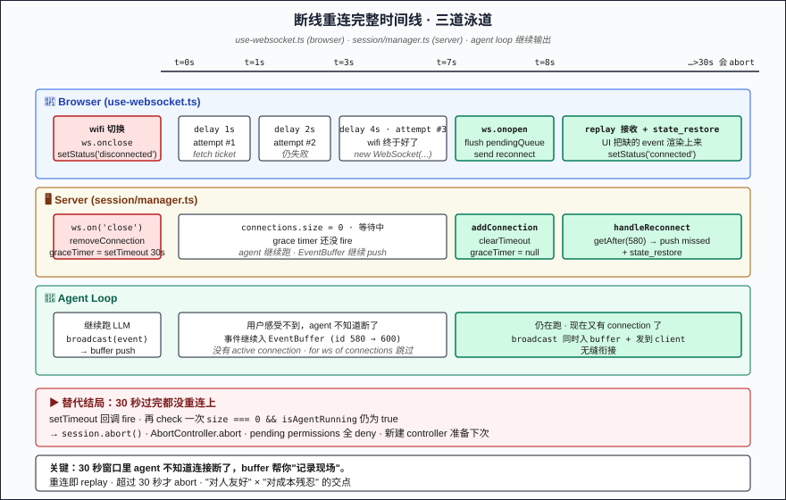

# Part 12: WebSocket 30-Second Grace — Switching Wifi Doesn't Interrupt the Agent

> Part 10 parked conversation history in SQLite. Part 11 paused the container after 30 minutes idle. This post switches to the layer in between — **the WebSocket connection between front-end and back-end**. The agent is running, the user closes the laptop / switches wifi / hits Cmd-R — the connection drops. **Should the agent loop abort immediately?** HarWork's answer: **wait 30 seconds**. Reconnect within 30 seconds and pick up seamlessly; truly gone past 30 seconds and only then abort. This post dissects the four-piece set in `session/manager.ts` — grace timer + EventBuffer(500) + front-end exponential backoff + dual ping/pong heartbeat — focused on **why "delayed abort" beats both "abort immediately" and "never abort"**.

## Problem Statement

The relationship between WebSocket connection and agent is subtle:

1. **What if the connection drops while the agent is running?** Abort immediately? Lose 30 seconds of progress just because the user switched wifi? Never abort? User closes the browser and walks away while you keep burning tokens?
2. **How do you fill in the events missed during disconnect?** The agent streamed 20 events in those 5 seconds — after reconnect the browser shows a half-finished output. How do you fill in the gap?
3. **How do you tell "really disconnected" from "just twitching"?** TCP connection looks alive but is actually dead (NAT timeout, wifi handoff, phone lock) — you need active heartbeat probing.
4. **How big should the server-side event buffer be?** Too small and you can't replay; too large and memory explodes (N users × M events × ~1KB each).
5. **What about user actions during disconnect?** User typed a message right as wifi dropped — drop it, or queue it for reconnect?

The five questions together = the core problem HarWork solves: **make the agent experience feel reliable when the network isn't**. The answer lives in `packages/engine/src/session/manager.ts`'s grace timer + EventBuffer + `packages/web/hooks/use-websocket.ts`'s exponential backoff, with the core being: **30s delayed abort + 500-event ring buffer + reconnect with lastEventId protocol replay + client 25s / server 30s dual heartbeat + pendingQueue for messages during disconnect**.

## Why Naive Approaches Fail

**Naive 1: Abort the agent immediately on disconnect.** Simple and brutal. But user network is fragile: subway 4G/5G handoff, wifi packet loss, laptop sleeping 5 seconds. Every blip kills the agent = every blip makes the user start over. **LLM call takes 10 seconds, an agent loop iteration takes 30 — users can't afford this kind of interruption.**

**Naive 2: Don't care about disconnects, let the agent run to completion.** Resource waste — user closed the browser and walked away but you're still calling LLMs, deducting tokens, holding container memory. **In an agent system's cost structure, "output nobody watches" is pure cost, not output.**

**Naive 3: Cache all stream events waiting for reconnect.** Memory explosion. A long agent run outputs hundreds of events, 1–5KB each, times 1000 online users = GB-scale RAM sitting there waiting for reconnects. **Event streams can't be cached unbounded.**

**Naive 4: On reconnect, replay from the very start of the conversation.** Front-end has to re-parse dozens of stream events and re-render every tool call. **What users see is a flickering "replay animation" — not "seamless continuation."**

**Naive 5: Trust only the TCP connection state.** TCP's "connection is alive" and "peer process is alive" are two different things — NAT timeout sends no notification, wifi handoff is invisible to the client, laptop sleep makes the socket look normal but the OS froze it long ago. **Heartbeat is application-layer aliveness above the network layer. Skip it and you die.**

HarWork's answer: **driven by user actions** — connection drops → grace timer 30-second countdown → reconnect within 30s? Cancel timer, replay missed events → grace expires? Real abort of the agent. Events use an EventBuffer ring buffer (500 cap), with monotonically increasing eventId. On reconnect, client sends its lastEventId and server pushes everything after.

## Core Solution: 30s grace timer + EventBuffer(500) + bidirectional heartbeat

### Grace timer state machine (`session/manager.ts:74-93`)

```typescript
addConnection(ws: WebSocketLike): void {
  this.connections.add(ws)
  if (this._graceTimer) {              // ← reconnected: cancel grace
    clearTimeout(this._graceTimer)
    this._graceTimer = null
  }
}

removeConnection(ws: WebSocketLike): void {
  this.connections.delete(ws)
  // Critical guard: only enter grace if "all connections dropped AND agent is running"
  if (this.connections.size === 0 && this._isAgentRunning) {
    this._graceTimer = setTimeout(() => {
      this._graceTimer = null
      // After 30s, double-check — user might have reconnected
      if (this.connections.size === 0 && this._isAgentRunning) {
        this.abort()
      }
    }, Session.GRACE_PERIOD_MS)         // ← 30_000ms
  }
}
```

**Three core points**:
1. **Grace only arms if the agent is running** — agent not running means there's nothing worth protecting when a connection drops
2. **Reconnect = cancel** — `addConnection`'s first action is clearTimeout, so faster reconnect is always better (front-end uses exponential backoff starting at 1s)
3. **Double-check inside the setTimeout callback** — the user might reconnect at second 29.9, so we must re-verify before firing abort (race condition guard)

### EventBuffer: 500-event ring buffer (`session/event-buffer.ts:3-32`)

```typescript
export class EventBuffer {
  private buffer: StreamEvent[] = []
  private _nextId = 1
  private capacity: number

  constructor(capacity = 500) { this.capacity = capacity }

  push(event: StreamEvent): StreamEvent {
    const stamped = { ...event, eventId: this._nextId++ }
    this.buffer.push(stamped)
    if (this.buffer.length > this.capacity) {
      this.buffer.shift()                    // ← FIFO drop
    }
    return stamped
  }

  getAfter(eventId: number): StreamEvent[] {
    return this.buffer.filter((e) => (e.eventId ?? 0) > eventId)
  }
}
```

**Three key details**:
- **eventId monotonically increasing from 1** — `_nextId++` never decrements, reconnect indexing is by this ID
- **500-cap is a ring buffer** — overflow `shift()`s the oldest, **for long-running agents that emit more than 500 events, the early ones can't be filled back in** (see "Pitfall 3" below)
- **getAfter is a filter, not a slice** — linear search, O(n) not O(1). Fine at 500 scale, but if someone bumps this to 5000+ they need to rewrite

### Broadcast: buffer and broadcast are the same action (`session/manager.ts:95-101`)

```typescript
broadcast(event: StreamEvent): void {
  const stamped = this._eventBuffer.push(event)  // ← buffer-push assigns eventId
  const data = JSON.stringify(stamped)
  for (const ws of this.connections) {           // ← push to every current connection
    ws.send(data)
  }
}
```

**Buffering and distributing aren't two steps — they're one atomic action**. Which means: the buffer holds exactly the sequence of events that have already gone out, so when we replay after reconnect, the content matches what the client received before (minus duplicates, which the client auto-deduplicates via its own lastEventId).

### Reconnect protocol: bidirectional lastEventId (`ws-message-handlers.ts:319-330`)

```typescript
function handleReconnect(msg: any, ctx: MessageHandlerContext): void {
  const lastEventId = Number(msg.lastEventId) || 0
  const missed = ctx.session.getEventsSince(lastEventId)
  for (const event of missed) {
    ctx.ws.send(JSON.stringify(event))           // ← push all the missed events
  }
  ctx.ws.send(JSON.stringify({
    type: 'state_restore',
    isAgentRunning: ctx.session.isAgentRunning,
    lastEventId: ctx.session.lastEventId,
  }))
}
```

**The protocol is**:
1. After client reconnects, the first message is `{type:'reconnect', lastEventId:<the last one I saw>}`
2. Server checks the EventBuffer and pushes everything `> lastEventId`
3. After pushing, send a `state_restore` frame telling client "is the agent still running, what's the current latest eventId" — front-end uses this to update UI (keep showing streaming or flip to idle)

### Front-end: exponential backoff + 25s heartbeat (`web/hooks/use-websocket.ts:12, 86-92, 132-146`)

```typescript
const RECONNECT_DELAYS = [1000, 2000, 4000, 8000, 16000]
const MAX_RECONNECT_ATTEMPTS = 10

// after onopen:
const keepalive = setInterval(() => {
  if (ws.readyState === WebSocket.OPEN) {
    ws.send(JSON.stringify({ type: 'ping' }))    // ← client-initiated ping every 25s
  }
}, 25_000)

// scheduleReconnect:
const delay = RECONNECT_DELAYS[Math.min(attempt, RECONNECT_DELAYS.length - 1)]
```

**Two seemingly unrelated numbers tell the same story**: server heartbeat is 30s (`ws-server.ts:184`), client ping is 25s — **client ping is always earlier than the server's "peer not responding" check**. That means even if the client network is half-broken and server pings are lost in flight, the client's own outbound ping keeps TCP alive, **so neither side rushes to declare the other dead**.

```typescript
ws.onopen = () => {
  // ...
  if (lastEventIdRef.current > 0) {              // ← previously disconnected, has a lastEventId
    ws.send(JSON.stringify({ type: 'reconnect', lastEventId: lastEventIdRef.current }))
  }
}
```

**Only send `reconnect` if `lastEventIdRef > 0`** — first-time connection skips this. The reconnect protocol is layered on top of normal connection as "if you've been here before."

### Server heartbeat + force terminate (`ws-server.ts:182-194`)

```typescript
let alive = true
const heartbeat = setInterval(() => {
  if (!alive) {
    clearInterval(heartbeat)
    ws.terminate()                                // ← force-kill socket
    return
  }
  alive = false
  ws.ping()
}, 30_000)
ws.on('pong', () => { alive = true })
```

**Classic dual-flag heartbeat pattern**: every 30s, ping once, mark alive=false, wait for pong to set alive=true. Next 30s tick and alive is still false? The socket is dead, `terminate` kills it directly — **don't wait for OS TCP keepalive (default 2 hours 11 minutes), you can't afford that**.

## Key Implementation Details

Five details that aren't obvious from a casual read:

**1. Grace timer doesn't fire on ordinary disconnect — only when "agent is running" (`manager.ts:85`)**

```typescript
if (this.connections.size === 0 && this._isAgentRunning) {
```

User closes the browser but agent isn't running? Do nothing — the session stays for when they return, the container is still up, the buffer is still there, the idle sweep will pause the container 30 minutes later. **The grace timer is built for "interrupting an agent," not for "cleaning up sessions."** Those two lifecycles are separated in HarWork.

**2. abort() really kills, but AbortController gets replaced (`manager.ts:110-117`)**

```typescript
abort(): void {
  if (this._graceTimer) { clearTimeout(this._graceTimer); this._graceTimer = null }
  this._abortController.abort()                  // ← signal fired
  this._isAgentRunning = false
  this._abortController = new AbortController()  // ← immediately swap in a fresh one
  // ...
}
```

**After abort, immediately `new AbortController()`** — the next chat needs a clean signal. If you don't swap, the second chat gets a signal that's already aborted, and the agent exits the moment it starts. This "use once, swap" pattern is standard AbortController usage but easy to miss.

**3. Pending permission requests get rejected too (`manager.ts:118-127`)**

```typescript
for (const [, resolve] of this._pendingPermissions) {
  resolve('deny')                                // ← reject every promise waiting for Allow
}
this._pendingPermissions.clear()
for (const [, resolve] of this._pendingUserAnswers) {
  resolve({ rejected: true, feedback: 'Aborted' })
}
```

Agent paused at the "ask user for permission" step waiting for the [Part 08](08-permissions-sandbox.md) permission UI — connection drops, grace expires, abort fires. The waiting promises can't just hang; resolve them all to 'deny' so the agent can take its "rejected" branch and exit cleanly. **Abort isn't only firing the signal — it must also clear every "waiting on user" state.**

**4. Client pendingQueue buffers sends during disconnect (`use-websocket.ts:75-78, 157-163`)**

```typescript
const send = useCallback((msg: WsMessage) => {
  if (wsRef.current?.readyState === WebSocket.OPEN) {
    wsRef.current.send(JSON.stringify(msg))
  } else {
    pendingQueueRef.current.push(msg)            // ← disconnected → queue it
  }
}, [])

// after onopen:
for (const queued of pendingQueueRef.current) {
  ws.send(JSON.stringify(queued))                // ← flush everything
}
```

User typed a message right as wifi switched? React already called send but the WebSocket isn't reconnected yet — **into pendingQueue to wait for reconnect**. After successful reconnect, `onopen` flushes the queue first, then sends reconnect. **This guarantees that the "user-perceived" continuity isn't broken by network blips.**

**5. clearEventBuffer hooks into the idle sweep (`manager.ts:253`)**

```typescript
// inside idle sweep:
session.clearEventBuffer()                        // ← pause container AND clear buffer
```

When Part 11's idle sweep triggers a container pause, it also clears the buffer. **Why?** Because 30 minutes of no connections means the user isn't coming back to watch "events from 30 minutes ago" — keeping them just wastes 500 slots. Reconnecting later is the start of a new conversation; buffer starts at 0.

## Counterintuitive Conclusion

> **"30 seconds" is neither "good enough" nor "industry standard" — it's the intersection of "human-friendly window" × "cost-cruel boundary"**. Shorter than 30s: user wifi blips trigger abort, experience breaks; longer than 30s: user walked away half a minute ago and you're still burning LLM tokens, cost goes out of control. The essence of 30s is admitting that "minor network wobble" and "user really walked away" don't have a clean boundary — **you use a fixed window to cover the fuzzy zone**.

Even more counterintuitive: **this 30-second window is bound to "agent is running."** Agent isn't running and you close the browser — I do nothing (grace doesn't arm), and 30 minutes later idle sweep pauses the container — that's minute-scale. Agent IS running and you close the browser — I wait 30 seconds to make sure you're not coming back, then abort — that's second-scale. **The two lifecycles use two time scales because they protect entirely different costs**: container memory is a continuous small bill (a 30-minute decision is fine), LLM tokens are big-grain spike bills (must respond in seconds). Putting "when to abort agent" and "when to pause container" on the same time scale means either bad UX (agent runs for 30 minutes after the user left) or memory waste (containers don't pause for 30 seconds).

The most counterintuitive engineering detail: **EventBuffer is a ring buffer, not an unbounded list**. Intuition says "for replay completeness, store everything" — but HarWork accepts the reality that "anything past 500 falls off the back," **because a long-running agent past 500 events probably doesn't need replay anyway**. User wifi blip = you need to fill in seconds, dozens of events at most; user comes back half an hour later = you shouldn't replay 30 minutes of output, that should come from SQLite conversation history not the buffer. **The ring buffer's design philosophy is "serve disconnect scenarios only, not time travel."**

## Three Production Pitfalls

**Pitfall 1: Assuming the front-end `lastEventId` accurately reflects what the client has seen.** `use-websocket.ts:115` updates `lastEventIdRef` inside `onmessage` — but React state hasn't updated, UI hasn't rendered. **If the client crashes between these** (onmessage ran, but OOM'd before React rendered), lastEventId has advanced but the user UI is still old. On reconnect, the client says "I saw X," the server believes it and doesn't send X again — **the user actually didn't see it**. HarWork's compromise: trust lastEventId first, manual refresh pulls conversation history (Part 10 path) when there's a UI discrepancy. The perfect solution is both sides report lastEventId and take the min, but it's complex and low-yield.

**Pitfall 2: MAX_RECONNECT_ATTEMPTS=10, max delay 16s.** Math: 1+2+4+8+16+16+16+16+16+16 = 111 seconds, give up after ~2 minutes. **User closes laptop 5 minutes, comes back, page shows "Connection lost" — manual refresh needed**. This is intentional: more than 2 minutes is basically "user walked away," automatic retries become counterproductive (phone wakes every second to retry). But the UI must explicitly say "please refresh" — HarWork's `use-chat.ts:313` 'Connection lost, reconnecting…' message should flip to 'Please refresh' once attempts are exhausted.

**Pitfall 3: Long-running agent emits more than 500 events, user reconnects, head is lost.** EventBuffer is a ring buffer — agent emits 600 events while user is gone, user reconnects after the 500th event has been pushed, the first 100 have been `shift()`'d. **On reconnect, client sees agent output "starting from the middle"** — no thinking, tool calls start half-finished. HarWork's stance is: in this case the client should reload the conversation from SQLite for full history, not rely on EventBuffer to fill in. **Buffer's promise is "events in the last 30 seconds," not "all events."** If the agent emits 500+ events in 30 seconds, the agent is too chatty, not the buffer too small.

## Figures

1. 
2. 
3. 

## Next Article

→ Part 13: Multi-model routing — mixing Claude / DeepSeek / Qwen / OpenAI

The WebSocket-connection side is done. Next we switch back into the agent internals: how does HarWork let one conversation use Claude for thinking, DeepSeek for code, and Qwen for Chinese reasoning? How does ModelRegistry register, how are different providers' stream protocols unified, how is token billing tracked per model? That's the model abstraction layer sitting above the connection layer.

---

📌 Reading map: [reading-map.md](../reading-map.md)
🔗 中文版本: [zh/12-websocket-30s-grace.md](../zh/12-websocket-30s-grace.md)
