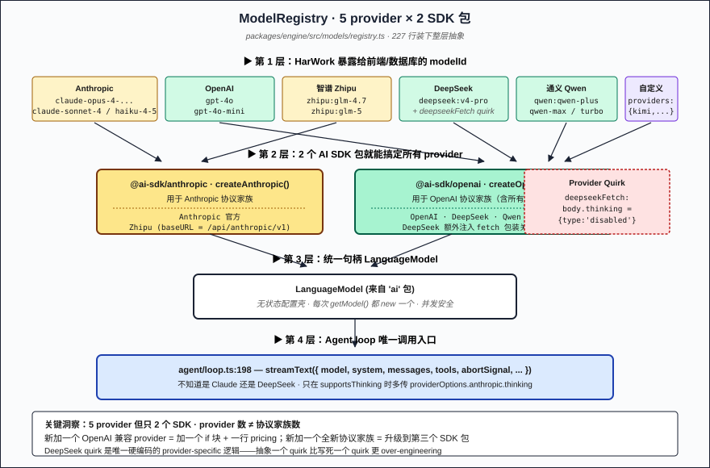
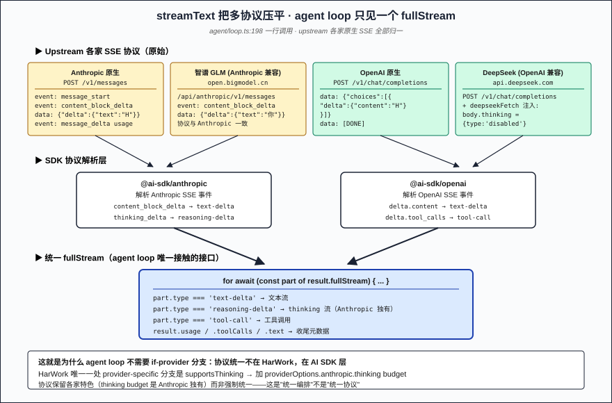
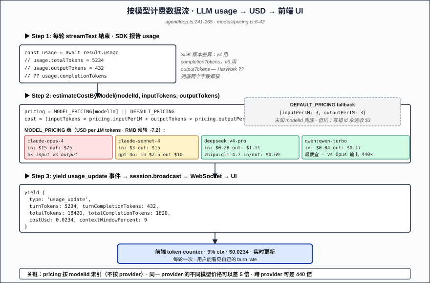

# Part 13: Multi-Model Routing — Mixing Claude / DeepSeek / Qwen In the Same Harness

> The first 12 posts assumed the agent had one model behind it. Anyone who's shipped a commercial agent knows otherwise: **use Claude Opus for hard thinking, Haiku for cheap dialogue, Qwen for Chinese prompts, DeepSeek for SQL/data crunching at one-tenth the cost**. "Multi-model routing" sounds like a major project — provider adapters, stream-protocol conversion, per-model token accounting — but the **actual "model abstraction layer" in HarWork is ~230 lines** (`packages/engine/src/models/registry.ts`). This post explains why it can be that short: **because 90% of Chinese LLM providers have already wrapped themselves to look like the OpenAI API, and the remaining 10% is handled by the AI SDK** — HarWork doesn't write adapters, it writes an "API-key gate plus namespace prefix."

**Jump to:** [Problem](#problem-statement) · [Naive approaches](#why-naive-approaches-fail) · [5 blocks](#core-solution-5-hardcoded-blocks--ai-sdk--namespace-prefixes) · [Implementation](#key-implementation-details) · [Counterintuitive](#counterintuitive-conclusion) · [Pitfalls](#three-production-pitfalls)

## Problem Statement

To get "swap the model behind an agent" right, you have to answer 5 questions:

1. **How do you unify stream protocols across providers?** Anthropic's `event: message_delta` and OpenAI's `data: {"choices":[...]}` look nothing alike — what does the agent loop receive?
2. **How do you make picking "Claude Sonnet 4" go to Anthropic and picking "DeepSeek V4" go to deepseek.com?** How is provider encoded in modelId?
3. **How do you bill tokens per model?** Claude Opus output costs $75 / M tokens, Qwen Turbo is $0.17 — a 440× spread. **The pricing table MUST be indexed by modelId**.
4. **Adding a new provider (say Moonshot Kimi) — how many files change?** 10 or 1?
5. **What happens when a provider hiccups (bad key, rate limit, network jitter)?** Fail-fast or fallback?

These 5 questions = the contract an agent harness must fulfill at the model-abstraction layer. HarWork's answer lives in 4 places: `models/registry.ts` (registration + factory), `models/pricing.ts` (pricing table), `agent/loop.ts:198` — the one line `streamText({model, ...})` — (unified call site), and `dev-server.ts:218-229` (startup env → instance). **The core bet is: don't write your own abstraction layer; trust that the Vercel AI SDK already flattened this layer for you**.

## Why Naive Approaches Fail

**Naive 1: Write a per-provider adapter class with a unified interface.** Looks "professional," is actually a pit. AI SDK has already made `streamText({model})` provider-agnostic — wrapping it again means **wrapping an already-unified interface into "your idea of unified."** **The downside isn't effort — it's lock-in**: SDK upgrades break your wrapper (v4 → v5 renamed `completionTokens` to `outputTokens`; HarWork at `agent/loop.ts:248` uses `??` to accept both).

**Naive 2: Let the front-end call provider APIs directly.** Where do you put the key? In the browser it leaks; in the BFF you'd write N stream proxies. **In HarWork all LLM calls go through engine — that's a security precondition, non-negotiable**.

**Naive 3: Route everything through OpenAI-compatible (use LiteLLM-style conversion).** Sounds like a free lunch, but **you lose capabilities that only exist in Anthropic's protocol**: thinking budget, prompt caching, document source. **Multi-model isn't about "unifying protocols," it's about "unifying orchestration" — protocols keep each provider's special powers**.

**Naive 4: Namespace modelIds per provider, route by baseURL.** e.g. `gpt-4o` always goes to a configured baseURL. **Problem**: user's "custom provider" might also call its model `gpt-4o` — how do you tell them apart? HarWork uses `provider:upstreamId` two-segment naming (`zhipu:glm-4.7` / `deepseek:v4-pro`); the prefix IS the routing key. **Anthropic and OpenAI models stay naked** (`claude-opus-4-20250514` / `gpt-4o`) for historical reasons, but they're "known brands," collision risk is low.

**Naive 5: Dynamic registration — user uploads a key at runtime, instantly available.** HarWork doesn't do this: models are **injected once at process startup from env vars** (`dev-server.ts:218`), no runtime hot-reload. **Why**: probeAll runs once at startup; supporting runtime adds means re-probing on every change, state machine complexity goes up an order of magnitude. **Trading 10× state-machine complexity for a low-frequency need isn't worth it**. To add a provider: restart engine.

HarWork's actual choices: **5-way hardcoded registry + AI SDK takes stream protocol + startup-time probe marks `available` + namespace-prefix routing**. Let's unpack.

## Core Solution: 5 Hardcoded Blocks + AI SDK + Namespace Prefixes

### Registry constructor: 5 `if (config.xxxApiKey)` blocks (`models/registry.ts:72-164`)

```typescript
constructor(config: ModelRegistryConfig = {}) {
  if (config.anthropicApiKey) {
    const anthropic = createAnthropic({ apiKey: config.anthropicApiKey, ... })
    for (const info of ANTHROPIC_MODELS) {
      this.models.set(info.id, { info, factory: () => anthropic(info.id) })
    }
  }

  if (config.openaiApiKey) {
    const openai = createOpenAI({ apiKey: config.openaiApiKey, ... })
    for (const info of OPENAI_MODELS) {
      this.models.set(info.id, { info, factory: () => openai.chat(info.id) })
    }
  }

  if (config.zhipuApiKey) {
    const zhipu = createAnthropic({                       // ← note: createAnthropic, not OpenAI
      apiKey: config.zhipuApiKey,
      baseURL: config.zhipuBaseURL || 'https://open.bigmodel.cn/api/anthropic/v1',
    })
    for (const model of ZHIPU_MODELS) {
      this.models.set(model.id, { info: model, factory: () => zhipu(model.upstreamId) })
    }
  }

  if (config.deepseekApiKey) {
    const deepseekFetch: typeof globalThis.fetch = async (input, init) => {
      if (init?.body && typeof init.body === 'string') {
        try {
          const body = JSON.parse(init.body)
          body.thinking = { type: 'disabled' }              // ← force-disable thinking
          init = { ...init, body: JSON.stringify(body) }
        } catch { /* pass through */ }
      }
      return globalThis.fetch(input, init)
    }
    const deepseek = createOpenAI({
      apiKey: config.deepseekApiKey,
      baseURL: config.deepseekBaseURL || 'https://api.deepseek.com',
      fetch: deepseekFetch,                                 // ← inject custom fetch
    } as any)
    for (const model of DEEPSEEK_MODELS) {
      this.models.set(model.id, { info: model, factory: () => deepseek.chat(model.upstreamId) })
    }
  }
  // qwen similar — OpenAI-compatible, baseURL points to Aliyun dashscope
}
```

**5 design points worth calling out**:

1. **No API key, no registration** — providers without a key never appear in `listModels()`. Front-end naturally won't show them, eliminating "user picked a model whose key I never set."
2. **Each model is `{ info, factory }`** — the factory is lazy, `anthropic(modelId)` only runs when called, so **the same model can be used concurrently** (AI SDK model instances are stateless).
3. **Zhipu uses `createAnthropic`, not `createOpenAI`** — Zhipu GLM exposes an Anthropic-compatible endpoint (`/api/anthropic/v1`), so HarWork reuses `@ai-sdk/anthropic` — **one fewer adapter**. But your modelId still says `zhipu:glm-4.7`; the fact that "it talks Anthropic protocol" is an implementation detail not leaked outward.
4. **The DeepSeek `deepseekFetch` wrapper**: DeepSeek's API doesn't accept some standard OpenAI fields, but the AI SDK enables thinking mode by default, causing 400s. **Fix**: intercept fetch, parse body, force-inject `thinking: { type: 'disabled' }`, send. **This is the genuine provider quirk** — SDK can't abstract it away, so it lives in the registry.
5. **`upstreamId` vs `id`**: `{ id: 'deepseek:v4-pro', upstreamId: 'deepseek-v4-pro' }` — the former is a stable id HarWork exposes to UI/DB, the latter is the actual string sent to the API. **A provider renaming (V4 → V4.1) only touches upstreamId, not id, so default_model rows in the DB don't need migration**.

### `getModel(modelId)`: pull factory, construct on demand (`models/registry.ts:166-172`)

```typescript
getModel(modelId: string): LanguageModel {
  const entry = this.models.get(modelId)
  if (!entry) {
    throw new Error(`Model "${modelId}" not found or not available. Available: ${[...this.models.keys()].join(', ')}`)
  }
  return entry.factory()
}
```

**No caching** — every `getModel` calls `new` on a `LanguageModel`. Looks wasteful, but AI SDK's model instance is just a config shell (baseURL, headers, apiKey), construction cost is negligible. **Upside**: per-request state like abort signals can't leak across requests.

### Agent loop call: one `streamText({model})` line (`agent/loop.ts:198-209`)

```typescript
result = streamText({
  model,                                                    // ← any provider, all are LanguageModel
  system,
  messages: aiMessages,
  tools: aiTools,
  abortSignal: context.abortController.signal,
  ...(params.supportsThinking ? {
    providerOptions: {
      anthropic: { thinking: { type: 'enabled', budgetTokens: 10000 } },
    },
  } : {}),
})
```

**The entire agent loop doesn't know whether it's talking to Claude or DeepSeek** — `model` is the SDK's unified handle. **The one provider-specific branch is `params.supportsThinking`**: only models flagged `supportsThinking` (`registry.ts:41-42`: Opus 4 / Sonnet 4) get `providerOptions.anthropic.thinking` injected. This bit reflects the tradeoff of **"unified protocol but preserve special features"**: thinking budget is Anthropic-only; the SDK puts it in `providerOptions.anthropic` namespace — **use it if you want, otherwise don't pass it**.

### Per-model billing: one table in `pricing.ts` (`models/pricing.ts:6-42`)

```typescript
const MODEL_PRICING: Record<string, ModelPricing> = {
  'claude-opus-4-20250514':    { inputPer1M: 15,   outputPer1M: 75 },
  'claude-sonnet-4-20250514':  { inputPer1M: 3,    outputPer1M: 15 },
  'claude-haiku-4-5-20251001': { inputPer1M: 0.80, outputPer1M: 4 },
  'gpt-4o':      { inputPer1M: 2.50, outputPer1M: 10 },
  'gpt-4o-mini': { inputPer1M: 0.15, outputPer1M: 0.60 },
  'zhipu:glm-4.7':   { inputPer1M: 0.69, outputPer1M: 0.69 },
  'zhipu:glm-5':     { inputPer1M: 1.39, outputPer1M: 1.39 },
  'deepseek:v4-pro': { inputPer1M: 0.28, outputPer1M: 1.11 },
  'qwen:qwen-plus':  { inputPer1M: 0.11, outputPer1M: 0.56 },
  'qwen:qwen-max':   { inputPer1M: 1.39, outputPer1M: 5.56 },
  'qwen:qwen-turbo': { inputPer1M: 0.04, outputPer1M: 0.17 },
}

const DEFAULT_PRICING: ModelPricing = { inputPer1M: 3, outputPer1M: 3 }

export function estimateCostByModel(modelId, inputTokens, outputTokens): number {
  const pricing = MODEL_PRICING[modelId] || DEFAULT_PRICING
  return (inputTokens * pricing.inputPer1M + outputTokens * pricing.outputPer1M) / 1_000_000
}
```

**4 points worth unpacking**:
- **Unified USD**: Chinese models' RMB prices pre-converted at ~7.2 — not at runtime — **avoids exchange-rate drift turning a historical $5 bill into "$4.9 today."**
- **inputPer1M ≠ outputPer1M**: every LLM output costs more than input; Claude Opus 5×, Qwen Max 4×, GPT-4o-mini 4× — **this is why trimming output tokens (compact system prompt, structured outputs) saves more than trimming input**.
- **DeepSeek has a 4× input/output gap** (0.28 / 1.11) but **Zhipu is 1:1** (0.69 / 0.69). **Chinese providers don't share a billing model**; pricing must be per-model, not per-provider.
- **DEFAULT_PRICING = {3, 3}**: a registered model not listed in pricing.ts still gets billed — at GPT-4o input rate. **A safety net** — won't zero out billing because of a typo'd modelId.

### `agent/loop.ts:241-265` emits `usage_update` per turn to the front-end

```typescript
usage = await result.usage
const turnTotalTokens = usage.totalTokens ?? 0
totalTokens += turnTotalTokens
const turnCompletionTokens = (usage as any).outputTokens ?? (usage as any).completionTokens ?? 0
totalCompletionTokens += turnCompletionTokens

yield {
  type: 'usage_update' as const,
  turnTokens: usage.totalTokens ?? 0,
  turnCompletionTokens,
  totalTokens,
  totalCompletionTokens,
  costUsd: estimateCostByModel(modelId, totalTokens - totalCompletionTokens, totalCompletionTokens),
  contextWindowPercent: turnCtxPercent,
}
```

**The line `outputTokens ?? completionTokens` carries the scar of an AI SDK version migration** — v4 called it `completionTokens`, v5 calls it `outputTokens`. HarWork doesn't pin a version, **it accepts both**. This is a rare "both are right" branch in engineering — driven by the reality that SDK evolution leaves transitional periods.

### Probing model availability: once at startup (`models/registry.ts:199-225`)

```typescript
async probeModel(modelId: string): Promise<boolean> {
  const entry = this.models.get(modelId)
  if (!entry) return false
  try {
    const model = entry.factory()
    await generateText({ model, prompt: 'hi', maxOutputTokens: 1 })
    entry.info.available = true
    return true
  } catch (err) {
    entry.info.available = false
    return false
  }
}

async probeAll(): Promise<void> {
  await Promise.allSettled([...this.models.keys()].map((id) => this.probeModel(id)))
}
```

**`dev-server.ts:652` runs probeAll at startup**, sending each model a 1-token `hi` — cost is basically zero, but **you know within 5 seconds whether each key/baseURL actually works**. `Promise.allSettled` ensures one bad provider doesn't poison the rest. `info.available = false` directly drives a "model unavailable" greyed-out state in the UI.

## Key Implementation Details

Five details that aren't obvious from a casual read:

**1. Custom providers go through the `providers` field — they don't compete with the 5 built-ins (`registry.ts:143-163`)**

```typescript
if (config.providers) {
  for (const [providerName, providerConfig] of Object.entries(config.providers)) {
    const provider = createOpenAI({ apiKey: providerConfig.apiKey, baseURL: providerConfig.baseURL })
    for (const model of providerConfig.models) {
      this.models.set(model.id, {
        info: { id: model.id, displayName: model.displayName, provider: providerName, ... },
        factory: () => provider.chat(model.id),
      })
    }
  }
}
```

A user's "custom OpenAI-compatible provider" (e.g. their company's private GLM-4 deployment, or Moonshot Kimi) injects via `providers: { kimi: { apiKey, baseURL, models: [...] } }`. **The id is user-defined, no forced `provider:` prefix** — HarWork trusts the user to manage their own namespace.

**2. `streamText`'s `abortSignal` is the session's controller (`loop.ts:203`)**

```typescript
abortSignal: context.abortController.signal,
```

This single line ties [Part 12](12-websocket-30s-grace.md)'s 30s grace abort to LLM calls — **grace expires → abort() → session.abortController.abort() → AI SDK receives signal → upstream HTTP request cancelled → tokens stop accruing**. **Without this line, the 30-second grace is empty**.

**3. `ws-message-handlers.ts:533-543` passes contextWindow and supportsThinking down to agent loop**

```typescript
const modelInfo = modelRegistry.getModelInfo(modelId)
const agentParams = createAgentParams({
  model,
  ...
  contextWindow: modelInfo?.contextWindow,
  supportsThinking: modelInfo?.supportsThinking,
})
```

`contextWindow` decides when [agent loop compaction](03-agent-loop-async-generator.md) triggers — Claude 200K vs DeepSeek 131K hit the threshold at different times. `supportsThinking` decides whether to pass `providerOptions.anthropic.thinking` to streamText. **The registry is not just a table — it's a table with metadata**: swap the model, the agent loop's behavior follows (smaller contextWindow → earlier compaction; no thinking support → no budgetTokens).

**4. Fallback chain: user default → first system available (`openai-compat.ts:131-145`)**

```typescript
if (!modelId || modelId === 'auto') {
  const preferred = await getDefaultModel(userId)
  if (preferred && modelRegistry.listModels().some(m => m.id === preferred && m.available !== false)) {
    modelId = preferred
  } else {
    modelId = modelRegistry.listModels().find(m => m.available !== false)?.id
  }
}
```

On the OpenAI-compatible path, `model: "auto"` triggers auto-selection: **first check the user's `default_model` setting, then fall back to the first available model in the registry**. This is for "I don't care which model — whichever works" IDE integrations (Cursor / VS Code Continue talk over the OpenAI-compatible API). **From the user's perspective, model selection disappears — HarWork picks for them**.

**5. Startup log reports which models were registered (`dev-server.ts:650`)**

```typescript
console.log(`[engine] Models registered: ${modelRegistry.listModels().map((m) => m.id).join(', ') || '(none — set API keys)'}`)
```

First time you boot HarWork, **this line tells you whether your env vars are wired up**. If it prints `(none — set API keys)`, none of the 5 env vars match — your `.env.local` is missing something. **This kind of self-diagnostic log is table stakes for an agent harness — don't make the user read source to guess config**.

## Counterintuitive Conclusion

> [!IMPORTANT]
> **"Multi-model support" effort scales with the number of protocol families, not provider count**. HarWork supports 5 providers (Anthropic / OpenAI / Zhipu / DeepSeek / Qwen) but only calls 2 SDK packages (`@ai-sdk/anthropic` + `@ai-sdk/openai`) — because **Zhipu speaks Anthropic-compatible, DeepSeek/Qwen speak OpenAI-compatible**. registry.ts fits all providers in ~230 lines because **the SDK has already abstracted "protocol family," and HarWork only writes "which key drives which SDK"**. If some day a provider arrives that's neither OpenAI- nor Anthropic-compatible (e.g. early Google Gemini), registry.ts will grow — not because of a new provider, but because of a new **protocol family**.

Even more counterintuitive: **HarWork has no `ModelProvider` interface, no `BaseProvider` abstract class, no "plugin system."** If you've used LiteLLM or LangChain's provider plugin system, this registry will feel too "flat." But HarWork bets that **Vercel AI SDK is already the de facto standard — binding tightly to it beats writing your own "anti-lock-in" abstraction**. The cost is occasional `??` fallbacks when SDK evolves (`outputTokens ?? completionTokens`); the gain is **adding a provider = one `if` block + one pricing row**.

The most counterintuitive engineering detail: **provider quirks aren't abstracted — they're hardcoded**. The DeepSeek `deepseekFetch` wrapper (force-disable thinking) is the **most "hardcoded" piece in the entire HarWork codebase** — and it **should** be. Trying to abstract it into a "GenericProviderQuirkHook" would only make the code harder to read — a quirk is a concrete failure of one provider, generalization is pointless. **Abstractions serve multiple similar concrete cases; with one concrete case, the abstraction itself is over-engineering**.

## Three Production Pitfalls

> [!WARNING]
> **Pitfall 1 — probeAll has non-zero startup cost, and you may not notice.**
>
> Each model = one `hi` call = a few tokens — 10 models = a few dozen tokens = ~$0.01. **One boot is negligible; but if your CI runs e2e tests with repeated engine restarts, hundreds per day, you'll see a "mysterious $1" appear on the bill**. HarWork doesn't gate it (`skipProbe: process.env.NODE_ENV === 'test'`). In CI you should use a mock provider or set ANTHROPIC_API_KEY etc. to empty so the registry skips registration entirely.

> [!WARNING]
> **Pitfall 2 — DEFAULT_PRICING `{3, 3}` is a silent trap.**
>
> You register a new model but forget to add the pricing.ts row — billing keeps running, but the price is always $3 / M tokens forever. **The user can't see the discrepancy** until the end-of-month reconciliation shows token count matching but dollar amount off — this kind of bug is painful to track down. **HarWork should `console.warn` inside `estimateCostByModel` when the DEFAULT branch fires**, but it doesn't today. **If you fork HarWork and add a custom provider, remember to add the pricing row at the same time**.

> [!WARNING]
> **Pitfall 3 — Dynamic providers aren't excluded from probe.**
>
> The `if (config.providers)` branch (`registry.ts:143-163`) — are its custom models auto-included in `probeAll`? **Yes** — `probeAll` iterates `this.models.keys()`, which includes everything registered. But if the user misconfigures the baseURL or key for a custom provider, it gets marked `available = false` within 5 seconds, UI immediately greys out. **The pit is from the user's POV**: they configured Kimi via env, booted, see Kimi greyed out in UI — **they don't know probe failed**, they assume HarWork is broken. **Production should expose probeAll's logs (`[models] xxx: unavailable — <msg>`) in an admin UI, not just `console.warn`**, but it currently doesn't.

## Figures

1. 
2. 
3. 

## Next

→ Part 14: AI Artifact Rendering — making agent-emitted code / charts / mockups interactive

The model abstraction layer is done. But the "artifacts" the agent produces — React components, Mermaid diagrams, SVGs, HTML pages — how do they turn from a token stream into a clickable preview? HarWork's design canvas (the design-collab flow you may be using) sits on a real artifact rendering pipeline: streamText code blocks compile live, iframe isolation, user edits in the preview round-trip back to the agent. Next post: the "visible agent."

---

📌 Reading map: [reading-map.md](../reading-map.md)
🔗 中文版本: [zh/13-multi-model-routing.md](../zh/13-multi-model-routing.md)
