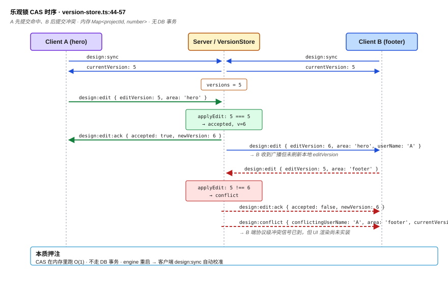
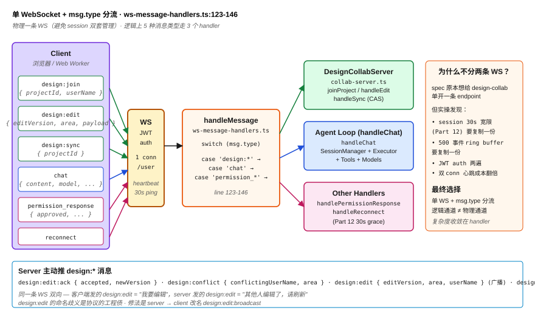
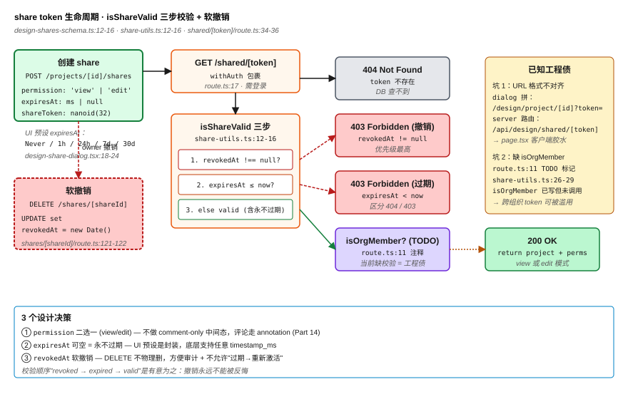

# Part 16: Optimistic Locking Real-Time Collaboration — Why AI Artifact Multi-User Collab Shouldn't Use CRDT

> The better AI artifacts (design mocks, PRDs, HTML) get, the higher the demand for concurrent editing. Google Docs uses OT, Figma uses CRDT, Notion uses OT — these are all collaboration models for **plain documents**. But every edit to an AI artifact carries **semantic decisions** ("I made this button red because it's the brand primary"); auto-merge = handing semantic judgment to a diff algorithm — disaster. HarWork picks the opposite path: **optimistic locking + explicit conflict + no auto-merge**. This post unpacks 4 things: why 5 naive approaches all fail, why HarWork's optimistic lock lives in **memory** not the DB, how the WebSocket `design:*` message protocol's 5 types are demultiplexed, and how org-level share tokens combine TTL + soft revoke — totaling **1146 lines of code** (`collab-server.ts` 183 + `version-store.ts` 89 + `ws-server.ts` 280 + `versions/route.ts` 108 + `shares/route.ts` 108 + `shares/[shareId]/route.ts` 129 + `shared/[token]/route.ts` 62 + `design-share-dialog.tsx` 138 + `share-utils.ts` 29 + `design-shares-schema.ts` 20).

**Jump to:** [Problem](#problem-statement) · [Naive approaches](#why-naive-approaches-fail) · [4-step pipeline](#core-solution-4-step-pipeline) · [Counterintuitive](#counter-intuitive-takeaway) · [Pitfalls](#three-production-traps)

## Problem Statement

Multi-user collaboration on AI artifacts has to answer 4 core questions:

1. **A edits hero, B simultaneously edits footer — at commit time, who overrides whom?** Can't be last-write-wins (lost work), can't lock B out (terrible UX).
2. **CRDT is great for plain documents — why does it fail on AI artifacts?** Yjs / Automerge auto-merge text by character diff — but in AI artifacts "red button" and "green button" are semantically opposed; the merge algorithm doesn't understand.
3. **Does the optimistic lock live in the DB or in memory?** DB is durable but every update needs a transaction with bad performance; memory is fast but zeroes out on restart. Which does HarWork pick?
4. **How do non-platform users participate?** Design mocks need to be shareable to clients and bosses — but you can't onboard each of them. How do you build "anonymous view / comment" without leaving a backdoor?

These 4 = the engineering contract for AI artifact multi-user collab. HarWork's answers live in 5 places: `packages/engine/src/design-collab/version-store.ts` (the core optimistic lock), `packages/engine/src/design-collab/collab-server.ts` (the WS collab server), `packages/engine/src/ws-message-handlers.ts` (message demux), `packages/web/lib/db/design-shares-schema.ts` (the share token table), `packages/web/components/design/design-share-dialog.tsx` (share UI).

## Why Naive Approaches Fail

**Naive 1: pessimistic lock.** A edits hero → lock the entire project, B blocked. UX disaster — B can't edit footer either. **Deadlock is worse**: A goes offline mid-edit, lock release relies on TTL, nobody can move during TTL. **1990s enterprise-software move.**

**Naive 2: CRDT (Yjs / Automerge).** Someone always says "that's what these were built for." Until this scenario: A changes button to red (brand primary), B changes it to green (a11y contrast) — CRDT character diff might merge to `#FF8800` (interpolation), which **neither user wants**. **In plain documents "two people typing 'hello' = no conflict" holds; in AI artifacts "two semantic decisions must be one or the other" holds**. Root cause: **edit granularity is character, semantic granularity is decision**.

**Naive 3: last-write-wins.** A commits first, B commits second, B overrides. But every edit to an AI artifact can be **half an hour of discussion + 3 rounds of AI iteration**; losing one = losing half an hour. **No production AI collab platform picks LWW**.

**Naive 4: DB row-level optimistic lock (version column + transaction).** Add `expectedVersion` to `design_versions`, each update does `WHERE version = ?` transaction, increments if matched. 3 pitfalls: (1) **transaction overhead** — every button color tweak writes a DB transaction; at 10-user concurrency SQLite locks the table; (2) **latency** — HTTP roundtrip 200-500ms before you know the write failed; (3) **broadcast disconnect** — DB version changed but other clients don't know; you either poll or layer WebSocket on top — at which point why not just go WS straight through?

**Naive 5: Operational Transform (the Google Docs approach).** Requires server-side "transformation functions" — given operations A and B, how do we transform A to apply after B. **"Operations" on AI artifacts are hard to formalize** ("make the button red" = what OT op?); the transformation functions can't be auto-derived. **OT works in Google Docs because the op set is tiny (insert/delete char); AI artifact ops are an open set**.

HarWork's actual choice: **in-memory VersionStore + WebSocket protocol-level conflict notification + explicit refusal to auto-merge + org-level share token**. Let's unpack.

## Core Solution: 4-Step Pipeline

### Step 1: in-memory version number + CAS semantics in `applyEdit` (`version-store.ts:44-57`)

```typescript
applyEdit(projectId: string, editVersion: number): EditApplyResult {
  const current = this.getVersion(projectId)

  if (editVersion === current) {
    const newVersion = this.incrementVersion(projectId)
    return { accepted: true, newVersion }
  }

  return {
    accepted: false,
    currentVersion: current,
    conflict: true,
  }
}
```

**The entire optimistic lock in 14 lines**. Semantics = CPU CAS (compare-and-swap): client sends `editVersion`, server compares to current; equal → +1, unequal → tell the client "the version you read is stale." **A `Map<projectId, number>` instead of DB row-level locking** — `version-store.ts:21`'s `versions` is **pure in-memory**. 3 reasons: (1) collab version numbers don't need persistence — when engine restarts all WS reconnect; clients send `design:sync` (`collab-server.ts:143-150`) to re-fetch; (2) Map O(1) is 1000× faster than SQLite transactions; (3) it doesn't get confused with the DB's `design_versions.versionNumber` (snapshot history) — **the former is "concurrent conflict detection," the latter is "version snapshot,"** two distinct concepts.

### Step 2: 5 WebSocket message types, demuxed (`ws-message-handlers.ts:123-141`)

```typescript
if (msg.type === 'design:join') {
  // Client enters project; server pushes design:sync to sync current version
  ctx.designCollabServer.joinProject(ctx.ws, ctx.userId, userName, projectId)
}

if (msg.type === 'design:edit') {
  // Client submits edit; server runs CAS and broadcasts or returns conflict
  ctx.designCollabServer.handleEdit(msg as DesignEditMessage)
}

if (msg.type === 'design:sync') {
  // Client-initiated sync (called on reconnect)
  ctx.designCollabServer.handleSync(ctx.ws, msg.projectId)
}
```

5 message types (`collab-server.ts:4-41`): client sends **`design:join` / `design:edit` / `design:sync`**; server sends **`design:edit:ack` / `design:conflict` / `design:edit` (broadcast to others)**. **`design:edit` means different things from client and from server**: client-sent = "I want to edit"; server-sent = "somebody else edited."

**Why not actually run a separate WebSocket channel**: the spec originally wanted to give `design-collab` its own WS endpoint, but in practice opening 2 WS for the same user makes session management messy (Part 12's 30s grace period and the 500-event ring buffer would both need duplication). Final pick: **single WS + msg-type demux**: `msg.type === 'design:edit'` → `DesignCollabServer`, `msg.type === 'chat'` → Agent Loop (`ws-message-handlers.ts:143-146`). **Logical channels distinguished by msg type, physically one WS only**.

### Step 3: conflict notification is protocol-level, not product-level (`collab-server.ts:118-140`)

```typescript
} else {
  const lastEditor = this.versionStore.getLastEditorOfArea(projectId, area)
  const senderClient = this.findClient(projectId, userId)
  if (senderClient) {
    this.sendToClient(senderClient.ws, {
      type: 'design:edit:ack',
      projectId,
      newVersion: result.currentVersion!,
      accepted: false,
    })
    this.sendToClient(senderClient.ws, {
      type: 'design:conflict',
      projectId,
      editVersion,
      currentVersion: result.currentVersion!,
      conflictingUserId: lastEditor?.userId || 'unknown',
      conflictingUserName: this.findClientName(...) || 'Another user',
      area,
    })
  }
}
```

The server stays disciplined: (1) tell the client "submission rejected" (`design:edit:ack` `accepted: false`); (2) attach `design:conflict` with **info about the conflicting party** — who, which area, current version; (3) **does not auto-merge**. How the client displays it = product decision. Spec originally called for a UI popup letting the user choose override/discard/merge, but **the current codebase doesn't yet have the conflict UI implemented** — the message goes out, but the frontend has no React handler. **This is HarWork's biggest product gap today, but the protocol design is sound**.

`getLastEditorOfArea` (`version-store.ts:75-83`) reverse-iterates the last 50 edits (`maxHistoryPerProject = 50` at line 23) to find the previous editor of that area. **Why only 50 entries**: this isn't an audit log (that goes to the DB); it's only there to tell the conflicting party "here's who edited what you're editing" — 50 is enough to cover one active collab session window.

### Step 4: org-level share token — TTL + soft revoke + route separation (`design-shares-schema.ts` + `share-utils.ts:12-16` + `shared/[token]/route.ts:34-36`)

```typescript
// design-shares-schema.ts:12-16
permission: text('permission', { enum: ['view', 'edit'] }).notNull().default('view'),
expiresAt: integer('expires_at', { mode: 'timestamp_ms' }),
revokedAt: integer('revoked_at', { mode: 'timestamp_ms' }),

// share-utils.ts:12-16
export function isShareValid(share: ShareRecord): boolean {
  if (share.revokedAt !== null) return false
  if (share.expiresAt === null) return true
  return share.expiresAt.getTime() > Date.now()
}
```

3 design points: (1) **`permission` is view/edit binary** — no "comment-only" middle state; AI artifact comments go through annotations (Part 14); (2) **`expiresAt` is nullable = never expires** — 1h/24h/7d/30d are UI presets (`design-share-dialog.tsx:18-24`); the underlying schema supports any timestamp; (3) **`revokedAt` soft revoke** — `DELETE` doesn't physically remove (`shares/[shareId]/route.ts:121-122`), only sets `revokedAt = new Date()`, friendly for audits.

`isShareValid` check order is critical: **revoke first, then expiry, then never-expires** — revocation always wins (no "expired + reactivate" allowed). `shared/[token]/route.ts:34` calls it on every access, **returns 403 on failure not 404** — separating "token doesn't exist" (404) from "token exists but invalid" (403).

## Counter-Intuitive Takeaway

> [!IMPORTANT]
> **AI artifact multi-user collab should not use CRDT.** This goes against 10 years of collab tooling trend (Figma / Linear / Notion all racing on CRDT implementations). But CRDT's core assumption is "**edits can be auto-merged**" — an assumption that holds in plain docs (two people typing "hello" = no conflict) and design canvas positions (dragging different elements = no conflict), but **completely fails on AI artifacts**. Every edit to an AI artifact is a **semantic decision** — "I made this button red because of brand primary + user behavior data + last week's PM convo." Handing that to a diff algorithm = letting the algorithm make product judgments. **HarWork picks optimistic locking + explicit conflict, which is admitting "the collaboration unit for AI artifacts is the decision, not the character"**.

More counter-intuitive: **the optimistic lock isn't in the DB, it's in an in-memory Map**. Every textbook on optimistic locking teaches "add a version column, use a transaction" — but HarWork's `VersionStore.versions: Map<string, number>` (`version-store.ts:21`) is a pure in-memory Map. 3 wins: (1) performance — SQLite single-threaded transactions lock the table at 10-user concurrency, Map O(1) doesn't; (2) simplification — version numbers don't need persistence; **on engine restart all WS connections drop, on reconnect clients proactively `design:sync`** (`collab-server.ts:143-150`), a natural reset; (3) layering — DB's `design_versions.versionNumber` manages "snapshot history" (the linear log Part 15 unpacked); in-memory `VersionStore.versions` manages "concurrent conflict detection." **Two version numbers along two dimensions, never mixed**.

The most counter-intuitive engineering detail: **the conflict UI is protocol-level, not product-level**. `collab-server.ts:130-138` emits the `design:conflict` message with conflicting user name, area, currentVersion — protocol complete. But **the React client has no corresponding handler to render the comparison view** — the "user picks override / discard / merge" UI that the spec described is **not implemented**. This is a **deliberate engineering-order choice**: get the protocol working first, let the server side correctly determine conflict, add the UI when user volume warrants. **Many collab features die from "build the pretty UI first, then back into the protocol" — HarWork goes the other way: protocol first, UI driven by user demand**.

## Three Production Traps

> [!WARNING]
> **Pitfall 1 — engine restart wipes the VersionStore, making all clients' `editVersion` "stale."**
>
> `version-store.ts:21`'s `Map` zeros out on process restart — say the last `currentVersion` clients received was 47; after restart `versions.get('proj-X') = 0`. If a client doesn't **send `design:sync` first** and instead fires `design:edit { editVersion: 47 }`, the server compares `47 !== 0` → all conflicts. **Production cost**: after engine restart the first wave of edits all fail; users see a flood of "conflict" prompts when nobody's actually conflicting with them. **Fix**: (1) client WS onopen must send `design:join` first; the server proactively pushes `design:sync` (`collab-server.ts:68-73`) for the client to calibrate; (2) on `design:edit` failure, client auto-retries once, first sending `design:sync` then re-sending edit; (3) ultimate fix: move `versions` from memory to Redis (with TTL); engine restart no longer loses state but it still doesn't go through DB transactions.

> [!WARNING]
> **Pitfall 2 — share-dialog generates a URL format that doesn't match the server route.**
>
> `design-share-dialog.tsx:56` concatenates `${origin}/design/project/${projectId}?token=${shareToken}` (query-param style), but the server share route is `/api/design/shared/[token]/route.ts` (path style). **It currently works because** `/design/project/[id]/page.tsx` reads `searchParams.token` on the client side and then fetches `/api/design/shared/${token}` — extra hop. **Production cost**: (1) client needs extra "read query → call API" glue code; (2) when sharing to non-logged-in users, page.tsx requires login first then redirects to share — **not truly "anonymous access"**. **Fix**: either change share URL to `/design/shared/${token}` to align directly with the server route, or have page.tsx skip the auth gate when there's a token in the query.

> [!WARNING]
> **Pitfall 3 — `shared/[token]` route uses `withAuth` but lacks `isOrgMember` check.**
>
> `shared/[token]/route.ts:17` wraps `withAuth` — meaning **share tokens aren't "public links"; the user must be logged in**. Issue: the TODO comment at `route.ts:11` reads "Add isOrgMember check when multi-org is implemented" — currently **any logged-in user can use any valid share token to access projects from other orgs**. `share-utils.ts:26-29` defines `isOrgMember`, but it's **not called** in the share route. **Production cost**: org A's share token leaks to an org B employee → that B employee can see org A's design after logging in (they can't write, but seeing is beyond the intent of view permission). **Fix**: in `shared/[token]/route.ts` after line 32, add `if (!isOrgMember(request.user.orgId, share.orgId)) return 403` — 4 lines of code.

## Diagrams

1. 
2. 
3. 

## Next Up

→ Part 17: Enterprise CI/CD — canary + multi-probe auto-rollback

With collaboration solved, the next hurdle is **how one person keeps this thing running**. HarWork is a solo-maintained AI platform; each deploy can't take users down, problems must roll back in 5 minutes, and you should sleep well without 24h monitoring — these rely on a 7-piece progressive release setup: main/tag auto-build, staging→production promotion gates, phased component releases, 5%→25%→50%→100% traffic ladder, multi-probe quality gates (incl. P95 latency), exponential backoff on ladder failure, independent web/engine release channels. Next post unpacks the engineering of these 7 GitHub Actions pieces, and "why big-co CI/CD templates always break when you copy them."

---

📌 Reading map: [reading-map.md](../reading-map.md)
🔗 中文版: [zh/16-optimistic-lock-collab.md](../zh/16-optimistic-lock-collab.md)
