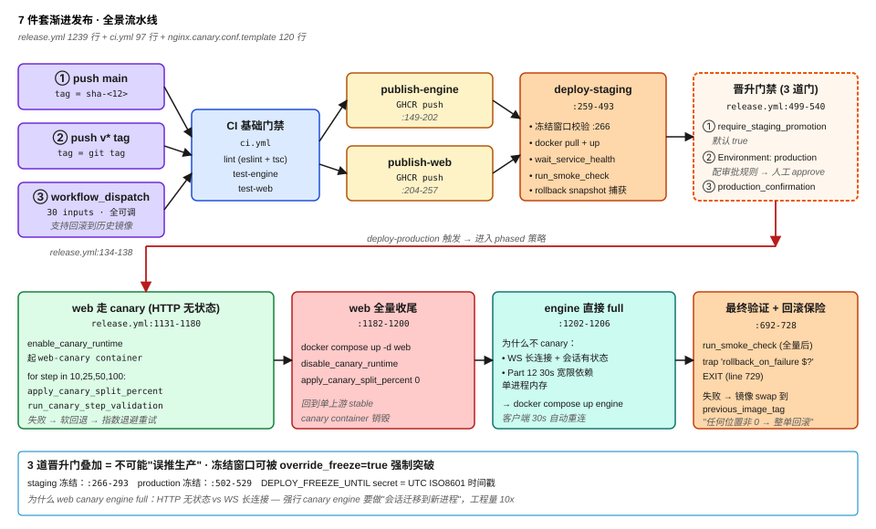
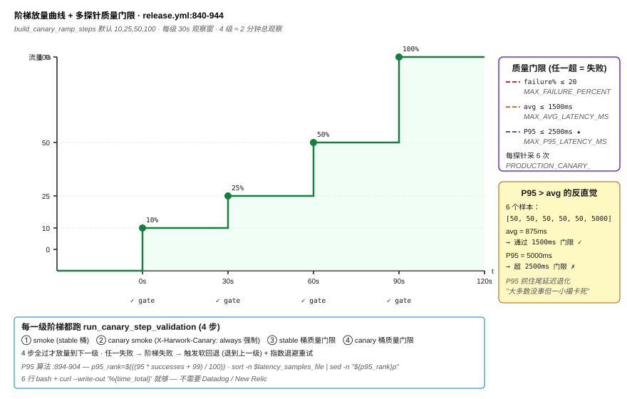
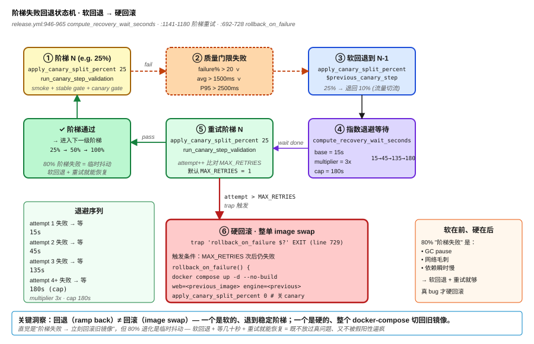

# Part 17: Enterprise CI/CD — Canary + Multi-Probe Auto-Rollback

> One person running an AI platform needs every release to answer 3 questions: don't crash users on each deploy, roll back within 5 minutes when something breaks, and sleep well without 24/7 monitoring. HarWork holds this line with a **7-piece progressive release setup** — main/tag auto-build + staging→production promotion gates + per-component release strategy + nginx split_clients traffic split + 10/25/50/100 ramp ladder + failure-rate/avg/P95 multi-probe thresholds + exponential backoff on ladder failures. **The key isn't copying big-co toolchains — it's getting the engineering pattern of progressive release right**. This post unpacks each piece's engineering details, why web goes canary while engine goes full, why P95 is more reliable than avg latency, and why ladder failures fall back before rolling back — totaling **1592 lines of infra-as-code** (`.github/workflows/release.yml` 1239 + `.github/workflows/ci.yml` 97 + `docker/nginx.canary.conf.template` 120 + `docs/release.md` 136).

## Problem Statement

A solo founder running a production-grade SaaS needs the release pipeline to solve 4 problems:

1. **Don't crash all users on every deploy.** Cutting 100% of traffic over to a new version in one shot = when the new version has a bug, everyone explodes at the same time.
2. **Roll back within 5 minutes.** Manually SSH-ing in, editing docker-compose, hand-pulling the old image tag — getting up at 3 AM and doing this in 5 minutes is hard.
3. **No 24/7 monitoring needed.** You can't rely on "someone in the group chat will yell" — one person has no "group." Automatic thresholds are the only reliable signal.
4. **Maintainable complexity.** Argo Rollouts / Spinnaker / Flagger are built for 100-person release teams. Solo maintenance cost explodes.

Together these 4 = the engineering contract for one-person enterprise-grade releases. HarWork's answers live in 4 files: `.github/workflows/release.yml` (the 7-piece main battlefield), `.github/workflows/ci.yml` (basic lint/test/build), `docker/nginx.canary.conf.template` (nginx traffic split), `docs/release.md` (release manual).

## Why Naive Approaches Fail

**Naive 1: manual SSH deploy.** Fine at first — weekly `docker pull && docker compose up -d` by memory. **Will burn by month 3**: forgot to pull a sub-image, forgot to back up the old image tag, no snapshot to recover when something goes sideways at night. **The reliability of manual ops doesn't rise with experience — it falls with fatigue.**

**Naive 2: simple `build & push`.** GitHub Action runs `docker build && docker push`; deployment relies on a server-side cron pulling `latest`. 3 pitfalls: (1) **no gates** — any failed PR merged to main gets pushed to prod; (2) **no rollback path** — `latest` overwrote the old image, the old version is gone; (3) **no quality observation window** — full traffic immediately; if nobody notices in 5 minutes, that's a 5-minute P0. **The minimum bar for production-grade CI/CD is "promotion + rollback + observation," all three.**

**Naive 3: copy big-co CI/CD templates.** Spinnaker `pipeline.json`, ArgoCD `Application`, Flagger `Canary` CRD — solo maintenance cost explodes. Spinnaker itself requires 5 microservices (clouddriver / front50 / orca / igor / gate) — **to release 1 app you first maintain 5 release tools** — backward. **Big-co tooling assumes "a release engineering team"; using it solo = self-torture.**

**Naive 4: blue-green deployment.** Blue-green = always running two full-size instances (blue is current prod, green is candidate). **On a single VPS / small cluster this doubles resources immediately** — cost doubles, release frequency gets bottlenecked by resources. **Blue-green fits "release = major event" traditional enterprises, not "2-3 releases a week" fast-iterating SaaS.**

**Naive 5: Kubernetes + Argo Rollouts.** Sounds "production-grade" — but k8s itself's operational burden (etcd backups, control-plane upgrades, CNI troubleshooting) needs a full-time SRE team. **One person, single ECS on Alibaba Cloud, docker-compose is enough; jumping to k8s = paying 1000% complexity for 1% feature value.**

HarWork's actual choice: **docker-compose + nginx split_clients + single GitHub Actions workflow + 7-piece setup.** Let's unpack.

## Core Solution: 7-Piece Progressive Release

### Piece 1: main/tag auto-trigger + multi-mode routing (`release.yml:134-138`)

```yaml
on:
  workflow_dispatch:
    inputs:
      # 30 params including image_tag / deploy_target / production_canary_percent ...
  push:
    branches: [main]
    tags: ['v*']
```

3 trigger modes take 3 paths: (1) **push main** → image tag = `sha-<12-char commit>`, auto deploy-staging (`release.yml:263`); (2) **push v\* tag** → image tag = git tag, auto staging→production promotion; (3) **workflow_dispatch** → 30 params fully tunable (including `deploy_tag` for rolling back to historical images). **The 3 modes aren't redundant — they're "daily / formal release / emergency," 3 distinct workflow scenarios.**

### Piece 2: staging → production promotion gate (`release.yml:499`)

```yaml
deploy-production:
  needs: [publish-engine, publish-web, deploy-staging]
  if: ${{ ... && ((github.event_name == 'workflow_dispatch' && (!inputs.require_staging_promotion || needs.deploy-staging.result == 'success')) || (github.event_name == 'push' && startsWith(github.ref, 'refs/tags/v') && needs.deploy-staging.result == 'success')) }}
  environment: production
```

3 gates: (1) `require_staging_promotion` (default `true`) — staging must succeed before production release; (2) **GitHub Environment: production** (`release.yml:500`) — once approval rules are configured, manual "approve" is required to proceed; (3) **manual-trigger extra requirement** `production_confirmation == "deploy-production"` (`release.yml:531-540`) — prevents misclicks. **3 stacked gates = "accidentally push to prod" is impossible.**

Freeze window (`release.yml:266-293` staging / `:502-529` production): the `DEPLOY_FREEZE_UNTIL` secret takes a UTC ISO8601 timestamp (e.g., `2026-05-20T00:00:00Z`); hitting the window means `exit 1`. **Manual trigger with `override_freeze=true` is the only way to force a release.** Monthly freeze, double-eleven freeze, on-call handover all rely on this.

### Piece 3: component-level release separation — web canary, engine full (`release.yml:1131-1206`)

In the phased strategy, web and engine paths are fully separated:

```bash
# Phase 1: web canary 10→25→50→100
if [ "$canary_percent" -gt 0 ]; then
  enable_canary_runtime "$first_canary_percent"  # start web-canary container
  for canary_step in $canary_ramp_csv; do
    apply_canary_split_percent "$canary_step"
    run_canary_step_validation                   # multi-probe threshold
  done
fi

# Phase 2: web full cutover
docker compose ... up -d --no-build web
disable_canary_runtime

# Phase 3: engine direct full
docker compose ... up -d --no-build engine ssh-gateway
```

**Why web canary, engine full**: web is HTTP stateless and nginx split_clients can split traffic naturally; engine is WebSocket long-lived + session-stateful — **forcing canary on engine requires "migrating WS sessions to the new process," and the engineering effort is 10× web canary**. Part 12 unpacked engine's 30s grace period for session resurrection — that mechanism depends on single-process memory; splitting traffic across processes breaks the premise. **So engine goes full + clients auto-reconnect within 30s** — leveraging architecture is even more stable than canary.

### Piece 4: nginx split_clients traffic split (`nginx.canary.conf.template:24-35`)

```nginx
split_clients "${remote_addr}${http_user_agent}" $harwork_split_bucket {
    __CANARY_PERCENT__% canary;
    * stable;
}

map "$harwork_force_canary:$harwork_cookie_bucket:$harwork_split_bucket" $harwork_bucket {
    "~^1:" canary;          # X-Harwork-Canary: always forced
    "~^0:canary:" canary;   # cookie sticky
    "~^0:stable:" stable;
    "~^0::canary$" canary;
    default stable;
}
```

3-layer decision priority: (1) **`X-Harwork-Canary: always` header wins** (line 13-16) — smoke probes use this to force-hit canary (`release.yml:818`), undiluted by traffic percent; (2) **`harwork_canary` cookie sticky** (line 18-22) — the same user falls into the same bucket, avoiding cross-bucket WS reconnections; (3) **`split_clients` hashes `${remote_addr}${http_user_agent}` for percent split** (line 24-27) — same IP+UA always lands in the same bucket, **not re-sampled per request**. The `__CANARY_PERCENT__` placeholder is replaced by `apply_canary_split_percent` (`release.yml:1044-1052`) via `sed`, then nginx reloads.

### Piece 5: 10/25/50/100 ramp ladder (`release.yml:989-1042` `build_canary_ramp_steps`)

Default ramp `10,25,50,100` (`release.yml:117`), truncated to the `production_canary_percent` target — target 50% → ramp becomes `10,25,50`; target 100% → full 4 levels. **Why not start at 5%**: with 6 sample requests (default) at 5%, the sampling error in nginx hash buckets is too large; 10% is the engineering sweet spot — small enough to limit blast radius, big enough for statistical signal. Each ladder interval is `phase_wait / step_count` seconds (`release.yml:1119-1128`, default 120s/4=30s per level), **total 4-level observation window ≈ 2 minutes** — 100× safer than "one-shot 100%," 720× faster than "24-hour grey release."

### Piece 6: multi-probe quality gate — failure rate / avg / **P95** (`release.yml:840-927`)

```bash
run_canary_quality_gate() {
  for probe_url in $probe_url_list; do
    # sample PRODUCTION_CANARY_SAMPLE_REQUESTS (default 6) times
    # record http_code and time_total
    failure_percent=$((failures * 100 / total))
    avg_latency_ms=$((total_latency_ms / successes))
    p95_rank=$(((95 * successes + 99) / 100))
    p95_latency_ms="$(sort -n "$latency_samples_file" | sed -n "${p95_rank}p")"

    [ "$failure_percent" -gt "$MAX_FAILURE_PERCENT" ] && return 1   # default 20%
    [ "$avg_latency_ms" -gt "$MAX_AVG_LATENCY_MS" ] && return 1     # default 1500ms
    [ "$p95_latency_ms" -gt "$MAX_P95_LATENCY_MS" ] && return 1     # default 2500ms
  done
}
```

3 thresholds **any-one-breached = ladder fails**: failure rate 20% / avg latency 1500ms / **P95 latency 2500ms**. **P95 is the core** — avg latency gets dragged down by lots of fast requests (5 × 50ms + 1 × 5000ms across 6 samples → avg = 875ms passes the 1500ms gate), but P95 = 5000ms exposes the tail-latency problem. **Only P95 catches "most users are fine but a small group is frozen" regressions.** Each probe samples 6 times (line 866-889), running once each in stable and canary header modes (`release.yml:937-942`) — **comparative validation, not single measurement**. `run_canary_step_validation` (`release.yml:929-944`) runs smoke → canary smoke → stable gate → canary gate in sequence; all 4 must pass for the ladder step to be considered passed.

### Piece 7: ladder failure soft fallback + exponential backoff retry (`release.yml:946-965`, `:1141-1180`)

```bash
compute_recovery_wait_seconds() {
  failed_attempt="$1"
  wait_seconds="$PRODUCTION_CANARY_STEP_RECOVERY_WAIT_SECONDS"  # default 15s
  if [ "$failed_attempt" -gt 1 ]; then
    i=2
    while [ "$i" -le "$failed_attempt" ]; do
      wait_seconds=$((wait_seconds * multiplier))   # default 3x
      [ "$wait_seconds" -gt "$wait_cap" ] && wait_seconds="$wait_cap"  # cap 180s
      i=$((i + 1))
    done
  fi
}
```

Failure sequence: ladder 25% fails → **fall back to 10%** (previous level `previous_canary_step`, `release.yml:1160`) → **exponential backoff wait** (15s → 45s → 135s → 180s cap) → **retry 25%** (default `PRODUCTION_CANARY_STEP_MAX_RETRIES=1`, i.e., one more retry max) → still fails → **trap fires rollback to previous image** (`release.yml:692-728` `rollback_on_failure`). **Fallback (ramp back) ≠ rollback (image swap)**: fallback is soft, retreating to the previous stable ladder; rollback is hard, swapping the entire docker-compose to the old image. **Soft first, hard later** — most regressions are "performance issues exposed by ramping too fast," so fallback suffices; only real bugs need rollback.

## Counter-Intuitive Takeaway

> **The key to one-person enterprise-grade releases isn't copying big-co toolchains — it's getting the engineering pattern of progressive release right.** Spinnaker / ArgoCD / Flagger are tools for 100-person release teams — solo use = self-torture. HarWork implements 7 pieces (canary traffic split + ramp ladder + multi-probe gates + exponential backoff fallback + auto-rollback) in **1239 lines of GitHub Actions YAML + 120 lines of nginx template**, running on a single Alibaba Cloud ECS with docker-compose. **Higher complexity isn't better — one-person maintenance demands "7 pieces done right," not "100 pieces all done wrong."**

More counter-intuitive: **P95 is more reliable than avg latency.** 99% of tutorials teach "monitor avg latency," but avg is a liar — 6 requests: 5 × 50ms + 1 × 5000ms → avg = 875ms passes the 1500ms gate, but one user waited 5 seconds. **Only P95 catches tail-latency regression**: the same samples give P95 = 5000ms, directly exceeding the 2500ms gate. HarWork computes P95 in 6 bash lines at `release.yml:894-904` using `sort -n | sed -n "${p95_rank}p"` — no Datadog / New Relic needed, **6 lines of bash + `curl --write-out '%{time_total}'` is enough**.

The most counter-intuitive engineering detail: **soft fallback before hard rollback.** Intuition says "ladder fails → roll back to old image immediately" — but HarWork doesn't do that (`release.yml:1158-1170`): on failure, first `apply_canary_split_percent "$previous_canary_step"` retreats to the previous ladder (25% fails → falls back to 10%), waits the exponential backoff seconds, retries the current ladder; only after `MAX_RETRIES` more failures does the trap fire the full rollback (`release.yml:400` `trap 'rollback_on_failure $?' EXIT`). **Why not roll back immediately**: 80% of "ladder failures" are transient noise (GC pause, network jitter, dependency hiccup) — **falling back to stable traffic + waiting a few dozen seconds + retrying** recovers. Only real bugs need rollback. **Soft first, hard later = don't miss real issues AND don't get drowned in false positives.**

## Three Production Traps

**Trap 1: the `trap 'rollback_on_failure $?' EXIT` `$?` semantics are unstable.** `release.yml:400`, `:729` both use this pattern — intent is "script exits non-zero anywhere → trap catches exit code → execute rollback." But bash's `$?` value in an EXIT trap depends on the trigger: **implicit exit from `set -e`** preserves the original code, but **explicit `exit N`** then `$?` = N in the trap, and **signal-triggered (SIGTERM)** gives `$?` = 128+signal. SSH disconnects (GitHub Actions runner network blip) trigger SIGHUP → trap sees `$?` = 129 ≠ 0 → falsely judges "deploy failed" and triggers rollback, but actually the deploy succeeded and only SSH disconnected. **Production cost**: low probability but a major incident when it happens. **Fix**: at trap entry add `[ "$exit_code" -ge 128 ] && return` — signal triggers don't roll back (GitHub Actions will retry the job); only roll back on script-logic non-zero exit.

**Trap 2: the quality gate including the stable bucket = wrongly blames the new version.** `release.yml:937-942`'s `run_canary_step_validation` runs 4 checks: smoke / canary smoke / **stable bucket quality gate** / canary bucket quality gate — any failure fails the level. Problem: **the stable bucket runs the old image**; if the old version itself has degraded (e.g., 30 days of memory leak) and the new version actually fixes it — under current logic, stable bucket exceeds P95 threshold → level fails → triggers fallback → falls back to the worse old version. **Production cost**: a good version gets dragged down by the bad old version's degradation and can never ship. **Fix**: change the stable bucket's threshold to "reference value, non-blocking" (record but don't `return 1`); only let the canary bucket's threshold decide ladder success — **compare against the baseline, not double thresholds**.

**Trap 3: the freeze window's `date -u -d` isn't cross-platform.** `release.yml:278`, `:514` use `date -u -d "$DEPLOY_FREEZE_UNTIL" +%s` to parse UTC ISO8601 — this is **GNU coreutils syntax**, works on GitHub Actions' default ubuntu runner. But if the deploy target host is macOS (developer local) or Alpine (small image OS) → `date` is BSD/busybox, doesn't recognize `-d`, **directly errors with "Invalid DEPLOY_FREEZE_UNTIL format" and `exit 1`**. Currently works because the runner is ubuntu, but **reuse the script locally or inside an Alpine container and it explodes**. **Fix**: replace with a Python one-liner — `python3 -c "from datetime import datetime; print(int(datetime.fromisoformat('$DEPLOY_FREEZE_UNTIL'.replace('Z','+00:00')).timestamp()))"` — cross-platform stable.

## Diagrams

1. 
2. 
3. 

## Next Up

→ Part 18: Retrospective — 49 days solo-building a Harness, what worked and what didn't

The 7-piece release pipeline holds the final mile from "personal project → production-ready." But the HarWork project itself — from the first commit on 2026-04-08 to the series-plan commit on 2026-05-26, **49 days / 287 commits / 60.7K LOC / 110 tests** solo full-stack building an AI platform — was it worth it? The final post in the series is an honest retrospective: which tech choices were right in hindsight (async generator Loop / Adapter pattern / single WS / 7-piece release), which were wrong (the admin component bloat / SQLite write contention / error monitoring stopped at webhook without Sentry), which are unfinished (conflict UI / business-level SLOs / field-level OpenAPI schema). **Not selling "indie developer mythology" — just delivering an engineering retrospective checklist.**

---

📌 Reading map: [reading-map.md](../reading-map.md)
🔗 中文版: [zh/17-enterprise-cicd.md](../zh/17-enterprise-cicd.md)
