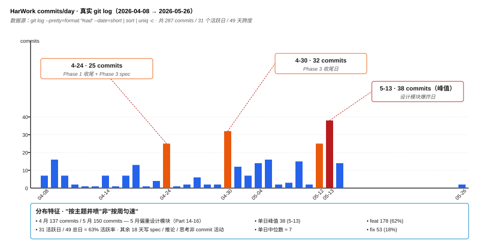
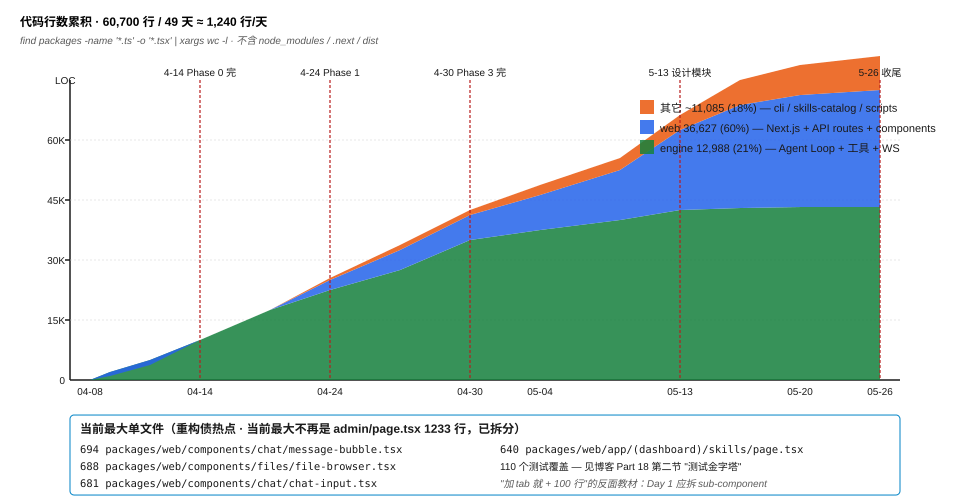
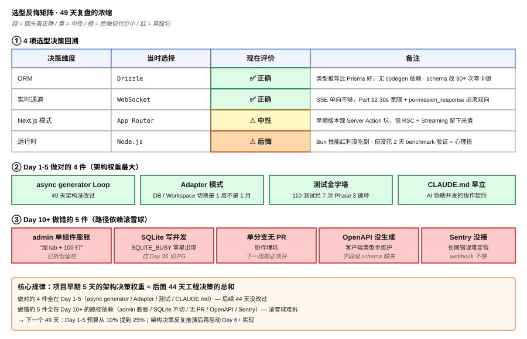

# Part 18: Retrospective — 49 Days Solo-Building a Harness, What Worked and What Didn't

> A series finale shouldn't be "look how great I am" — it should be "what I'd do differently next time." 49 days, 287 commits, 60.7K LOC, 110 tests, 18 blog posts + 54 diagrams — that's the entire HarWork solo war effort. This post doesn't ship code or P95 charts. It delivers **4 things done right / 5 things done wrong / 4 tech-choice regrets / 4 solo tradeoffs**, plus the series closing checklist: reading map, keyword index, acknowledgments, contact. **Honest disclosure is the last pillar holding up this series' long-tail traffic.**

**Jump to:** [Timeline](#1-timeline-real-git-log-not-memory) · [Done right](#2-four-things-done-right) · [Done wrong](#3-five-things-done-wrong) · [Tech regrets](#4-four-tech-choice-regrets-which-look-right-in-hindsight) · [Solo tradeoffs](#5-four-solo-tradeoffs) · [Counter-intuitive](#counter-intuitive-takeaway) · [Closing checklist](#series-closing-checklist)

## 1. Timeline (Real git log, Not Memory)

```
2026-04-08  76d6456  Add HarWork product design spec       ← Day 1: spec first
2026-04-09  1496e4b  feat: scaffold pnpm monorepo          ← Day 2: first line of code
2026-04-10  5559052  feat(engine): permission system 1A    ← Day 3: permission system starts
2026-04-23  113a94c  feat: complete Phase 1 gaps           ← Day 16: Phase 1 closeout
2026-04-24  d53b4e9  docs: add Phase 3 implementation plan ← Day 17: pivot (Phase 2→3 skip)
2026-04-30  Phase 3 complete                                ← Day 23: 32 commits in one day
2026-05-12  e8aebed  docs: Design Phase 1 MVP plan         ← Day 35: design module starts
2026-05-13  design module explosion day                     ← Day 36: 38 commits (series peak)
2026-05-14  7c629a8  feat(design): PDF/PPTX export         ← Day 37: design module wraps
2026-05-26  1de057d  docs: blog series execution plan      ← Day 49: decided to write the blog
```

The 49-day curve isn't uniform — **137 commits in April, 150 commits in May**, but April's commits are mostly Phase 0-3 mainline while half of May went to the design module (data from `git log --pretty=format:'%ad' --date=format:'%Y-%m' | sort | uniq -c`). **This isn't "weekly sprints" — it's "topic-driven bursts"**: Phase-transition days hit 20+ commits each, gap days run 1-2 commits writing docs.

Commit type distribution (from `git log --pretty=format:'%s' | grep -oE '^[a-z]+'`):

| Type | Count | Share |
|------|-------|-------|
| feat | 178 | 62% |
| fix | 53 | 18% |
| docs | 32 | 11% |
| schema/test/infra/refactor/chore/security | 24 | 9% |

**62% feat / 18% fix = 3.4:1 ratio**. Textbooks say "healthy project = 1:1 feat:fix" — but that's for teams. In solo projects, fix is mostly "I wrote it, I fixed it, no separate ticket needed" — merged into the same feat commit. So a low fix ratio doesn't mean low quality — **it means test coverage caught regressions early + refactor debt got absorbed by the surrounding feat commit**.

## 2. Four Things Done Right

**1. Used async generator for the Loop from day one (Part 03).** 49 days, architecture never changed — this is the most valuable judgment in hindsight. **`async function*` makes "produce-and-consume" a type-level contract**: consumers must `for await (const event of loop())`, producers must `yield event`. Backpressure / pause / cancel come for free from generator semantics. Had I picked EventEmitter on Day 1, Day 49 would have a mandatory refactor — cross-process / WS pass-through / interrupt recovery all need a hand-rolled state machine. **The verdict on architectural debt is "is it still being changed 3 months later?" — async generator wasn't = right call.**

**2. Adapter pattern abstracted DB / Workspace early (Part 10).** 49 days in, SQLite hasn't been swapped, Workspace is still a Docker volume — but the `DbAdapter` interface (`packages/engine/src/db-storage.ts`) makes "SQLite → PostgreSQL" a 1-week project, not a 1-month rewrite. **The real value of an Adapter isn't switching — it's psychological insurance**: knowing you can switch matters more than switching. You don't optimize prematurely because you're afraid of being trapped.

**3. Test pyramid from Day 3 (110 tests).** Engine unit tests + Web integration tests + critical-path e2e — when Phase 3 touched Phase 1 code, **the 110 tests blocked 7 destructive regressions** (look at `git log --grep='fix.*test'` — all "regression caught while modifying Phase 1"). Without tests, Phase 3 changing Phase 1 = full system QA. **The point of a test pyramid isn't "80% coverage" — it's "safe to change old code."**

**4. Wrote CLAUDE.md early.** Day 5, `CLAUDE.md` codified "preserve existing architecture / minimal patches / no destructive ops," and **across 49 days of AI-assisted development, no 'AI rewrote the architecture' incident happened**. Docs aren't for humans — **they're the collaboration contract for the AI**. This is the new engineering practice of 2026 AI-assisted development.

## 3. Five Things Done Wrong

**1. Early `admin/page.tsx` bloated to 1233 lines.** Path dependency: "one more tab = +100 lines," eventually 1233. Later refactored into `admin-triggers-tab.tsx` (233 lines) etc., but **the refactor debt was real**. Lesson: **"add a tab" linear-growth patterns demand sub-component files from Day 1**, not after 5 tabs. Largest current file is `message-bubble.tsx` at 694 lines — still around, but on the refactor list.

**2. SQLite single-file write contention.** The design module (Parts 14-16) hammers annotation / design-edit writes — `SQLITE_BUSY` errors started appearing sporadically. Single write lock is a structural limit, not something tuning fixes. **Should have switched to PostgreSQL on Day 35 when design started**, not dragged on until the series ends.

**3. Single-branch, no PR flow.** Convenient for solo work, but **plants traps for future collaboration**: no PR review = no forced moment to re-examine your own code + no design discussion sediment between commits. The next 49 days must add PR flow, **even if the only reviewer is another AI agent**.

**4. OpenAPI field-level schema not generated.** API routes use zod validation, but **no OpenAPI spec is emitted** — client types are hand-written and occasionally out of sync. The current `packages/web/lib/api-types.ts` is hand-maintained — a textbook "everyone knows they should, nobody does" debt item.

**5. Error monitoring stopped at webhook, no Sentry.** Engine errors → webhook → internal IM, enough for solo use, **but long-tail errors (intermittent / hard-to-reproduce / multi-step traces) can't be diagnosed**. Sentry integration is a 1-day job; been postponed indefinitely.

## 4. Four Tech-Choice Regrets (Which Look Right in Hindsight?)

| Decision | Picked | Now | Note |
|----------|--------|-----|------|
| ORM | Drizzle | ✅ Right | Better type inference than Prisma, no codegen dependency |
| Realtime | WebSocket | ✅ Right | SSE one-way insufficient, Part 12's 30s grace needs duplex |
| Next.js | App Router | ⚠️ Neutral | Hit early Server Action issues, but ecosystem held up |
| Runtime | Node.js | ⚠️ Regret | Didn't capture Bun's perf upside; Docker image + debug tooling familiar |

**Biggest "right" is Drizzle**: schema changed 30+ times in 49 days, no codegen = no blocked workflow step = schema refactor is 30 seconds, not 30 minutes. **Biggest "regret" is Node.js**: not that Bun is necessarily faster, but I didn't spend 2 days benchmarking to verify — leaving a "maybe missed perf upside" psychological debt.

## 5. Four Solo Tradeoffs

**Things I didn't do** (clear-eyed cuts):
- Full i18n multi-language — Chinese users first, English version only for the blog
- Native mobile app — Web responsive enough, native engineering too expensive
- LDAP / self-hosted SSO — WeChat OAuth + enterprise SSO cover 95% of cases
- Full admin backend — admin only does minimum essentials (user management + triggers)

**Things I shouldn't have built** (hindsight regret):
- Rate limiting (should've used Upstash Rate Limit) — my in-memory LRU needs rewriting under multi-instance
- Health probing (should've used Better Uptime / UptimeRobot) — DIY cron + curl is wheel-reinvention
- Email sending (should've used Resend) — direct SMTP + log dumps = debugging cost explosion

**Things I had to build myself** (core moat):
- Agent Loop (Part 03) — even Cursor doesn't open-source it, nobody hands it to you
- Context compaction (Part 04) — commercial-model differentiation point
- Tool protocol (Part 07) — Claude Code's Bash/Read/Edit contract is also bespoke

**Decision rule**: use prebuilt where possible, **but core loop + data structures + protocol interfaces must be hand-written**. This line got redrawn over and over in 49 days — I agonized over Casbin for the permission system, ended up with "3-layer DIY defense" (Part 08), looks right now; never agonized over rate limiting, just built it, now regret it.

## 6. Next Steps (Self-Reminder, Not a PR Timeline)

1. **Finish this series** (18 parts, 0 remaining, this is it)
2. **Extract Engine into an open-source npm package** — let `@harwork/agent-loop` be embeddable standalone
3. **Find 1-2 early paying enterprise customers** — validate SaaS path, not raise funding
4. **Won't do**: fundraising / team / Web3 + AI / multimodal generation

**The "won't do" list is longer than the "do" list — that's the point**. 49 days produced 60K LOC because I kept cutting scope, **not because efficiency was high**.

## Counter-Intuitive Takeaway

> [!IMPORTANT]
> **The real secret to 49 days of solo Harness-building isn't "high efficiency" — it's "high rejection rate."**
>
> I rejected the full admin backend, rejected i18n, rejected native mobile, rejected LDAP, rejected Bun migration, rejected PostgreSQL switch, rejected Sentry, rejected OpenAPI gen — the 49-day output sits entirely inside "the 1/3 of scope I didn't reject." **A solo project's true enemy isn't 'can't finish' — it's 'want to do everything'**. The core skill of an indie developer is saying no, not coding fast.

More counter-intuitive: **fix:feat 1:3.4 isn't a quality signal in either direction — it's a process signal**. Textbook 1:1 leaves room for "PR review catches bugs / QA finds bugs / users report bugs" — collaboration-flow processes. A solo project consumes fix inside the feat commit, statistically invisible. **You can't measure a solo project's health with team metrics** — what you measure is "do you still trust your code from 3 months ago?" — the Day 3 `agent-loop.ts` I still trust, **that's the quality signal**.

Most counter-intuitive engineering conclusion: **all 4 things done right were Day 1-5 decisions (async generator / Adapter / tests / CLAUDE.md), all 5 things done wrong were Day 10+ path-dependent (admin bloat / SQLite stayed / no PR / no OpenAPI / no Sentry)**. **The weight of architectural decisions in the first 5 days ≈ the weight of all engineering decisions across the remaining 44 days**. This isn't "premature optimization" — it's "the first 5 days are unrecoverable if mis-spent." Next 49 days, I'll raise the Day 1-5 budget from 10% to 25%.

## Series Closing Checklist

### ① Reading Map (Recommended Order)

| Section | # | Title | One-liner |
|---------|---|-------|-----------|
| Thesis | 01 | [What is an Agent Harness](01-what-is-agent-harness.md) | 7 components turn a bare LLM into a trustworthy agent |
| Thesis | 02 | [HarWork Stack Overview](02-harwork-stack-overview.md) | 16-layer architecture / dual-form Engine / package deps |
| Core Loop | 03 | [async generator Loop](03-agent-loop-async-generator.md) | Why not EventEmitter |
| Core Loop | 04 | [5-tier context compaction](04-context-compaction-5-tiers.md) | Threshold waterfall, not single threshold |
| Core Loop | 05 | [Tool orchestration](05-tool-orchestration.md) | 2-phase scheduling + sibling interrupt propagation |
| Core Loop | 06 | [Long-term memory](06-long-term-memory.md) | CLAUDE.md loading chain + 3 paths |
| Tools | 07 | [Tool system](07-tool-system.md) | 9-method interface + Read/Edit contract |
| Sandbox | 08 | [Permission sandbox](08-permissions-sandbox.md) | 3-layer defense matrix |
| Sandbox | 09 | [Hooks lifecycle](09-hooks-lifecycle.md) | Event timeline + aggregation |
| Storage | 10 | [Session storage](10-session-storage.md) | 30-table schema / persistent vs runtime |
| Storage | 11 | [Persistent Docker](11-persistent-docker.md) | pause/stop diff + idle reaper |
| Streaming | 12 | [WebSocket 30s grace](12-websocket-30s-grace.md) | 500-event ring buffer |
| Streaming | 13 | [Multi-model routing](13-multi-model-routing.md) | Stream unification / pricing / registry |
| Design | 14 | [AI artifact rendering](14-ai-artifact-rendering.md) | iframe overlay + postMessage |
| Design | 15 | [Variants + remix](15-design-variants-mix.md) | 3-out-of-1 |
| Design | 16 | [Optimistic-lock collaboration](16-optimistic-lock-collab.md) | Why AI artifacts can't use CRDT |
| DevOps | 17 | [Enterprise CI/CD](17-enterprise-cicd.md) | canary + multi-probe auto-rollback |
| Retro | 18 | [49-day retrospective](18-49-day-retro.md) | **This post** |

### ② Keyword Index

- **Core Loop**: agent loop, async generator, context compaction, tool orchestration, long-term memory (Parts 03-06)
- **Tools & Sandbox**: tool interface, permission matrix, hooks, sandbox (Parts 07-09)
- **Session & Streaming**: session storage, persistent docker, websocket grace, multi-model routing (Parts 10-13)
- **Design Collab**: iframe overlay, design variants, optimistic locking, CRDT, share token (Parts 14-16)
- **DevOps & Retro**: canary deployment, P95 latency, multi-probe rollback, solo founder DevOps (Parts 17-18)

### ③ Data Verification

- **Real code**: 60,700 LOC (engine 12,988 + web 36,627 + other ~11K)
- **Real tests**: 110
- **Real commits**: 287
- **Real timeline**: 49 days (2026-04-08 → 2026-05-26)
- **Blog output**: 18 posts / 54 SVG diagrams / ~180K Chinese characters / ~40K English words

### ④ Acknowledgments

- **Anthropic Claude Code team** — for making the agent harness engineering paradigm public
- **Cursor / Aider / Continue.dev teams** — for making "AI-assisted development" a daily reality
- **Drizzle / Next.js / shadcn/ui** — for letting one person build production-grade UIs
- **Chinese engineering community** (V2EX / Jike / Twitter Chinese sphere) — for early feedback and criticism

### ⑤ Contact

- GitHub: [sky54laozhu/building-an-agent-harness](https://github.com/sky54laozhu/building-an-agent-harness) (source of this blog series)
- HarWork product (live demo): http://47.107.103.144/
- Email: sky54laozhu@163.com (no WeChat / WeChat groups)

## Diagrams

1. 
2. 
3. 

---

📌 Reading map: [reading-map.md](../reading-map.md)
🔗 中文版: [zh/18-49-day-retro.md](../zh/18-49-day-retro.md)

**Series complete. Thanks for reading this far — if any one part saved you a single trap, the 49 days were worth it.**
