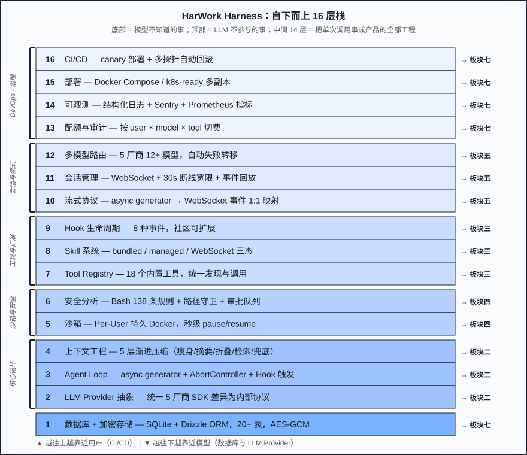
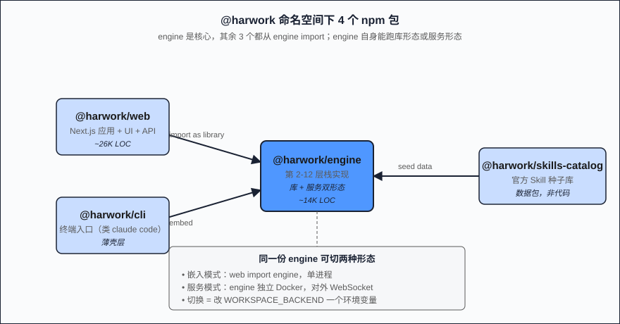
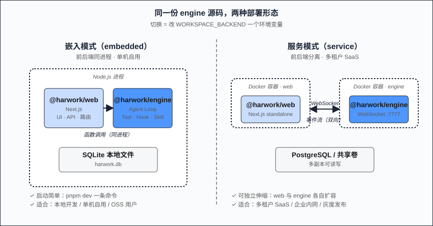

# 第 02 篇：HarWork Harness 全景图——16 层栈一次性摊开，附 cloc 实测

> 如果你要造一个 Claude Code 替代品，栈应该长什么样？这一篇用 HarWork 真实代码做样本，把 16 层栈一次性摊开，并用 cloc 实测出一个反直觉的数字：你以为 AI 产品最难的是 AI，实际真正"调 LLM"的代码只占 **0.67%**。

**章节跳转：**[问题](#问题陈述) · [朴素方案](#朴素方案为什么不行) · [16 层](#核心方案harwork-的-16-层栈) · [实现要点](#关键实现要点) · [反直觉](#反直觉结论cloc-实测下的ai-产品) · [阅读路径](#怎么读这个系列两条路径)

## 问题陈述

第 01 篇把"Agent Harness 是什么"讲清楚了：它是把无状态 LLM API 包装成"有状态、可控、可观测、可扩展"的运行时层。但读到这里，你大概率会问一个非常具体的工程问题——**"那这个'运行时层'拆开看，到底有几层、每一层多大、它们之间怎么调用？"**

这一篇就回答这个问题。我用 HarWork（一个已开发 90+ 天、已经能跑日常编程任务的开源 Agent Harness）的真实代码作样本，把 16 层栈从最底下的"加密存储"摊到最顶上的"CI/CD"。每一层会讲三件事：**为什么必须有这一层、HarWork 怎么做的、跳到本系列哪一篇看细节。**

读完这一篇，你应该能在白板上独立画出一个生产可用 Agent Harness 的骨架——然后才进入板块二开始挖细节。

## 朴素方案为什么不行

很多 Agent 开源项目把"前端 + LLM 调用"做完就上线了。前端用 Next.js，后端起个 Express 转发 LLM 请求，加点 Markdown 渲染，30 天 demo 就跑起来了。然后呢？

- **用户装个 npm 包就丢上下文**——会话没持久化，浏览器一刷新 30 轮对话归零
- **容器一删环境就没**——LLM 改的文件、装的依赖、跑的进程，全部丢
- **并发一上就崩**——两个用户同时发请求，工具执行串数据
- **断网就 GG**——WebSocket 断了没续传，最后一轮工具结果永远拿不回来
- **加新工具就改源码**——没有 Hook、没有 Skill、没有 Plugin，社区贡献是死的

这些不是"小问题，发版前修一下就行"，而是**架构层面就没规划过**。要把它们补上，必须从一开始就分层——从 LLM API 一直分到 CI/CD，每一层都不能省，每一层都有明确的边界和接口。下面就是 HarWork 当前的 16 层。

## 核心方案：HarWork 的 16 层栈

我把 16 层按"从底到顶 / 从依赖到使用"的顺序排好。**最底下是模型不知道的事（加密存储），最顶上是 LLM 也不参与的事（CI/CD 流水线）。中间 14 层，是把 LLM 一次次调用串成产品的全部工程。**

```
┌──────────────────────────────────────────────────────────┐
│ 16. CI/CD（canary + 多探针自动回滚）                       │ → 板块七
│ 15. 部署（Docker Compose / K8s-ready）                    │ → 板块七
│ 14. 可观测（结构化日志 + 错误上报 + 指标）                  │ → 板块七
│ 13. 配额与审计（按 user / model / tool 切费）              │ → 板块七
│ 12. 多模型路由（5 厂商 12+ 模型，自动失败转移）             │ → 板块五
│ 11. 会话管理（WS + 断线宽限 + 事件回放）                   │ → 板块五
│ 10. 流式协议（async generator → WebSocket 事件）           │ → 板块五
│  9. Hook 生命周期（8 种事件，社区可扩展）                  │ → 板块三
│  8. Skill 系统（bundled / managed / WebSocket 三态）       │ → 板块三
│  7. Tool Registry（18 个工具，统一发现与调用）             │ → 板块三
│  6. 安全分析（Bash 138 条规则 + 路径守卫）                 │ → 板块四
│  5. 沙箱（Per-User 持久 Docker，秒级 pause/resume）        │ → 板块四
│  4. 上下文工程（5 层渐进压缩）                             │ → 板块二
│  3. Agent Loop（async generator + AbortController）       │ → 板块二
│  2. LLM Provider 抽象（统一 5 厂商 SDK 差异）              │ → 板块二
│  1. 数据库 + 加密存储（20+ 表，会话/工具/审计三大主表组）   │ → 板块七
└──────────────────────────────────────────────────────────┘
```

每一层 1-2 句话讲清楚（详细深挖在对应板块）：

1. **数据库 + 加密存储**：会话状态必须落盘，否则连"断线续传"都做不到。HarWork 用 SQLite + Drizzle ORM 落 20+ 张表，对话内容、API key、SSH 私钥用 AES-GCM 加密入库。
2. **LLM Provider 抽象**：Anthropic 的 tool use、OpenAI 的 function calling、Google 的 Gemini 字段完全不兼容。这一层把"消息格式 / 工具协议 / 流式块"统一成 HarWork 内部协议，业务层只看到一个接口。
3. **Agent Loop**：第 01 篇展示了 20 行骨架，真实实现要加 AbortController、tool 并发、错误恢复、Hook 触发——HarWork 的 `agent/loop.ts` 是这层的核心，**整个 Loop + 上下文相关代码 2058 行**。
4. **上下文工程**：第 01 篇已经展开过 5 层渐进压缩。HarWork 把每层做成独立的 strategy，可以按用户偏好关闭。
5. **沙箱**：Claude Code 跑在用户机器的 OS 进程里，HarWork 选择 Per-User 持久 Docker——每个用户一个长期容器，秒级 pause/resume，文件状态跨会话保留。这一层最难的不是创建容器，而是 unpause 时同步好 git 工作区状态。
6. **安全分析**：用户让 LLM 跑 `rm -rf` 时谁拦？HarWork 在 Bash 执行前跑 138 条静态规则 + 路径守卫，可疑命令进入审批队列。
7. **Tool Registry**：18 个内置工具（Read/Write/Edit/Bash/Grep/Glob/...），统一接口：`name + description + schema + execute`。Skill 和 Hook 都从这里挂。
8. **Skill 系统**：三态——bundled（仓库内置）、managed（数据库装载）、WebSocket（远程 RPC）。同一个 Skill 接口能跑本地代码、远程 npm 包、IDE 内代码。
9. **Hook 生命周期**：8 种事件（PreToolCall / PostToolCall / SessionStart / ContextCompact / ...），第三方写一段 JS 就能介入生命周期。
10. **流式协议**：Agent Loop 是 async generator，里面 yield 的事件要走 WebSocket 给前端。这一层把"内部事件流"和"网络事件流"做了 1:1 映射，并保留每一帧的 sequence number 便于断线重放。
11. **会话管理**：WebSocket 断了不应该丢上下文。HarWork 给每个会话设 30 秒断线宽限期，期间事件全部 buffer，重连后从 last seen sequence 重放。
12. **多模型路由**：用户配 4 个 model alias（fast/standard/strong/vision），Harness 决定每一轮用哪个。Sonnet 报 429？自动 fallback 到 Haiku 继续跑。
13. **配额与审计**：每次 LLM 调用、每次 tool 执行都记入 audit log，按 user × model × tool 切费。企业部署的合规要求。
14. **可观测**：结构化日志 + Sentry 错误上报 + Prometheus 指标。线上每一次 401、每一个 tool 超时都能定位到具体 session_id 和 message_id。
15. **部署**：Docker Compose 单机起、k8s 多副本起，二选一。前端 Next.js standalone build，后端 engine 独立容器，DB 单独卷。
16. **CI/CD**：GitHub Actions 跑 lint / test / build / e2e，main 分支合并自动 canary 部署到测试环境，3 个探针（健康检查、关键 API、关键 UI）全通过才放量到生产。

层数听起来吓人，实际**每一层都是被"用户的某种期待"逼出来的**——你想要会话不丢，就必须有 1 + 11；你想要工具能扩展，就必须有 7 + 8 + 9；你想要企业能合规采购，就必须有 13 + 14。没有一层是 over-engineering。

## 关键实现要点

把 16 层栈跑通，**包结构**也跟着定型。HarWork 一共 4 个 npm 包：

| 包名 | 职责 | 形态 |
|---|---|---|
| `@harwork/engine` | 16 层栈第 2-12 层的全部实现 + 独立 WebSocket 服务 | 库 + 服务双形态 |
| `@harwork/web` | Next.js 应用 + 全部 UI + API 路由 + 数据库 schema | 应用 |
| `@harwork/cli` | 终端形态入口（类似 `claude code` 命令） | CLI |
| `@harwork/skills-catalog` | 官方 Skill 种子库 | 数据 |

最有意思的是 **`@harwork/engine` 的"双形态"**：同一份代码既能作为 npm 库被 `@harwork/web` import（嵌入模式，前后端同进程），又能跑成独立 Docker 容器对外暴露 WebSocket 端口（服务模式，前后端分离）。切换形态只改 `WORKSPACE_BACKEND` 一个环境变量。这意味着同一份 Harness 既能服务"单机自用"也能服务"多租户 SaaS"，不用维护两套代码。

支撑这个双形态的是 **Adapter 模式**。Engine 内部定义了三个核心抽象接口：`DbAdapter`（持久化）、`WorkspaceBackend`（沙箱执行）、`Executor`（命令执行）。Web 端用 Drizzle ORM 实现 `DbAdapter`、用 Docker Compose 实现 `WorkspaceBackend`；如果换成 SQLite + 本地进程，整个栈也能在 Mac 上裸跑——因为接口稳定，**任何一层都可替换**。这正是"分层"的核心价值。

## 反直觉结论：cloc 实测下的"AI 产品"

到了关键时刻。spec 要求这一篇不允许出现"没验证的占比断言"，所以我跑了一次 cloc，把 HarWork `packages/engine/src` + `packages/web/{app,components,lib}` 的全部 TypeScript 业务代码（不含 node_modules、不含测试、不含生成的 db 类型）扫了一遍。**实测数字如下：**

| 切片 | LOC | 占比 |
|------|-----|------|
| **真正调 LLM 的代码**（engine/models/，5 家厂商的 SDK adapter） | **228** | **0.67%** |
| Agent Loop 本体（engine/agent/） | 2,058 | 6.09% |
| Harness 支撑栈（loop + tools + hooks + skills + 沙箱 + 安全 + session + DB + observability） | 8,320 | 24.6% |
| 业务 / UI / API 层（web/components + web/app + web/lib/design） | 20,271 | 60.0% |
| 服务入口 + 胶水代码（dev-server、ws-server、cron、preview-proxy 等） | ~5,200 | 15.4% |
| **总计 TypeScript** | **33,807** | 100% |

数字摆出来，第 01 篇那个 "80% 工程 / 20% LLM" 还说得太客气。**真实比例是：在 33,807 行 TypeScript 里，真正负责"调 LLM"的只有 228 行——0.67%。**

> [!IMPORTANT]
> **你以为 AI 产品最难的是 AI；实际写完一个能用的 AI 产品后，AI 调用代码占比 < 1%。**

剩下 99.33% 在干嘛？在让那 0.67% **能跑起来、跑得稳、跑得安全、跑得能上生产**。这就是为什么 Claude Code 团队、Cursor 团队、Aider 作者都各自花了上百人月——不是 LLM 难调，是**让 LLM 调用看起来很简单**这件事难。

而这也是为什么"换个更强的 LLM"对产品体验的提升远远不如"重写一遍工具协议"。因为你能换的是那 0.67%，剩下 99.33% 还得自己写。

## 怎么读这个系列：两条路径

读完这一篇，你已经有了一张"白板上的全景图"。后面 17 篇怎么跟？给两条路径选：

**顺读路径**（推荐第一次完整读完）：
- 板块二：核心循环（第 03-05 篇，把 Loop / 上下文 / 流式拆透）
- 板块三：工具与扩展（第 06-08 篇，Tool / Skill / Hook 三大扩展点）
- 板块四：沙箱与安全（第 09-11 篇，Per-User Docker / 138 条规则 / 路径守卫）
- 板块五：会话与流式（第 12-13 篇，断线宽限 / 多模型路由）
- 板块六：设计协作（第 14-16 篇，HarWork 独有的设计模式）
- 板块七：DevOps（第 17-18 篇，从 cloc 到 canary 全套）

**跳读路径**（按你最关心的层切入）：
- 关心 **断线续传**？→ 第 12 篇（板块五）
- 关心 **rm -rf 怎么拦**？→ 第 08 篇（板块四）
- 关心 **怎么让社区扩展工具**？→ 第 07 篇（板块三）
- 关心 **怎么部署到生产**？→ 第 17 篇（板块七）

> 注意 **层 ≠ 篇**：16 层栈是技术依赖视角，18 篇是阅读体验视角。同一层可能拆成 2-3 篇（如安全层 = 静态分析 + 路径守卫 + 审批流，3 篇），同一篇可能横跨多层（如设计协作篇横跨 Hook + Skill + UI 三层）。所以"先看全景图，再决定怎么读"比"按编号死读"更高效。

## 配图

1. 
2. 
3. 

## 下一篇

→ [第 03 篇：Agent Loop——async generator 是怎么撑起整个对话的](./03-agent-loop-async-generator.md)

下一篇我们从第 16 层往下钻一层，进入板块二。先把那个 20 行的 Loop 骨架拆成真实的 `agent/loop.ts`，看看 AbortController、tool 并发、Hook 触发、错误恢复是怎么纠缠在一起的——以及为什么 Loop 必须用 async generator 而不能用普通 async function。

---

📌 系列阅读地图：[reading-map.md](../reading-map.md)
🔗 English version: [en/02-harwork-stack-overview.md](../en/02-harwork-stack-overview.md)
