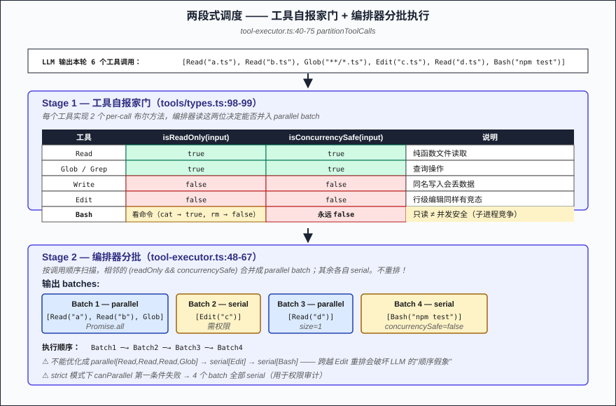
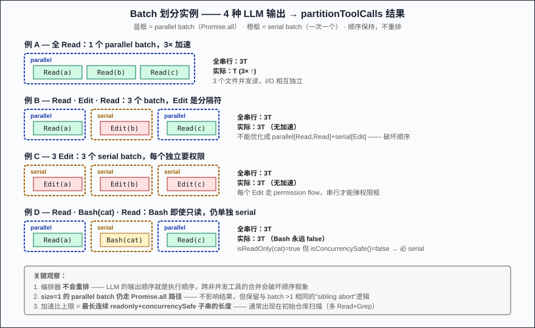
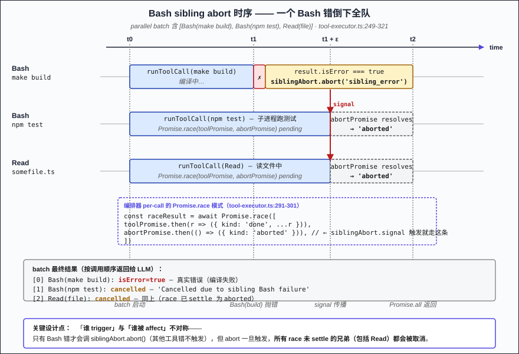

# 第 05 篇：工具调用编排 —— 并行 / 串行 / 中断

> 第 03 篇说每轮 Loop 会让 LLM 输出 0~N 个工具调用，然后调 `executeTools`。这一篇要回答：**executeTools 到底怎么决定哪些并行、哪些串行、谁能取消谁**？如果你直接 `await Promise.all`，连两条 Edit 同时写同一个文件都救不了；如果一律串行，3 个 Read 白白排队 3 倍延迟。HarWork 的 `tool-executor.ts`（657 行）给出了一个"两段式调度 + 4 路取消"的答案，本文把每一段拆开。

## 问题陈述

LLM 一轮可能吐出 8 个工具调用。Harness 在 LLM 与工具之间夹一个编排器，要解决 3 个具体问题：

1. **并发安全** —— 哪些能并行？两次 Edit 同一文件并发 = 数据丢失；两次 Read 不同文件并发 = 完全安全。
2. **失败级联** —— 一个工具失败，其他工具继续还是停？答案不能一刀切——Bash 编译失败后跑 `npm test` 没意义，但 Read failed 不影响 Glob。
3. **中断传播** —— 用户 Ctrl-C / 切窗口 / 关浏览器，正在跑的子进程、stream、数据库事务怎么收拾？

最朴素的方案——**全 `Promise.all`**——并发安全直接漏底；**全串行**——又慢又浪费；**让 LLM 自己声明**——LLM 真的会要求你"同时 rm 两个不同路径"，谁兜底？

## 朴素方案为什么不行

**朴素一：`Promise.all` 全并行**。Read + Read + Glob 并行没事，但只要混进一个 Edit（甚至两次 Bash 改同一目录），race condition 立刻爆。容器并发被打满时所有工具一起拖死。

**朴素二：全串行**。简单粗暴最安全，但 LLM 一轮 5 个 Read 串成 5 秒的请求，体验直接劝退。Cursor / Claude Code 的"嗖一下扫完仓库"体验全靠并行。

**朴素三：让 LLM 自己声明 `parallel: true`**。我试过，LLM 会自信地告诉你"这两个 rm 可以并行"——它对副作用的判断不靠谱，需要 harness 兜底。

**朴素四：写工具用 mutex 自己加锁**。可行，但所有工具作者都要懂并发——而工具作者大多数情况是 LLM 自己生成的代码，指望它正确加锁不现实。

共同问题：**这些方案都把"并发决策"权力放错了位置**——要么全交给调度器（不知道工具内部），要么全交给工具（不知道兄弟在干什么）。

## 核心方案：两段式调度

HarWork 的分工很干净：**工具自报家门，编排器分批执行**。

### Stage 1: 工具自报家门

每个工具实现 `HarWorkTool` 接口的两个布尔方法（`tools/types.ts:98-99`）：

```typescript
export interface HarWorkTool {
  isReadOnly(input): boolean        // 这次调用是否只读？
  isConcurrencySafe(input): boolean // 这次调用能否与同类并发？
}
```

注意两者都是 **per-call** 而非 per-tool——Bash 的 `cat large.log` 是只读的，`rm -rf /` 不是；同一个 Bash 工具在不同 input 下给出不同答案。

实际工具的声明：

| 工具 | isReadOnly | isConcurrencySafe | 原因 |
|------|-----------|-------------------|------|
| Read | `true` | `true` | 文件读不冲突 |
| Glob / Grep | `true` | `true` | 纯查询 |
| Write | `false` | `false` | 任何写都不能与同名并发 |
| Edit | `false` | `false` | 同上 |
| Bash | **看命令** | **永远 `false`** | 即使 `cat` 只读，子进程并发也可能耗尽容器资源 |

Bash 是唯一一个 `isReadOnly` 动态判断的工具（`bash.ts:301-307` 把命令拆成子命令逐个查），但 `isConcurrencySafe` 直接钉死成 `false`——**只读 ≠ 并发安全**，Bash 的特殊性在这里体现。

### Stage 2: 编排器分批

`partitionToolCalls`（`tool-executor.ts:40-75`）扫一遍调用列表，把**连续的"只读 + 并发安全"调用攒成一个 parallel batch**，其他每个独占一个 serial batch：

```typescript
const canParallel =
  permissionMode !== 'strict' &&
  tool != null &&
  tool.isReadOnly(call.args) &&
  tool.isConcurrencySafe(call.args)

if (canParallel) {
  currentParallel.push(call)
} else {
  // Flush 当前并行 batch，开一个新的 serial batch
  if (currentParallel.length > 0) {
    batches.push({ parallel: true, calls: currentParallel })
    currentParallel = []
  }
  batches.push({ parallel: false, calls: [call] })
}
```

LLM 输出 `[Read, Read, Glob, Edit, Read, Bash]` → 编排器分成 4 个 batch：
1. `[Read, Read, Glob]` parallel
2. `[Edit]` serial
3. `[Read]` parallel（只有 1 个也走"parallel"路径，但其实就是单个）
4. `[Bash]` serial

**关键**："分批"按调用顺序进行，**不重排**——LLM 觉得自己说什么就什么时候执行，编排器只决定"这段能不能同时跑"。这是反直觉结论的伏笔。

## 4 路取消机制

这才是 657 行代码里真正复杂的部分——单纯的"分组并行"几十行就写完了，剩下 500 多行处理"出错怎么停"。HarWork 有 **4 条独立取消路径**，覆盖不同粒度：

### 取消路径 1：Bash sibling abort（并行 batch 内）

```typescript
// tool-executor.ts:249
const siblingAbort = new AbortController()

const results = await Promise.all(
  batch.calls.map(async (call) => {
    // ... permission check ...
    
    // tool-executor.ts:291-301 Race: 执行 vs 兄弟取消
    const toolPromise = runToolCall(call, tool, context)
    const abortPromise = new Promise<'aborted'>((resolve) => {
      siblingAbort.signal.addEventListener('abort', () => resolve('aborted'), { once: true })
    })
    const raceResult = await Promise.race([
      toolPromise.then((r) => ({ kind: 'done', ...r })),
      abortPromise.then(() => ({ kind: 'aborted' })),
    ])

    // tool-executor.ts:318-321 如果是 Bash 错了，取消所有兄弟
    if (result.isError && call.toolName === 'Bash') {
      siblingAbort.abort('sibling_error')
    }
  }),
)
```

设计要点（**触发非对称**）：**只有 Bash 错误会触发 `siblingAbort.abort()`**——Read / Glob 失败不会触发兄弟取消。原因？Bash 命令之间常有隐式依赖链（`make build && npm test`——build 错了 test 就无意义），其他工具的失败是独立事件。

但**一旦 abort 被触发**，`Promise.race` 让**所有未 settle 的兄弟都收到取消信号**——包括正在跑的 Read。所以 `[Bash(build), Bash(test), Read(file)]` 这个 batch 里，build 失败时 test **和** Read 一起被取消，**不是只取消 Bash 兄弟**。

源码注释（`tool-executor.ts:246-248`）写的是「Non-Bash tools are independent and unaffected」——这里的 "unaffected" 指的是"非 Bash 失败不会引发 cascade"（触发端），不是"Bash cascade 时非 Bash 不受影响"。注释容易误解，**以代码为准**。

### 取消路径 2：Serial Bash 链取消

```typescript
// tool-executor.ts:373-388
if (bashErrored && call.toolName === 'Bash') {
  // 直接 yield 一个 cancelled result，不调 tool
  yield { type: 'tool_call_result', content: 'Cancelled: previous Bash command failed', isError: true, ... }
  continue
}
```

串行 batch 里，一旦某个 Bash 错了，**后续 Bash 调用全部取消（但其他工具不受影响）**。`bashErrored` 标记在 turn 范围内有效——下一轮 Loop 重置。这与并行 batch 的逻辑对称：一个的 race+signal，一个的 flag+skip。

### 取消路径 3：全局 abort（用户中断）

```typescript
// tool-executor.ts:355
if (context.abortController.signal.aborted) {
  yield { type: 'tool_call_result', content: 'Aborted', isError: true, ... }
  return  // 整个 generator 退出
}
```

**只在 serial batch 的循环开头检查**——为什么不在 parallel batch 里？因为 parallel batch 已经在跑了，要中断它得靠各自工具响应 `context.abortController.signal`（这是第 03 篇 AbortSignal 树状传播的延续）。executor 自己在 parallel 后无法"撤回"已经发出的请求，只能让工具内部把 signal 接通到子进程的 SIGTERM、stream 的 close、DB 事务的 rollback。

### 取消路径 4：硬上限（速率限制 + 拒绝计数）

```typescript
// tool-executor.ts:226-230
const maxToolCalls = options?.maxToolCalls ?? 50
const denials = createDenialTracker(5, 20)  // 5 连续 / 20 总数 → abort
```

- **maxToolCalls = 50**：一轮工具调用上限。LLM 偶尔会陷入"调 20 次 Read 找一行代码"的循环——硬上限拉住它。
- **denials = (5 consecutive, 20 total)**：用户连续 5 次拒绝、或总共 20 次拒绝 → 整个 turn abort。防止"LLM 一直问，用户一直拒"的 deadlock。

## 关键实现要点

5 个细节决定生死：

**1. parallel batch 也要做权限检查**

`tool-executor.ts:262-275` —— 即使是只读工具进入 parallel batch，仍然要调 `tool.checkPermissions`。一个常见误解："只读就一定能跑"。错——`.env` 文件的 Read 也会被 bypass-immune 规则挡掉（见第 10 篇 sandbox）。

**2. Strict 模式打断所有并行**

`tool-executor.ts:52` —— `permissionMode !== 'strict'` 是 `canParallel` 的第一个条件。Plan 模式 / 严格审计模式下，**所有工具都走 serial**——因为每个都要弹权限框。这是有意为之：严格模式下"快"不是目标，"可审计"才是。

**3. 工具内 emitEvent 的 buffered 模式**

`tool-executor.ts:574-582` —— 串行执行一个工具时，会临时设置 `context.emitEvent`，让工具内部（比如 sub-agent 工具）能 enqueue 中间事件。等工具返回后，先 yield 主 result，再 flush buffered events。**顺序很重要**：用户先看到主结果，再看 sub-agent 的明细。

**4. EnterPlanMode/ExitPlanMode 的 side effect**

`tool-executor.ts:600-607` —— 这两个工具不只返回结果，还**修改 `context.permissionMode`**。它们走 serial 路径，所以修改完立刻对后续工具生效。如果它们能并行，状态污染就来了。

**5. PreToolUse hook 可以否决**

`tool-executor.ts:535-571` —— 在 tool 实际跑之前调 PreToolUse hook，hook 返回 `blockingErrors` 就直接拒绝。这是 ECC 等插件接管工具的入口（参考第 14 篇 hook 全景）。

## 反直觉结论

> **编排器的真正复杂度不在"并发算法"，而在"失败语义"。** 并行分组只占 657 行里的 ~50 行；剩下 600 行全在处理"什么时候该停、停谁、怎么停"。

换句话说：**并行是优化，取消是正确性**。一个错过 sibling abort 的编排器在演示视频里看起来一样快——但 production 跑久了你会看到「编译失败但仍然在跑测试，跑出一堆假阳性错误然后回灌给 LLM」的灾难。

最反直觉的：**LLM 完全不知道编排器在做什么**。它输出 `[Read, Read, Edit]`，收到的结果按这个顺序排列，仿佛 3 个工具按顺序串行跑完。**编排器存在感越为零，LLM 表现越稳定**——因为 LLM 训练时见到的工具结果就是按顺序排列的。一旦你把"这两个并行了"暴露给 LLM，它会开始在 prompt 里推理并发，幻觉概率立刻上升。

这也解释了为什么 `partitionToolCalls` 不重排：**只能合并相邻的、不能跨越非并发工具**。`[Read, Edit, Read]` 必须是 `parallel[Read] → serial[Edit] → parallel[Read]`，不能优化成 `parallel[Read, Read] → serial[Edit]`——后者快但破坏顺序假象。

## 三个生产坑

**陷阱一：把非幂等工具声明为 `isConcurrencySafe: () => true`**。我见过有人写"自增计数器"工具，声明 concurrencySafe，跑两次并发结果只 +1（race condition）。**默认应该是 false**——除非你能证明工具调用对外部状态没有任何依赖（Read / Glob 这种纯函数才符合）。

**陷阱二：误以为 "sibling abort = AbortController.abort() 就够"**。看 `tool-executor.ts:291-301`，必须用 `Promise.race` 把 toolPromise 和 abortPromise 包起来。如果只 `siblingAbort.abort()` 而不 race，**已经在 await 的工具会继续跑完**——signal 只是个通知，不会强行中断 in-flight Promise。这个坑很常见，因为 AbortController 的语义"取消"被很多人误解为强制终止。

**陷阱三：忘了 `bashErrored` 在 turn 之间需要重置**。`tool-executor.ts:228` 在每次 `executeTools` 调用时 `let bashErrored = false`——所以新一轮 Loop 自动重置。如果你把这变量提升到 ToolContext 里"复用"，你会得到「用户上一轮 Bash 失败，这一轮所有 Bash 都被取消」的诡异 bug。

## 配图

1. 
2. 
3. 

## 下一篇

→ [第 06 篇：长期记忆 —— CLAUDE.md + auto memory](./06-long-term-memory.md)

下一篇我们从"工具如何不打架"走到"对话结束后留下什么"。每次会话从零开始 = 用户得反复说自己的偏好；把全部历史塞 prompt = 几次就爆。Claude Code / HarWork 的答案是 `CLAUDE.md`（项目级）+ auto memory（用户级）双层机制——下篇拆这套"可控、可遗忘、可分层"的长期记忆是如何实现的。

---

📌 系列阅读地图：[reading-map.md](../reading-map.md)
🔗 English version: [en/05-tool-orchestration.md](../en/05-tool-orchestration.md)
