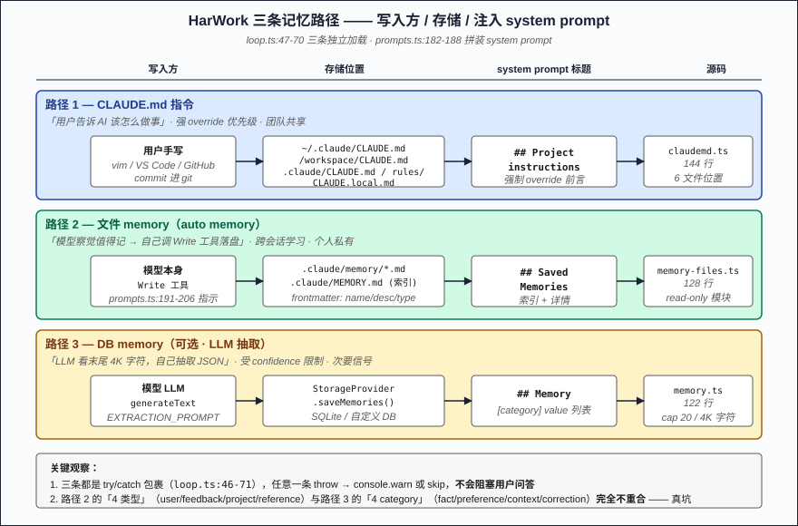
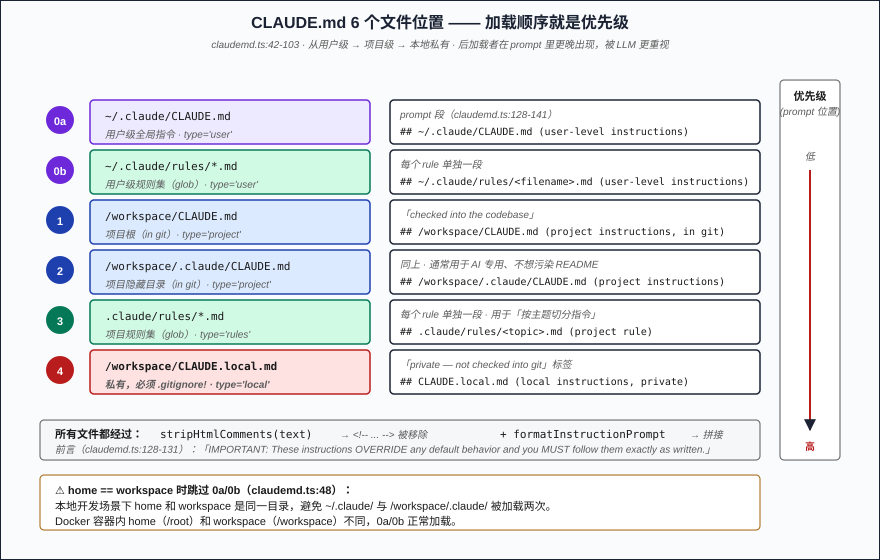
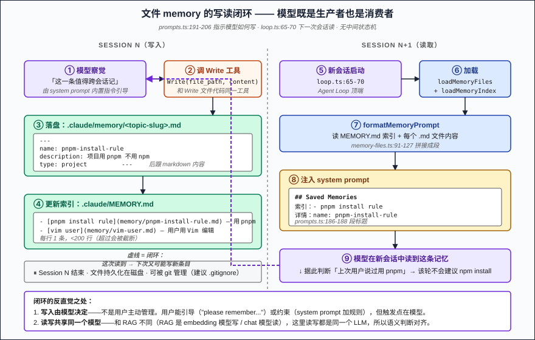

# 第 06 篇：长期记忆 —— CLAUDE.md + auto memory 的三条路径

> 第 03 篇说 Agent Loop 每轮都会从头组装 system prompt——可这就引出一个问题：**每次会话从零开始，用户得反复教 AI 自己的偏好**。把所有历史塞进 prompt？几轮就爆。靠 LLM 自己每轮"想起来"用户喜欢什么？它没那个 receptor。HarWork（复刻 Claude Code）的答案是**长期记忆**——但它不是一条路径，是三条：CLAUDE.md（指令）、文件级 auto memory（用户/模型协作）、DB-based 抽取（可选）。这一篇把三条全拆开。

## 问题陈述

跨会话状态有三种典型形态，需求差异很大：

1. **项目约定**（"用 pnpm 不用 npm"、"测试目录在 packages/*/test/"）—— 团队共享，应该进 git，所有 contributor 都能看到。
2. **个人偏好**（"我喜欢简洁回复"、"我用 Vim"）—— 个人的，跨项目通用，不该 commit。
3. **临时性事实**（"X 上次说要先做 Y"、"昨天那个 bug 的修复方式是 Z"）—— 状态变化快，需要可遗忘。

如果只用一套机制处理这三种，要么粒度太粗（什么都塞一个 CLAUDE.md），要么粒度太细（每条偏好建个文件就是 100 个文件的开销）。

## 朴素方案为什么不行

**朴素一：让 LLM 自己记得**。LLM 没有跨 session 的状态——每次 API 调用都是无状态的。"记得"意味着把记忆放进 prompt。

**朴素二：把全部历史塞 prompt**。第 04 篇已经详尽推过：上下文窗口有限，会话长了 LLM 自己也会"忘"（attention 衰减）。这条死路。

**朴素三：向量库 + RAG**。可行，但 setup 重——要部署 embedding model、向量 DB、相似度阈值要调。对单人工作流大炮打蚊子。Claude Code / HarWork 选了更朴素的方案：**就是文件**。

**朴素四：用户每次手写 system prompt**。负担大，且会忘了更新。

## 核心方案：三条记忆路径

HarWork 的记忆系统**不是一条**，而是分三个独立通道，按需启用：

| 路径 | 写入方 | 存储位置 | 注入 system prompt 的标题 | 源码 |
|------|--------|----------|--------------------------|------|
| 1. **CLAUDE.md 指令** | 用户手写（git tracked） | 多个固定路径 | `# Project instructions` | `claudemd.ts` 144 行 |
| 2. **文件 memory** | 模型用 Write 工具写 | `.claude/memory/*.md` + `.claude/MEMORY.md` | `# Saved Memories` | `memory-files.ts` 128 行 |
| 3. **DB memory**（可选） | 模型用 LLM 自动抽取 | `StorageProvider`（数据库） | `# Memory` | `memory.ts` 122 行 |

Loop 顶端在 `loop.ts:47-70` 把这三条全部 load 完，然后塞进 `buildSystemPrompt`（`prompts.ts:182-188`）。三条互不阻塞：任意一条 throw 都不会让会话挂掉（每条都裹了 try/catch + skip silently）。

### 路径 1：CLAUDE.md —— 6 个文件位置 + 覆盖优先级

`claudemd.ts:42-103 loadInstructionFiles` 按下面顺序扫 6 个位置：

```
0a. ~/.claude/CLAUDE.md              ← 用户级，全局指令
0b. ~/.claude/rules/*.md             ← 用户级规则集
1.  /workspace/CLAUDE.md             ← 项目根（in git）
2.  /workspace/.claude/CLAUDE.md     ← 项目隐藏目录（in git）
3.  /workspace/.claude/rules/*.md    ← 项目规则集
4.  /workspace/CLAUDE.local.md       ← 本地私有（**.gitignore'd**）
```

加载顺序就是优先级——后加载的覆盖前面的（在 prompt 里出现在后面，被 LLM 更看重）。其中：

- **0a/0b 用户级**：当 home == workspace 时跳过（避免重复加载）—— `claudemd.ts:48,51`
- **每个文件都被 `stripHtmlComments` 处理**（`claudemd.ts:109-111`），作者可以用 `<!-- ... -->` 留对人不对 AI 的注释
- **路径和类型一起进 prompt**：`## /workspace/CLAUDE.md (project instructions, checked into the codebase)`—— LLM 知道"这条是 git 里的，还是本机私货"

注入到 system prompt 的开头是一段强制说辞（`claudemd.ts:128-131`）：

> "Codebase and user instructions are shown below. Be sure to adhere to these instructions. **IMPORTANT: These instructions OVERRIDE any default behavior and you MUST follow them exactly as written.**"

这句话很关键——它把 CLAUDE.md 的优先级**抬到了系统默认行为之上**。这就是为什么你在 CLAUDE.md 里写"永远不要用 git push --force"对 Claude 真的有效——它不是建议，是覆盖。

### 路径 2：文件 memory —— 模型写、模块读

`memory-files.ts` 这个模块**只读**（源码 L4 注释明确："Writing is done by the model via the Write tool — this module is read-only.")。模型怎么写？通过 `prompts.ts:191-206` 注入的 system prompt 指令：

```typescript
// prompts.ts:191-206 内置 "Memory management" 指令（摘要）：
1. Create a memory file using the Write tool at .claude/memory/<topic-slug>.md
2. Use frontmatter:
   ---
   name: <descriptive title>
   description: <one-line summary for relevance matching>
   type: <user|feedback|project|reference>
   ---
   <content>
3. Update the index at .claude/MEMORY.md — each entry: - [Title](memory/<file>.md) — hook
4. Prefer updating existing over creating duplicates
5. Memory types: user / feedback / project / reference
```

**4 种 type**（per system prompt 文档）：
- `user`：用户角色、偏好、知识背景
- `feedback`：用户对 AI 工作方式的修正（"don't do X" / "yes exactly")
- `project`：当前项目的临时事实、决策、deadline
- `reference`：外部资源指针（Linear project ID、Grafana 看板 URL）

模型按"察觉值得记"的判断主动调 Write 工具落盘，下一次会话 `loadMemoryFiles + formatMemoryPrompt`（`loop.ts:65-70`）把这些文件 + 索引塞回 prompt。**写读完全闭环，不需要任何中间状态机。**

`MEMORY.md` 是索引文件，每行一个条目（类似 README 的 TOC）。HarWork 的 system prompt（`prompts.ts:191-206`）只指示模型"keep it concise / prefer updating over creating duplicates"，没有在代码层做行数截断——它依赖模型自律。但每条 memory 文件本身会全文进 prompt，所以索引太长 → 文件太多 → 每轮 token 飙升。

### 路径 3：DB memory —— 可选的 LLM 抽取

`memory.ts:39 extractMemories` 是另一条路径，**与文件 memory 完全独立**：

```typescript
// memory.ts:55-58 调 LLM 抽取
const result = await generateText({
  model,
  system: EXTRACTION_PROMPT,  // memory.ts:15-33 那段长 prompt
  messages: [{ role: 'user', content: truncated }],  // 末尾 4000 字符
})
// 解析 JSON 数组 → MemoryEntry[]
// 落 StorageProvider.saveMemories
```

抽取出的 entry 有 **4 种 category**（注意：和文件 memory 的 4 种 type **完全不同**）：

| `memory.ts` 的 category | `memory-files.ts` 的 type |
|------------------------|--------------------------|
| `fact` | `user` |
| `preference` | `feedback` |
| `context` | `project` |
| `correction` | `reference` |

**这是一个真坑**——两套四类，含义完全不重合，前者从"LLM 视角"分（这是事实？还是偏好？），后者从"用户视角"分（这是关于我的？还是关于项目的？）。如果你扩展 HarWork，最好把两者统一，否则你会在两个地方各维护一份分类常量。

DB 路径会在会话结束（或某个钩子）触发抽取，单次调用最多取 20 条（`memory.ts:112` `.slice(0, 20)`），上下文只看末尾 4000 字符（`memory.ts:50-51`）—— 这两条 hard limit 是为了**防止"自动抽取"反过来把上下文打爆**。

## 关键实现要点

5 个细节决定生死：

**1. CLAUDE.md 的 user 级会被 home==workspace 时跳过**

`claudemd.ts:48` —— 用户 home 和 workspace 是同一路径时，跳过 `~/.claude/CLAUDE.md` 加载。这是给"本地开发"场景准备的：你在自己机器上跑 HarWork，home 就是 workspace，避免同一份指令被加载两次。Docker 环境下 home 和 workspace 不同，user-level 会正常生效。

**2. HTML 注释被 strip —— 给读者的话不会进 prompt**

`claudemd.ts:109-111` —— 任何 `<!-- ... -->` 块在注入前被移除。所以你可以在 CLAUDE.md 里写：

```markdown
<!-- 给团队的说明：这个项目用 pnpm，因为 npm hoisting 在 monorepo 下有 bug -->
- 使用 pnpm 安装依赖
```

前面的 `<!-- -->` 给人看，AI 只看到后面那条规则。token 不浪费。

**3. CLAUDE.local.md 是私有指令的逃生口**

`claudemd.ts:97-100` 加载 `CLAUDE.local.md`（**不应进 git**）。常见用法：写"我的 SSH 端口是 2222"、"production DB 密码在 1Password 名为 X 的条目"这种**只对自己有用、不能 commit** 的指令。每个项目应该把它加到 `.gitignore`。

**4. 三条路径互不阻塞**

`loop.ts:46-71` —— 三条 load 都包了 try/catch，任意一条 throw 只会 `console.warn`（CLAUDE.md）或 silently skip（其他两条）。**记忆是增强项，不是关键路径**——记忆 load 失败不能阻塞用户提问。

**5. memory.ts 是可选挂载的**

`loop.ts:55` 检查 `storage.getMemories` 是否存在——如果你的 StorageProvider 没实现这个方法，DB memory 完全不启用。HarWork 默认的 SQLite 实现实际上实现了，但替换成 in-memory provider 时就自动降级到只用文件 memory。

## 反直觉结论

> **记忆系统的真正难点不是"怎么记"，而是"分清边界"。** CLAUDE.md / 文件 memory / DB memory 看起来都在做"长期记忆"，但它们各自的写入者、读取者、生命周期、共享范围全不同—— 混用 = 你过 3 个月就分不清某条规则来源是哪条路径。

换种说法：**记忆是给 LLM 看的状态机，而状态机最怕的是"两个变量同时表达同一含义"**。HarWork 的两套分类常量（`fact/preference/context/correction` vs `user/feedback/project/reference`）就是这个坑的活样本——两个开发同时往两边写，结果就是你 grep 都不知道该 grep 哪一套。

最反直觉的：**写入由模型自己决定**。文件 memory 不是用户主动管理的——是模型在对话中"察觉值得记"时主动调 Write 工具写。这意味着你能在 prompt 里通过"please remember that..."触发它，也可以在 system prompt 里加约束（如"don't save anything about my passwords"）控制它写什么。**模型既是记忆的消费者，也是生产者**——这条闭环是其他 RAG 方案做不到的，因为后者 embedding 模型与 chat 模型是分离的，没法共享上下文判断。

## 三个生产坑

**陷阱一：CLAUDE.md 写得像产品文档**。我见过有人在 CLAUDE.md 里塞了 5000 字"项目愿景 + 团队介绍 + 历史决策"—— 每轮会话每轮都贴进 prompt，预算瞬间被吃光。**CLAUDE.md 是 instruction，不是文档**：写"应该做什么、不应该做什么"，不写"为什么我们这么做"。后者放 README。

**陷阱二：用 DB memory 抽取代替手工 CLAUDE.md**。`memory.ts` 的 LLM 抽取**只看末尾 4000 字符**（`memory.ts:50-51`），且 confidence 是 LLM 自己估的——不可靠。**真正重要的、需要每轮都遵守的规则，必须写进 CLAUDE.md**（人工 curate），而不是寄希望于 LLM 抽取出来。DB memory 适合捕捉"用户随手说了一句的偏好"这种次要信号。

**陷阱三：把 `.claude/memory/` 提交进 git**。文件 memory 是**模型写的**，里面可能有用户随口说的临时偏好、不再相关的旧上下文。提交后所有 contributor 都会被这些噪音污染。正确做法：`.claude/memory/` 加到 `.gitignore`，团队共享的规则放 `CLAUDE.md`。**只有 CLAUDE.md / .claude/CLAUDE.md / .claude/rules/ 应该 in git**——`CLAUDE.local.md` 和 `.claude/memory/` 都该 ignored。

## 配图

1. 
2. 
3. 

## 下一篇

→ 第 07 篇：工具系统 —— Read / Write / Edit / Bash / Glob / Grep 的设计共性

下一篇我们从"会话级状态"走到"工具级原子操作"。Claude Code 内置 12 个工具，HarWork 复刻并扩展到 20+。这些工具看起来都很普通（Read 就是读文件嘛），但每个的 `description` 长达 100+ 行、`prompt()` 方法专门解释"什么时候应该用我而不是 Bash"——这些细节决定 LLM 用不用、用对不用错。下篇拆"工具 prompt 工程"的真正难点。

---

📌 系列阅读地图：[reading-map.md](../reading-map.md)
🔗 English version: [en/06-long-term-memory.md](../en/06-long-term-memory.md)
