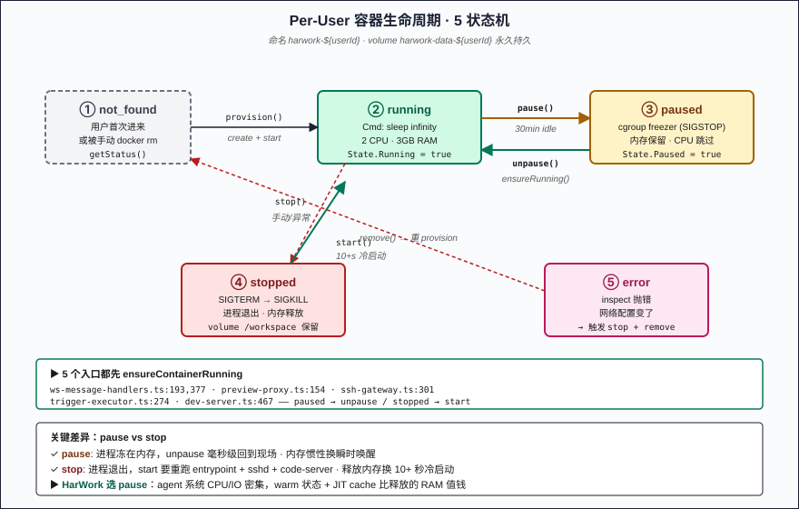
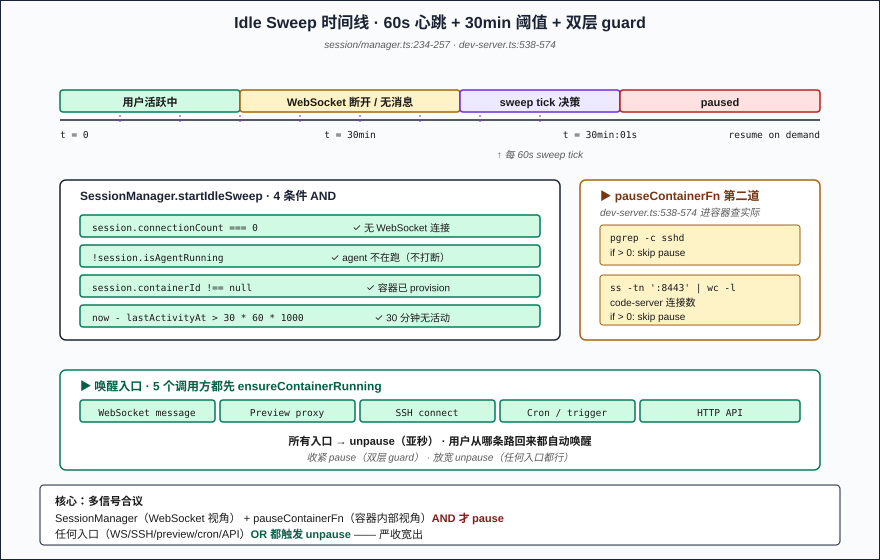
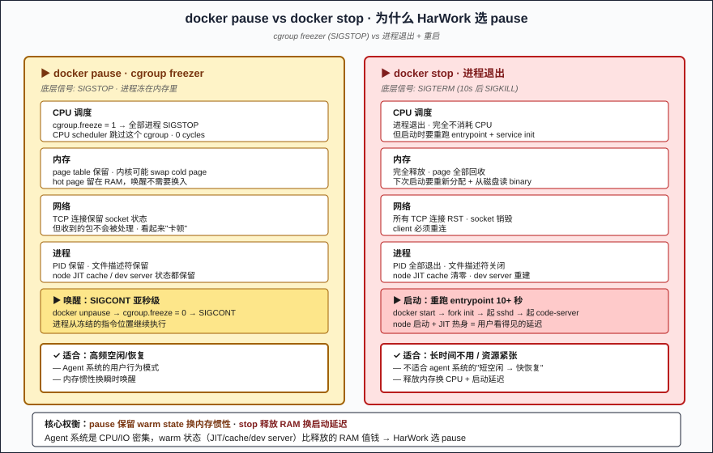

# 第 11 篇：Per-User 持久 Docker —— pause/unpause 节省冷启动开销

> 第 10 篇把 session 数据落在 SQLite 里：用户回来对话历史还在。可对话**运行环境**呢？AI 跑命令的那个 Linux 沙箱，每次对话都开一个新容器吗？HarWork 的答案是：**一个用户一个持久容器，30 分钟空闲 `docker pause` 冻 CPU，用户回来 `docker unpause` 瞬间唤醒**。冷启动重型镜像（ubuntu + node + python + code-server + ssh）从头拉满要 10+ 秒；pause 用 cgroup freezer，unpause 是亚秒级。这一篇拆 HarWork 的容器生命周期表（**`packages/web/lib/workspace/docker.ts` 271 行 + `packages/engine/src/session/manager.ts` 的 idle sweep 部分 + `dev-server.ts` 的双重 guard**），重点是**为什么 pause 而不是 stop**。

**章节跳转：**[问题](#问题陈述) · [朴素方案](#朴素方案为什么不行) · [持久容器](#核心方案per-user-持久容器--30min-idle-sweep--双层-pause-guard) · [实现要点](#关键实现要点) · [反直觉](#反直觉结论) · [生产坑](#三个生产坑)

## 问题陈述

让每个用户都有一个能跑命令的 Linux 沙箱，听起来直接，做起来要解决至少 5 个问题：

1. **粒度选哪个？** —— Per-request 容器（每次 HTTP 请求开新容器）？Per-session？Per-user？前两者冷启动延迟肉眼可见，后者要解决"用户离线时谁付内存"。
2. **空闲怎么省？** —— 一个 base image ≈ 2GB，运行起来 1-3GB RAM。N 个用户在线 = N × 3GB 内存。空闲的容器要不要释放资源？
3. **空闲怎么唤醒？** —— 停了容器再启动要重新跑 entrypoint、sshd、code-server——10+ 秒。怎么让"空闲 → 恢复"快到无感？
4. **怎么知道用户回来了？** —— 用户点开浏览器、WebSocket 重连、SSH 连进来、cron 触发器跑、preview proxy 访问 8080 端口——五个入口都要触发"先把容器拉起来再服务"。
5. **后端能不能换？** —— Docker 单机不够，要上 Kubernetes 怎么办？K8s 没有 native pause——backend 切换不能让 idle sweep 逻辑炸。

5 个都要解。HarWork 的答案落在 **`packages/web/lib/workspace/docker.ts` 271 行 + `packages/engine/src/session/manager.ts` 265 行 + `packages/engine/src/dev-server.ts` 的 backend 选择层**，核心是：**Per-user 持久容器 + 30 分钟 idle sweep + cgroup freezer pause + 5 个 ensureRunning 入口 + Docker/K8s 双 backend 抽象**。

## 朴素方案为什么不行

**朴素 1：Per-request 容器。** 每次用户发一条消息开一个新容器、跑完销毁。隔离性满分，但每次冷启动 5-13 秒（ubuntu + node + code-server + ssh 起来不便宜）。**用户敲三句话等 30 秒就跑了。**

**朴素 2：永远 running，不 pause。** 1000 个用户 = 1000 × 3GB = 3TB RAM 永久占用。绝大多数时间这些容器啥都没做，光开着耗钱。**单价 vs 在线率不平衡。**

**朴素 3：用 docker stop 代替 pause。** Stop 释放内存看起来很美——但**进程被 SIGTERM 杀掉**，dev server 重启要 3-5s、node JIT 缓存清零、code-server 重新打开浏览器要点回到上次的位置。Pause 走 **cgroup freezer (SIGSTOP)**——进程冻在内存里，唤醒就是发 SIGCONT，毫秒级回到现场。**Stop 释放的是内存，丢的是 warm 状态；pause 保留 warm 状态、CPU 调度跳过它。**

**朴素 4：30 分钟到了就硬 pause。** 用户开着 SSH 终端正在 vim 编辑、code-server 浏览器标签开着——硬 pause 进去，terminal 卡住、IDE 转圈圈。**pause 决策不能只看 last activity，还要看进程层面的连接。**

**朴素 5：Engine 直接调 dockerode。** Engine 包绑死 Docker，要上 K8s 就要把 SessionManager.startIdleSweep 重写。HarWork 选 callback 注入：`pauseContainer?: (id) => Promise<void>` 由外部传——dev-server.ts 看 `WORKSPACE_BACKEND` 环境变量决定具体实现，Docker 还是 K8s 都通过同一个 callback 口子进。

HarWork 的答案：**Per-user 容器名 `harwork-${userId}` + container_id 存在 users 表 + 每 60 秒扫一遍所有 session + 30 分钟无活动才 pause + pause 前先 pgrep sshd + ss 检查 code-server 连接 + 五个入口都 ensureContainerRunning + Docker/K8s 双 backend 通过 callback 注入**。

## 核心方案：Per-User 持久容器 + 30min Idle Sweep + 双层 pause guard

### 容器命名与持久化（`web/lib/workspace/docker.ts:19-61`）

```typescript
async provision(userId: string): Promise<string> {
  const containerName = `harwork-${userId}`
  // ... 已存在则复用
  const container = await docker.createContainer({
    Image: BASE_IMAGE,           // 'harwork-base:latest'
    name: containerName,
    Cmd: ['sleep', 'infinity'],   // ← 进程不做事，光开着
    Env: [...],
    HostConfig: {
      NanoCpus: 2_000_000_000,    // 2 核
      Memory: 3 * 1024 * 1024 * 1024,  // 3GB
      Binds: [`harwork-data-${userId}:/workspace`],  // ← per-user volume
      RestartPolicy: { Name: 'unless-stopped' },
      NetworkMode: NETWORK_NAME,
    },
    User: 'worker',               // ← 非 root
    WorkingDir: '/workspace',
  })
  await container.start()
  return container.id
}
```

**关键设计：容器名按 `harwork-${userId}` 派生**——重复 `provision()` 直接拿现有容器（`docker.ts:23-29` 的 try/catch），不会重复创建。容器 ID 存到 `users.container_id` 列（`schema.ts:11`），下次进来直接读 DB 拿 containerId 而不是查 docker。

**Cmd 是 `sleep infinity`**——容器不跑应用，只是个 idle Linux 沙箱。AI 想跑命令？Engine 通过 `docker.exec` 在这个容器里临时起进程（[第 07 篇](07-tool-system.md) 的 BashTool 走这条路）。

**Volume `harwork-data-${userId}:/workspace`** 是 per-user 持久卷——容器 stop/remove 后 volume 还在，下次 provision 挂回去就拿回所有文件。这是 user data 真正持久的地方。

### Idle Sweep：60s 心跳 + 30min 阈值（`session/manager.ts:234-257`）

```typescript
startIdleSweep(opts: IdleSweepOptions): void {
  const intervalMs = opts.intervalMs ?? 60_000
  const idleThresholdMs = opts.idleThresholdMs ?? 30 * 60 * 1000

  this._sweepTimer = setInterval(async () => {
    const now = Date.now()
    for (const [userId, session] of this.sessions) {
      if (
        session.connectionCount === 0 &&         // ← 没有 WebSocket 连接
        !session.isAgentRunning &&                // ← 没有 agent 在跑
        session.containerId &&                    // ← 已绑定容器
        now - session.lastActivityAt > idleThresholdMs  // ← 30 分钟没动
      ) {
        try {
          await opts.onIdle(userId, session.containerId)  // ← 派下去 pause
          console.log(`[idle-sweep] Paused container for user ${userId}`)
        } catch (err) { ... }
        session.clearEventBuffer()  // ← buffer 也清掉，重连重头再来
      }
    }
  }, intervalMs)
}
```

**4 个 AND 条件全部满足才 pause**：
- 没人连着 WebSocket（用户关了浏览器）
- 没有 agent 正在跑（不是停在 LLM 调用中间）
- 容器已经 provisioned（不是新用户）
- 距离 last activity 30 分钟以上

每 60 秒扫一次所有 session（Map），找符合条件的派下去 pause。**这是 cooperative sweep**——SessionManager 自己不知道 docker，通过 `onIdle` callback（ws-server.ts:74-81）传到下层。

### 双层 pause guard：连接层 + 进程层（`dev-server.ts:538-574`）

SessionManager 给了绿灯还不够——容器里可能还有 SSH 进来的终端、code-server 浏览器连接没断。dev-server.ts 的 `pauseContainerFn` 是**真正的 pause 决策点**：

```typescript
pauseContainerFn = async (containerId: string) => {
  const container = docker.getContainer(containerId)
  const info = await container.inspect()
  if (!info.State.Running || info.State.Paused) return  // ← 已经停了/已 pause

  // Guard 1: 检查 SSH 会话
  const sshCount = await containerExec(container, ['pgrep', '-c', '-u', 'worker', 'sshd'])
  if (parseInt(sshCount) > 0) {
    console.log(`[idle-sweep] Skipping pause — ${sshCount} active SSH session(s)`)
    return
  }

  // Guard 2: 检查 code-server 已建立连接（8443 端口）
  const wsCount = await containerExec(container, [
    'sh', '-c', "ss -tn state established '( sport = :8443 )' | tail -n +2 | wc -l"
  ])
  if (parseInt(wsCount) > 0) {
    console.log(`[idle-sweep] Skipping pause — ${wsCount} active code-server connection(s)`)
    return
  }

  await container.pause()  // ← 真 pause 在这里
}
```

**两次 guard 的意义不同**：
- SessionManager 知道**用户 WebSocket 是否连着**（HarWork 自己的连接）
- pause guard 知道**容器内部有没有别的活动**（SSH 终端、code-server IDE）——这些都不走 WebSocket，SessionManager 看不到

**两个 guard 走 `docker exec` 进容器内部 pgrep/ss 检查**——cooperative 之外的真实状态校验。如果 guard 失败（exec 异常），try/catch 吞掉继续走（说明容器不健康，pause 也没意义）。

### Resume：5 个入口都要 ensureRunning（`dev-server.ts:532-537`）

```typescript
ensureContainerRunningFn = async (containerId: string) => {
  const container = docker.getContainer(containerId)
  const info = await container.inspect()
  if (info.State.Paused) await container.unpause()         // ← 暂停的 → 唤醒
  else if (!info.State.Running) await container.start()    // ← 停了的 → 启动
}
```

只有一行核心逻辑，但**调用方有 5 个入口**（grep `ensureContainerRunning` 找出来的）：
- WebSocket 收到 user 消息（`ws-message-handlers.ts:193, 377`）
- Preview proxy 转发请求（`preview-proxy.ts:154`）
- SSH gateway 接受连接（`ssh-gateway.ts:301`）
- Cron / trigger 定时跑（`trigger-executor.ts:274`）
- HTTP API 调用容器内部（`dev-server.ts:467`）

**任何入口都先 ensureRunning 再做事**——用户从哪个渠道回来都会自动唤醒。pause/unpause 对调用方完全透明。

### Docker vs K8s：backend 通过 callback 注入（`dev-server.ts:506-575`）

```typescript
const WORKSPACE_BACKEND = process.env.WORKSPACE_BACKEND || 'docker'

let pauseContainerFn: (containerId: string) => Promise<void>
let ensureContainerRunningFn: (containerId: string) => Promise<void>

if (WORKSPACE_BACKEND === 'k8s') {
  const k8s = new K8sWorkspaceBackend({ ... })
  ensureContainerRunningFn = async (userId) => { await k8s.ensureRunning(userId) }
  pauseContainerFn = async (userId) => { await k8s.pause(userId) }
} else {
  ensureContainerRunningFn = async (containerId) => { /* docker.unpause/start */ }
  pauseContainerFn = async (containerId) => { /* docker.pause + guards */ }
}
```

K8s backend 的 `pause` 是 no-op（`workspace/k8s.ts:160-161` 注释里写："K8s doesn't support pause natively"）——K8s 切换到的是 "scale to 0" 或 sidecar 注入式的 freeze 方案。**SessionManager 不知道这件事**——它只调 `onIdle` callback，pause 在哪个后端实现是 backend 自己的事。

这是博客系列第 4 次出现"接口在 core、实现在 wrapper"的模式（Tool 接口 → Hook 协议 → Storage 接口 → Workspace backend）。

## 关键实现要点

5 个不容易看出来的细节：

**1. lastActivityAt 在哪里被更新（`session/manager.ts:46-48`）**

```typescript
recordActivity(): void {
  this._lastActivityAt = Date.now()
}
```

`recordActivity()` 在收到 WebSocket 消息、agent 开始跑、ensureContainerRunning 触发时被调。**每次有真实交互就刷一次时间戳**——纯被动连着 WebSocket 不算（30 分钟不发消息也照样 pause）。

**2. agent 跑到中间 sweep 也不打断（`manager.ts:243`）**

```typescript
session.connectionCount === 0 && !session.isAgentRunning && ...
```

`!session.isAgentRunning` guard 保证**正在跑的 agent 不会被 pause 截胡**。即使 30 分钟过去了，只要 agent loop 没退，sweep 跳过这个 session。第 03 篇 agent loop 的 finally 块会把 `isAgentRunning` 设回 false，那时下一轮 sweep 才有机会动它。

**3. 容器名"复活"机制（`docker.ts:23-32`）**

```typescript
try {
  const existing = docker.getContainer(containerName)
  const info = await existing.inspect()
  const onCorrectNetwork = !!info.NetworkSettings.Networks[NETWORK_NAME]
  if (onCorrectNetwork) {
    return info.Id  // ← 直接拿回现有容器
  }
  try { await existing.stop({ t: 5 }) } catch { /* may already be stopped */ }
  await existing.remove()  // ← 网络配置变了的老容器先清掉
} catch {
  // Container doesn't exist, create it
}
```

`provision()` 实际上是 **idempotent get-or-create**——重复调拿同一个容器。但容器如果在错误的 docker network 上（升级时 network 改名）会被识别为"过期容器"清掉重建。**容器名稳定 + 数据卷稳定 = 用户数据天然可恢复**。

**4. Resolve 的双重检查（`resolve.ts:18-44`）**

```typescript
export async function resolveContainerId(userId: string): Promise<string> {
  const user = await db.query.users.findFirst({ ... })
  if (user?.containerId) {
    const status = await containerManager.getStatus(user.containerId)
    if (status.status !== 'not_found') return user.containerId
    // ↑ 容器被人手动 docker rm 了 → DB 还存着旧 ID
    await db.update(users).set({ containerId: null })
  }
  const containerId = await containerManager.provision(userId)
  await db.update(users).set({ containerId })
  seedSkillsToContainer(containerId).catch(() => {})  // ← 异步 seed skills，不阻塞
  return containerId
}
```

**先信 DB 缓存的 containerId，但要二次校验**——`getStatus` 真去 docker daemon 问一次，'not_found' 说明手动 `docker rm` 了，清掉旧 ID 重 provision。`seedSkillsToContainer` 不 await，**用户拿到容器就能开始工作**，skill 异步落进 `/workspace/.claude/skills`，迟到不会阻塞主路径。

**5. K8s pause 是 no-op 而不是 throw（`workspace/k8s.ts:160-161`）**

```typescript
async pause(_workspaceId: string): Promise<void> {
  // K8s doesn't support pause natively.
  // Scale-to-zero or sidecar freeze should be configured at the cluster level.
}
```

切到 K8s backend 后 `pause` 就是 no-op 而不是 throw。**为什么不直接 throw？** 因为 SessionManager 不应该感知 backend 差异——pause 失败不能让 sweep 循环挂掉。这是"接口约定的最低承诺"原则：实现可以"承认能力缺失"但不能"打破契约"。

## 反直觉结论

> [!IMPORTANT]
> **持久容器的关键不是"复用容器"，而是"区分活动信号的来源层"**。SessionManager 看的是 WebSocket（HarWork 自己的连接），pauseContainerFn 看的是 SSH 进程数 + code-server 网络连接（容器内部的真实状态）。两个信号源同时为零才 pause，缺一不可——**只看一头就会要么过早 pause（用户 SSH 着被冻），要么从来不 pause（容器内部明明没人在用）**。

换句话说：**pause 决策不是单一信号能完成的**。WebSocket 断了不等于用户走了，30 分钟不动不等于容器空闲，pgrep 没 sshd 不等于以后不会有人 ssh 进来。HarWork 的答案是**多信号合议**：SessionManager 第一道关、容器内部 pgrep+ss 第二道关、两道都过才 pause；唤醒侧反向——任何一个入口（WebSocket / SSH / preview / cron / API）都能触发 unpause。**收紧 pause 决策、放宽 unpause 入口**——这种"严收宽出"是持久容器系统的关键平衡。

最反直觉：**pause 比 stop 内存更省**。直觉以为 stop 释放进程内存，应该比 pause（进程冻在内存里）省。但 pause 后内核可以把 cold 的 page 写到 swap、热的留着；stop 全部释放后唤醒要重新从磁盘读 binary、再 fork 起来、JIT 重新热身——**stop 省内存但费 CPU 和延迟，pause 保留 warm 状态换轻微的内存惯性**。Agent 系统是 CPU/IO 密集的，stop 是错的优化。

## 三个生产坑

> [!WARNING]
> **坑 1 —— 以为 pause 期间收到的 TCP 连接会自动 unpause。**
>
> 错。`docker pause` 冻 cgroup，**容器内的进程一行代码都不会执行**——TCP 连接进来 SYN-ACK 都回不了，等 TCP 重试到超时 client 就报错了。所以 HarWork 把 unpause 显式挂在每个入口的"接收侧"：WebSocket 握手前、preview proxy 转发前、SSH 接受前都先 `ensureContainerRunning`。**容器要醒才能服务，靠 client 重试醒不过来。**

> [!WARNING]
> **坑 2 —— sweep 间隔和 idle 阈值反向调整。**
>
> "30 分钟太长，调成 5 分钟，容器更省"——但是 60 秒一次 sweep + 5 分钟阈值意味着**用户出去倒杯水回来发现容器刚 pause 完**，下一句话要等 unpause。**idle 阈值 >> 用户离开屏幕的常见时长**（吃饭 30-60 分钟，会议 30-90 分钟）是用户体验和资源占用的平衡点，不能盲调小。

> [!WARNING]
> **坑 3 —— seedSkillsToContainer 同步 await 阻塞首次 provision。**
>
> Skills 几十个、每个写一个文件——seed 一次可能花 2-5 秒。如果 await seed 完才返回 containerId，用户首次进来等 docker create + seed = 15+ 秒。HarWork 选**异步 seed 不 await**（`resolve.ts:36`：`seedSkillsToContainer(containerId).catch(() => {})`）——容器先给用户用，skills 慢慢飘进去。代价是用户第一秒可能看不到 skill 列表，但大部分用户不会立刻用 skill。**异步初始化 vs 同步预备的取舍，按"用户期待的 P95 等待时间"选。**

## 配图

1. 
2. 
3. 

## 下一篇

→ 第 12 篇：WebSocket 30 秒宽限期 —— 切 wifi 不打断 agent

容器侧的活动状态判断说完了，下一篇切到**前后端连接侧**：WebSocket 断开为什么不立刻 abort agent？30 秒 grace timer 怎么和 EventBuffer(500) 配合让用户切 wifi、合上电脑、Cmd-R 刷新都不打断长跑的 agent。这是第 10 篇内存态字段和本篇 idle sweep 之间的真实运行衔接。

---

📌 系列阅读地图：[reading-map.md](../reading-map.md)
🔗 English version: [en/11-persistent-docker.md](../en/11-persistent-docker.md)
