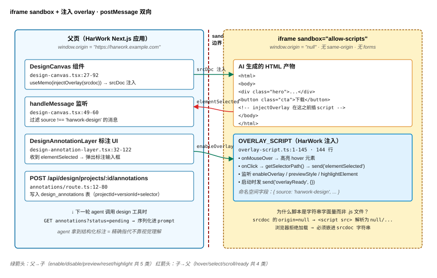
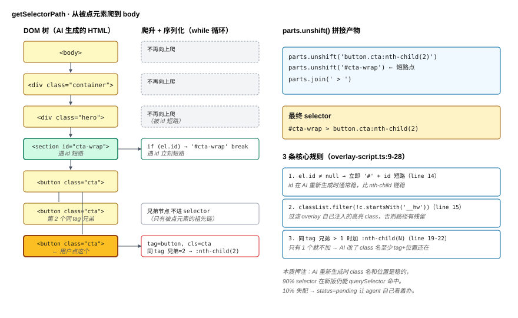
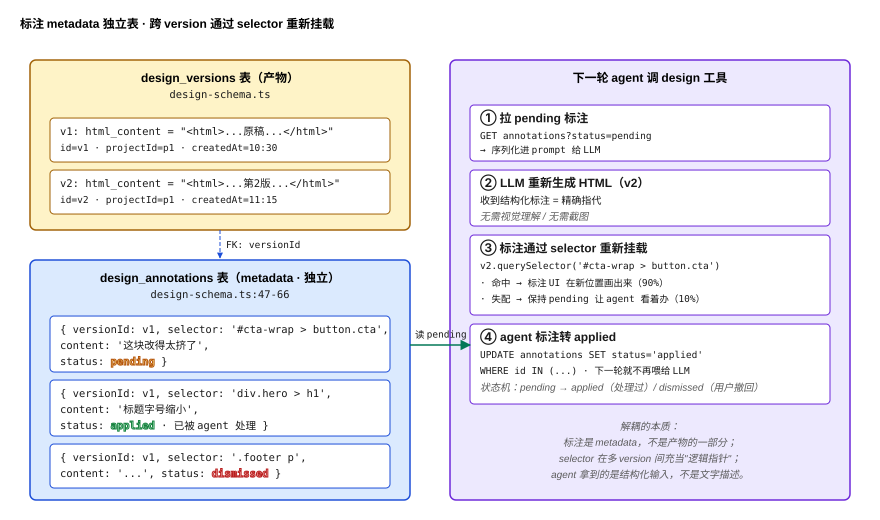

# Part 14：AI 产物渲染 —— iframe overlay + postMessage 让 LLM 输出的 HTML 可被指着改

> 前 13 篇 agent harness 一直在讲"看不见的部分"——loop、上下文、工具、权限、会话、模型。但商业 agent 卖给客户的从来不是 token 流，是**产物**（artifact）：HTML 设计稿、Mermaid 图表、Markdown 报告、SVG 图标。**产物必须被看见，才有价值**。HarWork 的 design canvas 是这个系列里最"可视"的子系统——agent 输出一段 HTML，浏览器实时渲染，用户**点页面里某个按钮说"这块改得太挤了"**，agent 下一轮就精确改那个按钮。这一篇拆这条路径背后的 3 个核心技术：**iframe sandbox 隔离、overlay 脚本注入、postMessage 双向协议**——总共 **368 行代码**（`design-canvas.tsx` 92 + `overlay-script.ts` 154 + `design-annotation-layer.tsx` 122）。

**章节跳转：**[问题](#问题陈述) · [朴素方案](#朴素方案为什么不行) · [4 步管线](#核心方案4-步管线) · [反直觉](#反直觉结论) · [生产坑](#三个生产坑)

## 问题陈述

把"agent 输出的 HTML 让用户点着改"做对，要回答 4 个问题：

1. **HTML 直接 render 到主页面行不行？** AI 生成的 HTML 带 `<script>`、带 `position: fixed` 的弹窗、带改写全局 CSS 的 `* { box-sizing }`——**任何一条都会污染 HarWork 自己的 UI**。
2. **用 iframe 完全隔离呢？** 那"用户点了 iframe 里的哪个按钮"父页面怎么知道？iframe 的 `contentDocument` 在跨源时是**只读**的——browser 直接抛 `SecurityError`。
3. **iframe 里要插 HarWork 自己的脚本去抓点击事件，怎么不让 AI 产物的脚本干扰它？** AI 可能（无意或有意）写 `window.parent.postMessage('hi', '*')`——你的协议要能区分"我注入的脚本说话"和"产物里的代码说话"。
4. **用户标注怎么和产物本身解耦？** Agent 下一轮 re-generate HTML 时，"这个按钮太挤"这条标注**必须挂得住**——否则用户每改一次就要重画一遍标注。

这 4 个问题合起来 = AI 产物可视化层必须给出的工程答案。HarWork 的答案藏在 4 个地方：`packages/web/components/design/design-canvas.tsx`（iframe 宿主 + 父端协议）、`packages/web/components/design/overlay-script.ts`（注入到 iframe 里的脚本，154 行）、`packages/web/components/design/design-annotation-layer.tsx`（标注 UI 层）、`design_annotations` 表（标注解耦存储，`packages/web/lib/db/design-schema.ts:47-66`）。

## 朴素方案为什么不行

**朴素 1：HTML 直接 `dangerouslySetInnerHTML` 到主页面。** 立刻有 3 个坏处：(1) AI 写的 `body { margin: 0 }` 把整个 HarWork 主页面布局打散；(2) AI 写的 `<script>alert('hi')</script>` 直接在主页面执行——XSS 风险等于 0 隔离；(3) AI 引入 `tailwindcss/dist.css` 之类全局样式覆盖 HarWork 自己的 Tailwind class。**主页面不是 sandbox，不能装别人的代码**。

**朴素 2：iframe + `sandbox=""`（完全隔离）。** 看着安全，问题是 `sandbox=""` 等于禁掉**所有 capability**——AI 写的 React/Vue 跑不起来（没 `allow-scripts`），form 不能提交，连点击都拿不到。**完全隔离 = 完全不能用**。HarWork 选 `sandbox="allow-scripts"`（`design-canvas.tsx:86`）——**只放 script，不放 same-origin、不放 forms、不放 popups、不放 modals**——刚好够运行 AI 生成的交互逻辑，又不让它访问 cookie、localStorage、父页 DOM。

**朴素 3：iframe + `sandbox="allow-scripts allow-same-origin"`。** 加 `allow-same-origin` 看着方便（父页可以 `iframe.contentDocument.querySelector(...)`），但**MDN 明确警告**：`allow-scripts` + `allow-same-origin` 同时存在时，iframe 里的脚本可以删掉 sandbox 属性、变成全权 iframe——**等于没 sandbox**。HarWork 选**只 `allow-scripts` 不加 `allow-same-origin`**（看 `design-canvas.tsx:86`）——代价是父子页面之间**任何状态共享都必须走 postMessage**。

**朴素 4：让 iframe 加载远程 URL（`<iframe src="https://preview-cdn/...">`）而不是 srcdoc。** 你得起一个静态托管服务、给每次预览生成临时 URL、处理 CORS——**多 1 个 service、多 1 套 lifecycle**。HarWork 走 `srcDoc={injectedHtml}`（`design-canvas.tsx:85`）——HTML 是字符串变量，**前端组件 props → iframe 直接吃**，0 个网络往返。

**朴素 5：用户点 iframe 里的元素后，把 selector 写进对话历史让 agent 处理。** 看着省事，但 **agent 看到的是文字描述**——`<button class="bg-blue-500">下载</button>` 这种 outer HTML 它读得懂，但**"在视口往下 300px 的位置"它读不懂**。HarWork 把标注作为**结构化数据**存进 `design_annotations` 表（`design-schema.ts:47`），下一轮 agent 拿到的不只是文字，还有 `elementSelector: 'div.hero > button.cta'`——**精确指代不依赖 LLM 的视觉理解**。

HarWork 实际的选择：**`sandbox="allow-scripts"` 极简模式 + injectOverlay 注入 154 行 script + 双向 postMessage 协议 + 标注独立表存储**。下面拆。

## 核心方案：4 步管线

### 第 1 步：injectOverlay —— 在 AI 产物的 `</body>` 前塞 overlay 脚本（`overlay-script.ts:147-154`）

```typescript
export function injectOverlay(html: string): string {
  const script = `<script>${OVERLAY_SCRIPT}</script>`
  const bodyCloseIdx = html.lastIndexOf('</body>')
  if (bodyCloseIdx !== -1) {
    return html.slice(0, bodyCloseIdx) + script + html.slice(bodyCloseIdx)
  }
  return html + script
}
```

8 行函数。**用 `lastIndexOf('</body>')` 找闭标签**——为什么不用正则、不用 DOM parser？因为这是热路径（每次 srcdoc 变都跑），`useMemo` 在 `design-canvas.tsx:34-37` 包住它：**正则会触发回溯、DOM parser 会拷贝整棵树**。`lastIndexOf` 一次 O(n) 扫描，n 是 HTML 长度——对于 AI 一次生成的 ~50KB 产物，这是 <1ms 的操作。**简单字符串拼接打败结构化解析**——前提是你信得过 AI 至少能输出一个完整的 HTML 文档（如果没有 `</body>`，函数 fallback 拼到末尾）。

### 第 2 步：CSS 选择器路径序列化（`overlay-script.ts:9-28`）

```javascript
function getSelectorPath(el) {
  if (el.id) return '#' + el.id;
  var parts = [];
  while (el && el !== document.body && el !== document.documentElement) {
    var tag = el.tagName.toLowerCase();
    if (el.id) { parts.unshift('#' + el.id); break; }
    var cls = Array.from(el.classList).filter(function(c) { return !c.startsWith('__hw'); }).join('.');
    var selector = cls ? tag + '.' + cls : tag;
    var parent = el.parentElement;
    if (parent) {
      var siblings = Array.from(parent.children).filter(function(s) { return s.tagName === el.tagName; });
      if (siblings.length > 1) {
        selector += ':nth-child(' + (Array.from(parent.children).indexOf(el) + 1) + ')';
      }
    }
    parts.unshift(selector);
    el = parent;
  }
  return parts.join(' > ');
}
```

3 条规则：(1) **遇到 `id` 直接短路**——`#hero-cta` 比 `body > div.container > div.hero > button.cta` 短 4 倍，也更稳；(2) **过滤 `__hw` 前缀的 class**——overlay 自己注入的高亮 class（`__hw-highlight`）不能进 selector，否则下一次取相同元素会撞 highlight 残留；(3) **同 tag 兄弟超过 1 个时加 `:nth-child(N)`**——只有 1 个就不加，**保持 selector 在 AI 重新生成时尽量稳定**（class 名变了至少 tag + 位置还在）。

这个算法的本质押注：**class 名是稳的，位置也是稳的，AI 不会无缘无故把 `<button class="cta">` 改成 `<a class="cta">`**——经验上 90% 命中。剩下 10% 的失配，HarWork 把标注标 `status: 'pending'` 让 agent 自己看着办（`design-schema.ts:60-62`）。

### 第 3 步：双向 postMessage 协议 —— iframe ↔ 父页（`overlay-script.ts:42-43`、`design-canvas.tsx:39-43`）

```javascript
function send(type, payload) {
  window.parent.postMessage({ source: 'harwork-design', type: type, payload: payload }, '*');
}
```

```typescript
const sendToIframe = useCallback((type: string, payload: unknown = {}) => {
  iframeRef.current?.contentWindow?.postMessage(
    { source: 'harwork-design', type, payload },
    '*',
  )
}, [])
```

**`source: 'harwork-design'` 是协议命名空间**——所有 HarWork 自己的消息必须带这个 key。父页的 `handleMessage`（`design-canvas.tsx:49-60`）和 overlay 的 listener（`overlay-script.ts:121-141`）都先检查这个字段，**不匹配就丢弃**。这一招挡住了 3 类外来消息：(1) AI 产物里写的 `window.parent.postMessage(...)`——它没 `source: 'harwork-design'`，被父页忽略；(2) 浏览器扩展塞进 window 的消息（React DevTools 之类）——也没这个 key；(3) 第三方 iframe（比如 AI 产物自己嵌的 YouTube）——同理被忽略。**命名空间比 origin check 在 srcdoc iframe 场景下更实用**——因为 srcdoc 的 iframe `origin` 是 `"null"`，origin check 没法用。

消息类型设计上，**父→子**有 5 种：`enableOverlay` / `disableOverlay` / `previewStyle` / `resetPreview` / `highlightElement`（`overlay-script.ts:124-140`）。**子→父**有 4 种：`elementHovered` / `elementSelected` / `scrollUpdate` / `overlayReady`（搜 `send(` 看实现）。**少而扁**——没用嵌套类型、没用 RPC return value——`postMessage` 本质是单向 fire-and-forget，**强行做 RPC 反而引入超时和错误传播的复杂度**。

### 第 4 步：标注独立表存储 —— `design_annotations`（`design-schema.ts:47-66`）

```typescript
export const designAnnotations = sqliteTable('design_annotations', {
  id: text('id').primaryKey(),
  projectId: text('project_id').notNull().references(() => designProjects.id, { onDelete: 'cascade' }),
  versionId: text('version_id').notNull().references(() => designVersions.id, { onDelete: 'cascade' }),
  userId: text('user_id').notNull().references(() => users.id),
  elementSelector: text('element_selector').notNull(),
  content: text('content').notNull(),
  status: text('status', { enum: ['pending', 'applied', 'dismissed'] }).notNull().default('pending'),
  createdAt: integer('created_at', { mode: 'timestamp_ms' }).notNull().$defaultFn(() => new Date()),
})
```

标注**不挂在 HTML 里**——HTML 存在 `design_versions.html_content`，标注存在 `design_annotations`，靠 `versionId` + `elementSelector` 关联。这是为什么 agent 下一轮重新生成 HTML 时，标注**还在**：标注是 metadata，不是产物的一部分。

状态机有 3 个：`pending` → `applied`（agent 处理过）/ `dismissed`（用户撤回）。GET 接口支持 `?status=pending` 过滤（`annotations/route.ts:104`），PATCH `[annotationId]` 更新 status（`[annotationId]/route.ts:50-52`）。agent 端的接入点在 `design-iterate.ts:8`——该工具的入参就有 `elementSelector`，第 60 行把它拼成 `Focus on element: <selector>.` 注入 LLM prompt——**精确指代由 selector 完成，不靠 LLM 看截图**。当前的流程是 1 次 chat → 1 次 design-iterate 工具调用 → 1 个 selector；批量"把所有 pending 标注一次性喂给 LLM"还是表里准备好但尚未自动化的能力——你 fork HarWork 想接的话，写个 batch tool 就行。**没有这层解耦，agent 每次都得对着完整 HTML 重新理解——成本爆炸**。

## 反直觉结论

> [!IMPORTANT]
> **iframe sandbox 的"难"不在选哪些 capability，而在"不选 same-origin"**。看到 `sandbox="allow-scripts allow-same-origin allow-forms allow-popups"` 这种长串属性的 PR 你会以为作者很懂——其实他在**关闭 sandbox**。HarWork 故意只开 `allow-scripts`（`design-canvas.tsx:86`），代价是任何状态共享必须走 postMessage——但这正是你想要的"代价"：**postMessage 是显式协议、可审计；同源访问是隐式共享、不可审计**。同源很爽，但当你的 iframe 内容是 LLM 生成的、不可信的，**显式协议是唯一的护城河**。

更反直觉的：**`sandbox="allow-scripts"`（不带 allow-same-origin）的 iframe 里，`window.origin === "null"`**。你不能 `event.origin === 'https://harwork.example.com'` 检查——因为 origin 就是字符串 `"null"`。所以 HarWork 用**命名空间字段**（`source: 'harwork-design'`）而不是 origin check（`design-canvas.tsx:52`、`overlay-script.ts:123`）。看到别人代码里 `if (e.origin !== window.origin) return` 来 sandbox srcdoc iframe 的——**那段代码永远走不到 return 后面**，因为两边都是 `"null"`。命名空间 + `source: e.source !== iframeRef.current.contentWindow` 检查（`design-canvas.tsx:50`）才是 srcdoc 场景的正解。

最反直觉的工程细节：**overlay 脚本是字符串字面量，不是单独的 .js 文件**。`OVERLAY_SCRIPT` 是 `overlay-script.ts:1-145` 里 144 行的 backtick template literal。为什么不放 `public/design-overlay.js` 让 iframe `<script src="/design-overlay.js">` 引？因为**srcdoc iframe 的 origin 是 `"null"`**——`<script src="/...">` 解析出来的 URL 是 `null/design-overlay.js`，浏览器**拒绝加载**。把脚本**嵌进 srcdoc 字符串里**是唯一在 sandbox 模式下注入代码的方法。所以 HarWork 选 ES module 字符串字面量——**TypeScript 给你 syntax highlight，build 出来嵌进 HTML，0 网络往返、0 跨域问题**。

## 三个生产坑

> [!WARNING]
> **坑 1 —— 两套 postMessage 协议同时活着。**
>
> `overlay-script.ts:43` 发的消息是 `{ source: 'harwork-design', type: 'elementSelected', payload: {...} }`，但 `lib/design/annotation-protocol.ts:1-8` 又定义了一套 `{ type: 'harwork-design:element-clicked', payload: {...} }` 的"前缀式" type 协议——`design-annotation-layer.tsx:55` 用 `isOverlayMessage` 检查后者。**两套并存的原因**：早期用 source+type，后来重构成 `harwork-design:` 前缀想统一，但 design-canvas.tsx 这条主链路没改完。**生产代价**：annotation-layer 收不到 design-canvas iframe 直接发的消息（type 不匹配），目前是父组件把消息再转发一次。**如果你 fork HarWork**，建议**先把两套合并成一套**——选前缀式更好，因为它在 chrome devtools "message" panel 里更容易过滤。

> [!WARNING]
> **坑 2 —— `enableOverlay` 之前发的事件全丢。**
>
> `design-canvas.tsx:66-68` 在 `editMode` 变化时发 `enableOverlay`/`disableOverlay`，但 iframe 加载是异步的——**iframe 还没跑完 overlay 脚本，父页就 sendToIframe 了**——这条消息**永远到不了**（postMessage 不缓冲）。HarWork 的当前缓解：overlay 脚本启动时 `send('overlayReady', {})`（`overlay-script.ts:143`），父页**应该**用这个信号触发 enableOverlay——但 design-canvas.tsx **没监听 overlayReady**（搜 `overlayReady` 在父端没出现）。结果：第一次打开设计稿时，**点元素偶发不弹标注框**，要切换 editMode 一次才好。**修法**：父页 useEffect 监听 overlayReady 再发 enableOverlay；或者 overlay 脚本启动时直接 `enabled = true`（取消 enableOverlay 信令）。

> [!WARNING]
> **坑 3 —— getSelectorPath 在 React 重新挂载后失效。**
>
> AI 重新生成 HTML 时，class 名通常变化不大（Tailwind 那几个 class），但**Tailwind JIT 在 production build 可能给你 `class="text-sm font-bold sm:text-base"` 这种空格分隔 4 个 class 的元素**——`getSelectorPath` 用 `.join('.')` 把 4 个 class 全拼成 `text-sm.font-bold.sm:text-base` 这种**带冒号**的 selector——浏览器 `querySelector` 见到 `:` 当成伪类，**直接 throw**。HarWork 现在没对 `:` 做 CSS.escape——遇到 sm:/md:/lg: 这种 Tailwind responsive class，selector 直接报错。**修法**：在 `getSelectorPath:15` 里加 `cls.replace(/:/g, '\\\\:')`，或者用 `CSS.escape(c)` 包每个 class。**生产部署如果允许 Tailwind 产物，必须修这个**。

## 配图

1. 
2. 
3. 

## 下一篇

→ Part 15：多方案对比 —— agent 一次出 3 版设计，用户怎么 mix-and-match

iframe overlay 解决的是"一个产物里指着改"。但商业 design agent 真正的高频场景是**一次 3 个方案并排比**——hero 区用 A，导航用 B，footer 用 C。HarWork 的多方案系统不是"3 个独立 iframe"，而是把 3 版 HTML diff 出 section 后允许用户**跨方案拖拽组合**。这套"AI artifact + 人类组合" 的协作模型比单稿迭代有趣得多——下一篇拆 design_variants 表、版本树、跨稿合并算法。

---

📌 阅读地图：[reading-map.md](../reading-map.md)
🔗 English version: [en/14-ai-artifact-rendering.md](../en/14-ai-artifact-rendering.md)
