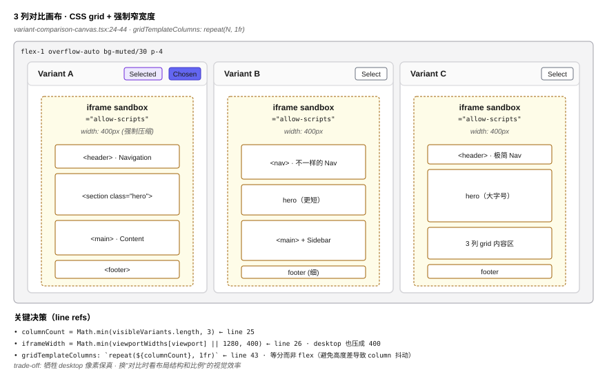
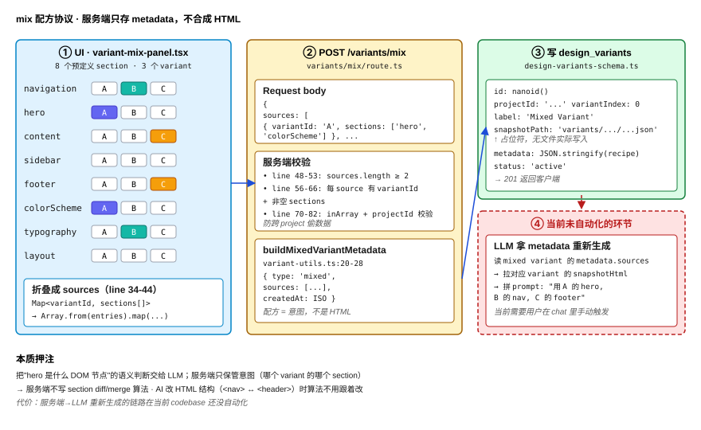
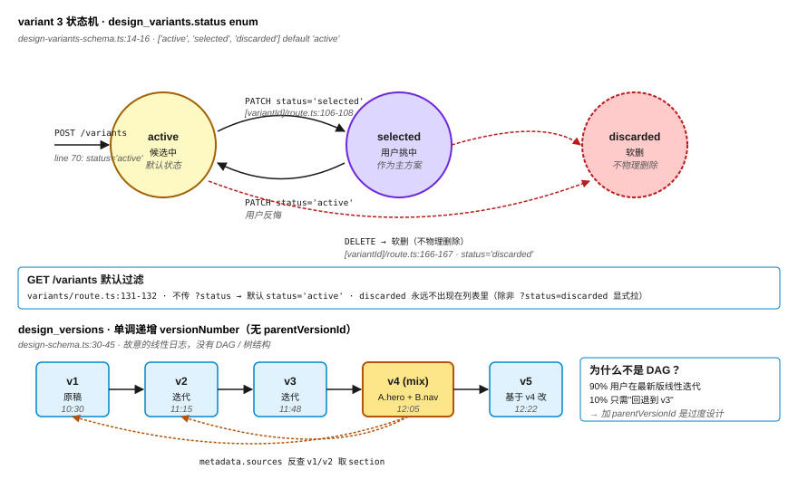

# Part 15：多方案对比与 mix-and-match —— AI 一次出 3 版，用户跨稿拖元素拼第 4 版

> 上一篇拆完"一份 AI 产物里指着改"。但商业 design agent 真正的高频场景是**一次出 3 个方案并排比**——hero 区用 A、导航用 B、footer 用 C。HarWork 的多方案系统不是"3 个独立 iframe"，而是把"组合"做成一等公民：用户在 8 个 section 维度上**点选哪个 section 取自哪个方案**，POST 给 `/variants/mix` 接口生成第 4 个 variant。这一篇拆 4 个东西：3 列对比画布的布局策略、mix 的"配方"协议（不是 HTML 合成）、`design_variants` schema 的 status 状态机、以及"为什么版本树在 schema 里其实只是一条线性日志"——共 **818 行代码**（`variant-comparison-canvas.tsx` 94 + `variant-mix-panel.tsx` 133 + `variant-selector.tsx` 105 + `variant-utils.ts` 41 + `variants/route.ts` 143 + `variants/mix/route.ts` 125 + `[variantId]/route.ts` 177）。

## 问题陈述

把"AI 一次出 3 版让用户拼第 4 版"做对，要回答 4 个问题：

1. **3 个 iframe 横排会不会撑爆视口？** Desktop 设计稿宽度 1280px，3 个并排就是 3840px——用户屏幕 1440px 根本放不下。
2. **mix-and-match 是真的拼 HTML，还是只记"配方"？** 真拼 HTML 要写 section diff 算法；记配方就是存 `{ variantId, sections: [...] }` 然后让 agent 下一轮重新生成。两条路代价完全不同。
3. **3 个方案共享一份 overlay 脚本，但点击事件怎么知道是哪个方案？** Part 14 的 postMessage 协议带 `source: 'harwork-design'`，但 3 个 iframe 都发同样的 source——怎么分流？
4. **方案被"用户选中"后，schema 状态怎么跟？** 用户选了 A 不代表 B/C 要删，他可能后悔。状态不能是布尔值。

这 4 个问题合起来 = AI 多方案对比的工程契约。HarWork 的答案藏在 4 个地方：`packages/web/components/design/variant-comparison-canvas.tsx`（3 列布局 + iframe 渲染）、`packages/web/components/design/variant-mix-panel.tsx`（8 个 section 选择 UI）、`packages/web/lib/design/variant-utils.ts`（mix 配方协议、label 生成）、`packages/web/app/api/design/projects/[id]/variants/mix/route.ts`（mix 接口实现）。

## 朴素方案为什么不行

**朴素 1：3 个 iframe 各按 1280px 渲染，让用户横向滚动。** 视觉上"3 个 desktop 设计稿摆一起"是有的，但 UX 直接崩——用户为了对比 hero 区高度，要在 3 个画布里**分别滚动**。HarWork 的做法（`variant-comparison-canvas.tsx:26`）：`iframeWidth = Math.min(viewportWidths[viewport] || 1280, 400)`——**强制宽度不超过 400px**，desktop 也压成 400 渲染。代价是 desktop 设计稿在缩放比下显示——但**对比时看的是布局结构和比例，不是像素级保真**，所以这个 trade-off 划得来。

**朴素 2：mix 接口在服务端做真的 HTML 合成——拿 3 个 variant 的 HTML，按 section 切片，拼成新 HTML。** 你得自己写：`section` 是什么？navigation 用 `<nav>` 还是 `<header>`？hero 是 `<section class="hero">` 还是 `<div class="hero-banner">`？AI 每次生成结构都不一样，**切片算法永远在追新格式**。HarWork 故意不合 HTML：mix 接口（`variants/mix/route.ts:84-105`）只写一条 metadata 记录 `{ type: 'mixed', sources: [{ variantId, sections }] }`——**配方**，不是产物。真的 HTML 生成留给 agent 在下一轮拿这条 metadata 做参考。

**朴素 3：让用户在画布上拖拽 section 直接拼。** 听着炫，但你得做：拖拽 hit region 算法、section 边界检测、跨 iframe 拖拽（浏览器原生 drag-and-drop 在跨 origin iframe 间不通）……开发量翻 5 倍，且**用户的"section"和 AI 心里的"section"未必一致**。HarWork 用 8 个**预定义** section（`variant-mix-panel.tsx:13-22`）：navigation / hero / content / sidebar / footer / colorScheme / typography / layout——**词汇表收敛**，agent 一看就懂，UI 只是 button grid。

**朴素 4：把 variant 当一次性 generate 结果——用户选定 A 后就把 B/C 删掉。** 实操上用户会反悔："我选了 A，但 B 的 typography 其实更好"。HarWork 的 schema（`design-variants-schema.ts:14`）用 3 状态枚举 `['active', 'selected', 'discarded']`——**用户的"选中"不删除其它**，DELETE 接口也是软删（`variants/[variantId]/route.ts:166`：`status='discarded'` 而非物理删除）。**任何"选中即丢弃"的 schema 都是错的**——用户在反悔时给你看的脸不会好看。

**朴素 5：版本树用 parentVersionId 字段做有向无环图。** 看着合理：从 v1 mix 出 v2，v2 fork 出 v3a 和 v3b，DAG 跟着用户思路扩展。HarWork 实际的 schema（`design-schema.ts:30-45`）**没有 parentVersionId**——只有 `versionNumber`（单调递增整数）。这是个**故意的简化**：树形结构需要 UI 配套（分支可视化、合并冲突）、数据库查询需要递归 CTE，但实际用户**90% 时间在最新版上迭代**，剩 10% 只是"回退到 v3"——线性历史 + 用户手动开新 project fork 已经够用。**说"版本树"的人通常没真用过版本树**。

HarWork 的实际选择：**强制 400px iframe + mix 只存配方 + 8 个预定义 section + 3 状态枚举 + 线性版本日志**。下面拆。

## 核心方案：4 步管线

### 第 1 步：3 列对比画布——CSS grid + 强制窄宽度（`variant-comparison-canvas.tsx:24-44`）

```tsx
const visibleVariants = variants.filter((v) => selectedIds.includes(v.id))
const columnCount = Math.min(visibleVariants.length, 3)
const iframeWidth = Math.min(viewportWidths[viewport] || 1280, 400)
// ...
<div
  className="grid gap-4 h-full"
  style={{ gridTemplateColumns: `repeat(${columnCount}, 1fr)` }}
>
```

3 个关键决策：(1) **`columnCount` 取 `min(visibleVariants.length, 3)`**——视口最多 3 列，超过 3 个 variant 用户得在 selector 里切换（`variant-selector.tsx:30-35` 的多选 checkbox）；(2) **`iframeWidth = min(viewportWidths, 400)`**——上面说过，对比时强制窄宽度；(3) **`grid-template-columns: repeat(N, 1fr)`**——CSS grid 等分，不是 flex，避免不同 variant 高度不等时 column 抖动。这块代码 21 行（`variant-comparison-canvas.tsx:39-91`），剩下都是 chrome（标题栏、"Select"按钮、loading 占位）。

### 第 2 步：mix 配方协议（不是 HTML 合成）（`variant-utils.ts:9-28`）

```typescript
export interface MixSource {
  variantId: string
  sections: string[]
}

export interface MixedVariantMetadata {
  type: 'mixed'
  sources: MixSource[]
  createdAt: string
}

export function buildMixedVariantMetadata(input: {
  sources: MixSource[]
}): MixedVariantMetadata {
  return {
    type: 'mixed',
    sources: input.sources,
    createdAt: new Date().toISOString(),
  }
}
```

**协议本质：一份 JSON 配方，不是合成产物**。UI 端（`variant-mix-panel.tsx:34-44`）把用户的 8 个 section 选择折叠成 `Map<variantId, sections[]>`：

```typescript
const sourceMap = new Map<string, string[]>()
for (const [section, variantId] of Object.entries(selections)) {
  const existing = sourceMap.get(variantId) || []
  existing.push(section)
  sourceMap.set(variantId, existing)
}
const sources = Array.from(sourceMap.entries()).map(([variantId, sections]) => ({
  variantId, sections,
}))
```

POST 给 `/variants/mix` 后，服务端（`variants/mix/route.ts:84-110`）做的事：(1) 校验每个 source 有 `variantId` 和非空 `sections`（line 56-66）；(2) 用 `inArray` 验证所有 variantId 都属于当前 project（line 70-82）——**防止跨 project 偷数据**；(3) 写一条 `designVariants` 记录，`metadata` 字段存 `JSON.stringify({ type: 'mixed', sources, createdAt })`，`status: 'active'`。**没有 HTML 合成**——`snapshotPath` 字段只是占位（`variants/${id}/${variantId}.json`）。

下游 agent 拿到这条 mix variant 的 metadata，知道"hero 从 A 取、navigation 从 B 取"，自己**重新 generate**完整 HTML——这条链路在当前代码库里**还没有自动化**，agent 拿 metadata 重新生成是手动触发（用户在 chat 里说"基于 mixed variant 重新生成"）。这是**配方协议**的代价：解耦的同时丢了端到端自动化。

### 第 3 步：3 状态枚举的 variant 生命周期（`design-variants-schema.ts:14-16`、`variants/[variantId]/route.ts`）

```typescript
status: text('status', { enum: ['active', 'selected', 'discarded'] })
  .notNull()
  .default('active'),
```

3 个状态：**active**（默认，候选中）/ **selected**（用户挑中作为主方案）/ **discarded**（用户放弃，软删）。状态转换：
- `POST /variants` 生成时全部 `active`（`variants/route.ts:70`）
- `PATCH /variants/[variantId] body.status=selected`：用户在 comparison canvas 点 "Select" 按钮（`variant-comparison-canvas.tsx:57`）
- `DELETE /variants/[variantId]`：**软删，不物理删**——`variants/[variantId]/route.ts:166-167`：`db.update().set({ status: 'discarded' })`
- `GET /variants` 默认过滤掉 discarded（`variants/route.ts:131-132`：`status === 'active'` 是默认条件）

**为什么不用布尔 `isSelected`**：因为用户的选中不互斥——他可能"挑了 A 但 B 也保留着以备 mix 时引用"。如果用布尔，要么"选 A 时自动取消 B"（用户行为不容忍），要么"多个能同时 isSelected=true"（语义模糊）。三态枚举把"选中"和"删除"分成两个独立维度——**选中是 promote、删除是 demote，不是同一根坐标轴的两端**。

### 第 4 步：variant labels 自动生成 + 速率限制（`variant-utils.ts:1-7`、`variants/route.ts:20-25`）

```typescript
export function generateVariantLabels(count: number): string[] {
  const labels: string[] = []
  for (let i = 0; i < count; i++) {
    labels.push(`Variant ${String.fromCharCode(65 + i)}`)
  }
  return labels
}
```

`String.fromCharCode(65 + i)` = ASCII 'A' + i——生成 `Variant A`、`Variant B`……到 `Variant E`（count 上限 5，`validateVariantCount` 在 `variant-utils.ts:37-41`）。**为什么不用 1/2/3**：因为 mix-and-match UI 里要快速口头说 "A 的 hero、B 的 navigation"，字母比数字更口语化、不和 versionNumber 撞。

速率限制（`variants/route.ts:20-25`）：每用户每分钟最多 20 次 variant create、10 次 mix（`variants/mix/route.ts:20-25`）。**mix 比 generate 限得更死**——因为 mix 是 user-driven，generate 是 agent 主动调用；user-driven 的频率应该比 agent 慢，否则用户在 UI 上手抖连点会刷爆限流。

## 反直觉结论

> **AI 一次出 3 个方案的真正价值不在"提供 3 个选项"，而在"3 个方案的元素可以被拆开重组"**。如果方案不能拆，3 个方案 = 一个加强版的 retry——用户挑一个、丢两个、agent 烧 3 倍 token、用户得到 0 倍升级。HarWork 的 mix-and-match 把"组合"做成一等公民（8 个预定义 section 的 button grid），**让用户的"我想要 A 的 hero + B 的 navigation"从口述变成结构化输入**——agent 下一轮拿到的不是文字描述，是 `{ sources: [{ variantId: 'A', sections: ['hero'] }, { variantId: 'B', sections: ['navigation'] }] }`，精确指代不靠语言理解。

更反直觉的：**mix 接口不合成 HTML**。第一次看 `variants/mix/route.ts` 时所有人都期待"输入 3 个 variant 输出 1 份合成 HTML"，实际它只写一条 metadata 记录就返回 201。**合成 HTML 是 LLM 的活，不是服务端的活**——服务端做 section diff/merge 算法的代价是：每次 AI 改 HTML 结构（`<nav>` 变 `<header>`）算法跟着改。把"hero 是什么 DOM 节点"的语义判断交给 LLM，服务端只保管**意图**（哪个 variant 的哪个 section）——这才是真正的解耦。

最反直觉的工程细节：**所谓"版本树"在 schema 里其实是一条线性日志**。Part 14 文末预告说"版本树是 DAG"，但读 `design-schema.ts:30-45` 会发现 `design_versions` 表**没有 `parentVersionId` 字段**——只有单调递增的 `versionNumber`（line 35），插入新版本时用 `max(versionNumber) + 1`（`versions/route.ts:48`）。这是**故意的简化**：90% 的 AI 设计协作场景里用户在最新版上线性迭代，DAG 在产品形态成熟前是过度设计。**当前 mix 出的"v4"和原来的 v1/v2/v3 在 schema 里是同辈关系，靠 mix variant 的 metadata 字段反查 source**——这套近似 DAG 的设计已经够用，但要演化成真 DAG，加一个 `parentVersionId` 列即可。**先线性、后树，是承认产品形态在变的诚实**。

## 三个生产坑

**坑 1：sandbox 在 snapshotHtml / previewUrl 两路上不一致**。`variant-comparison-canvas.tsx:72` 走 `srcDoc={variant.snapshotHtml}` 时 `sandbox="allow-scripts"`（和 Part 14 一致，安全），但 line 79 走 `<iframe src={variant.previewUrl}>` 时是 `sandbox="allow-scripts allow-same-origin"`——Part 14 反复强调过两个一起开**等于没沙箱**。**为什么两路不同**：`previewUrl` 走的是 HarWork 自己的 nginx 静态预览（同源），所以历史上加了 `allow-same-origin` 想让父页能 querySelector iframe 内容。但**这等于给同源静态预览开了从沙箱逃逸的口子**——当 AI 产物里写 `parent.location = '...'` 时，previewUrl 路径会成功，srcDoc 路径会被阻挡。**修法**：把 line 79 也改成 `sandbox="allow-scripts"`，previewUrl 路径放弃同源访问，全部走 postMessage——和 srcDoc 一致。

**坑 2：variant.snapshotHtml 在 schema 里根本不存在**。`variant-selector.tsx:10` 定义的 `Variant` 接口里有 `snapshotHtml?: string`，但 `design-variants-schema.ts` 里**没这个字段**——variant 表只有 `snapshotPath`（文件路径占位）和 `previewUrl`。意思是：3 列对比画布要拿到 variant 的 HTML 渲染，得在**前端运行时把 design_versions 的 snapshotHtml 注入到 Variant 对象**——`app/design/project/[id]/page.tsx:110` 那行 `if (v.snapshotHtml) setCurrentHtml(...)` 就是这个胶水。**生产代价**：如果 mix 出的新 variant 没人帮它写 snapshotHtml（也没人补 design_versions 记录），3 列画布会一直显示 "Generating..."（line 84-86）。**修法**：variant 生命周期里加"mix → 生成对应 design_versions 记录"的自动化触发，或者把 snapshotHtml 真正存到 design_variants 表里（接受冗余）。

**坑 3：mix-panel 的 button grid 在 8 个 section × 5 个 variant 时变成 40 个按钮**。`variant-mix-panel.tsx:96-114` 用嵌套 map 渲染：8 行 section × N 列 variant。当用户开 5 个 variant 后，UI 是 40 个按钮，**screen reader 没有任何分组语义**（没有 `role="radiogroup"`），键盘 Tab 顺序穿过 40 个 button 才能完成一次选择。**生产代价**：accessibility audit 直接红条；移动端拇指点击 40 px button 经常误触相邻 section。**修法**：每个 section 改用原生 `<select>` 或 `<radiogroup>`——既给 a11y 正确语义，又把 Tab 数量从 40 降到 8。

## 配图

1. 
2. 
3. 

## 下一篇

→ Part 16：乐观锁实时协作 —— 为什么 AI 产物的多人协作不该用 CRDT

mix-and-match 解决"单用户跨方案重组"。但 AI 产物（设计稿、PRD、HTML）越好用，多人同时编辑的需求越高——A 在改 hero、B 同时在改 footer，提交时谁覆盖谁？传统 CRDT（Yjs / Automerge）在普通文档里很香，但**AI 产物的每次编辑都包含语义决策**（"这个按钮改红是因为品牌主色"），自动合并相当于把语义决策权交给 diff 算法。HarWork 选乐观锁 + 显式冲突 UI——下一篇拆 `design_versions.versionNumber` 字段如何做乐观锁、WebSocket `design-collab` 通道的分流、以及组织级 share token 的 TTL 管理。

---

📌 阅读地图：[reading-map.md](../reading-map.md)
🔗 English version: [en/15-design-variants-mix.md](../en/15-design-variants-mix.md)
